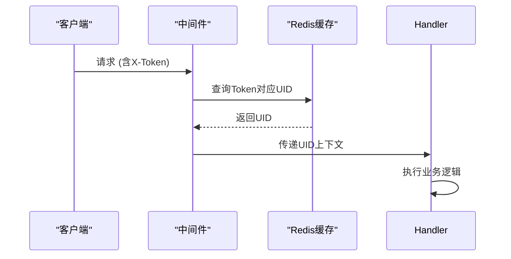

# API 接口参考

<cite>
**本文档引用的文件**
- [space.proto](file://app/api/proto/space.proto)
- [dumplinks.proto](file://app/api/proto/dumplinks.proto)
- [login.proto](file://app/api/proto/login.proto)
- [README.md](file://README.md)
- [login.go](file://app/api/login.go)
- [redis.go](file://app/dal/redis.go)
- [login.go](file://app/pkg/middleware/login.go)
</cite>

## 目录
1. [简介](#简介)
2. [认证机制](#认证机制)
3. [核心概念](#核心概念)
4. [空间管理接口](#空间管理接口)
5. [页面分享接口](#页面分享接口)
6. [登录认证接口](#登录认证接口)
7. [书签导入导出接口](#书签导入导出接口)

## 简介
本 API 文档详细描述了通过 gRPC-Gateway 暴露的所有 RESTful 接口。接口按服务分组，涵盖空间管理、页面分享、登录认证和书签处理等功能。所有接口均基于 Protobuf 定义，并通过 HTTP 映射对外提供服务。

**Section sources**
- [README.md](file://README.md#L1-L129)

## 认证机制
所有需要登录态的接口均通过 `X-Token` 请求头进行身份验证。`X-Token` 是一个字符串标识，服务器将其映射到用户 ID。当用户完成第三方登录后，系统会生成一个 token 并通过 `SetXToken` 存储在 Redis 中，有效期由 `LoginTimeout` 控制。

客户端在调用受保护的接口时，必须在请求头中包含 `X-Token` 字段。中间件 `GetLoginUid` 会解析该 token 并获取对应的用户 ID，用于后续权限校验。



**Diagram sources**
- [login.go](file://app/pkg/middleware/login.go#L0-L15)
- [redis.go](file://app/dal/redis.go#L66-L90)

**Section sources**
- [login.go](file://app/pkg/middleware/login.go#L0-L15)
- [redis.go](file://app/dal/redis.go#L60-L91)

## 核心概念

### 更新掩码（mask）
在更新页面时，`mask` 字段使用位运算表示需要更新的字段：
- `0x01`（1）：更新标题（title）
- `0x02`（2）：更新描述（brief）
- `0x04`（4）：更新集合（collections）
- 组合值如 `0x07`（7）表示同时更新所有三个字段

该机制允许客户端精确控制更新范围，避免不必要的数据覆盖。

### 页面权限类型
页面可通过生成不同类型的共享链接来控制访问权限：
- `readonly`：只读链接，访问者只能查看内容
- `edit`：可编辑链接，访问者可以修改内容但不能删除
- `admin`：超级权限链接，访问者拥有完全控制权（包括删除）

只有页面所有者或具有 `admin` 权限的用户才能创建这些链接。

### 页面配置（PageConf）
每个页面包含以下配置属性：
- `read_only`：是否为只读状态
- `can_edit`：是否允许编辑
- `can_delete`：是否允许删除

这些字段共同决定了页面的实际行为和用户交互能力。

**Section sources**
- [README.md](file://README.md#L100-L128)
- [space.proto](file://app/api/proto/space.proto#L200-L215)

## 空间管理接口

### 获取用户信息
获取指定用户的公开信息及登录用户自身的私有信息。

**HTTP 方法**: POST  
**URL 路径**: `/space/getUserInfo`  
**请求体结构**:
```json
{
  "uid": 1
}
```

**响应体结构**:
```json
{
  "uid": 1,
  "display_name": "用户名",
  "avatar": "头像URL",
  "email": "邮箱",
  "username": "用户名",
  "status": 0,
  "last_login_time": 1700000000,
  "is_admin": 0,
  "provider": "google",
  "create_time": 1700000000,
  "update_time": 1700000000
}
```

**curl 示例**:
```bash
curl '127.0.0.1:80/space/getUserInfo' -d '{"uid": 1}' -H 'content-type: application/json' -H 'X-Token: test'
```

**Section sources**
- [space.proto](file://app/api/proto/space.proto#L6-L11)
- [README.md](file://README.md#L30-L33)

### 拉取我的空间
获取当前用户的空间信息及其包含的页面列表。

**HTTP 方法**: POST  
**URL 路径**: `/space/getMySpace`  
**请求体结构**: `{}`  
**响应体结构**:
```json
{
  "space_name": "我的空间",
  "page_briefs": [
    {
      "page_id": "p1",
      "title": "页面标题",
      "brief": "页面描述",
      "create_time": 1700000000,
      "update_time": 1700000000,
      "is_self": true,
      "page_conf": {
        "read_only": false,
        "can_edit": true,
        "can_delete": true
      }
    }
  ]
}
```

**curl 示例**:
```bash
curl '127.0.0.1:80/space/getMySpace' -d '{}' -H 'content-type: application/json' -H 'X-Token: test'
```

**Section sources**
- [space.proto](file://app/api/proto/space.proto#L13-L25)
- [README.md](file://README.md#L36-L39)

### 创建页面
为当前用户创建一个新的页面。

**HTTP 方法**: POST  
**URL 路径**: `/space/createPage`  
**请求体结构**:
```json
{
  "title": "我的页面",
  "brief": "这是一个测试页面",
  "collections": [
    {
      "links": [
        {
          "title": "示例链接",
          "url": "https://example.com",
          "tags": ["示例", "测试"],
          "photo_url": "https://example.com/photo.jpg",
          "sub_links": [
            {
              "sub_title": "子链接",
              "sub_url": "https://sub.example.com"
            }
          ]
        }
      ]
    }
  ]
}
```

**响应体结构**:
```json
{
  "page_id": "new_page_id",
  "version": 0,
  "page_ids": ["new_page_id"]
}
```

**curl 示例**:
```bash
curl '127.0.0.1:80/space/createPage' -d '{
  "title": "我的页面",
  "brief": "这是一个测试页面",
  "collections": [
    {
      "links": [
        {
          "title": "示例链接",
          "url": "https://example.com",
          "tags": ["示例", "测试"]
        }
      ]
    }
  ]
}' -H 'content-type: application/json' -H 'X-Token: test'
```

**Section sources**
- [space.proto](file://app/api/proto/space.proto#L27-L39)
- [README.md](file://README.md#L42-L62)

### 更新页面
更新指定页面的内容，需提供版本号和掩码。

**HTTP 方法**: POST  
**URL 路径**: `/space/updatePage`  
**请求体结构**:
```json
{
  "page_id": "O3sFmpq",
  "title": "更新后的标题",
  "brief": "更新后的描述",
  "collections": [],
  "version": 0,
  "mask": 7
}
```

**响应体结构**:
```json
{
  "update_time": 1700000000,
  "version": 1
}
```

**curl 示例**:
```bash
curl '127.0.0.1:80/space/updatePage' -d '{
  "page_id": "O3sFmpq",
  "title": "更新后的页面标题",
  "brief": "更新后的页面描述",
  "collections": [
    {
      "links": [
        {
          "title": "更新后的链接",
          "url": "https://updated.example.com",
          "tags": ["更新", "测试"]
        }
      ]
    }
  ],
  "version": 0,
  "mask": 7
}' -H 'content-type: application/json' -H 'X-Token: test'
```

**Section sources**
- [space.proto](file://app/api/proto/space.proto#L41-L53)
- [README.md](file://README.md#L65-L85)

### 删除页面
删除指定的页面。

**HTTP 方法**: POST  
**URL 路径**: `/space/deletePage`  
**请求体结构**:
```json
{
  "page_id": "test_page_id"
}
```

**响应体结构**: `{}`

**curl 示例**:
```bash
curl '127.0.0.1:80/space/deletePage' -d '{"page_id": "test_page_id"}' -H 'content-type: application/json' -H 'X-Token: test'
```

**Section sources**
- [space.proto](file://app/api/proto/space.proto#L55-L61)
- [README.md](file://README.md#L88-L91)

### 保存页面顺序
调整用户空间中页面的显示顺序。

**HTTP 方法**: POST  
**URL 路径**: `/space/savePageIds`  
**请求体结构**:
```json
{
  "page_ids": ["page1", "page2", "page3"]
}
```

**响应体结构**:
```json
{
  "page_ids": ["page1", "page2", "page3"]
}
```

**curl 示例**:
```bash
curl '127.0.0.1:80/space/savePageIds' -d '{
  "page_ids": ["page1", "page2", "page3"]
}' -H 'content-type: application/json' -H 'X-Token: test'
```

**Section sources**
- [space.proto](file://app/api/proto/space.proto#L63-L75)
- [README.md](file://README.md#L94-L97)

## 页面分享接口

### 添加页面链接
为指定页面生成只读、可编辑或超级权限的共享链接。

**HTTP 方法**: POST  
**URL 路径**: `/space/addPageLink`  
**请求体结构**:
```json
{
  "page_id": "test_page_id",
  "page_type": "readonly"
}
```

**响应体结构**:
```json
{
  "new_page_id": "R加密字符串1",
  "page_type": "readonly"
}
```

**curl 示例**:
```bash
curl '127.0.0.1:80/space/addPageLink' -d '{
  "page_id": "test_page_id",
  "page_type": "readonly"
}' -H 'content-type: application/json' -H 'X-Token: test'
```

**Section sources**
- [space.proto](file://app/api/proto/space.proto#L77-L90)
- [README.md](file://README.md#L100-L103)

### 移除页面链接
删除指定页面的共享链接。

**HTTP 方法**: POST  
**URL 路径**: `/space/removePageLink`  
**请求体结构**:
```json
{
  "page_id": "test_page_id"
}
```

**响应体结构**: `{}`

**curl 示例**:
```bash
curl '127.0.0.1:80/space/removePageLink' -d '{"page_id": "test_page_id"}' -H 'content-type: application/json' -H 'X-Token: test'
```

**Section sources**
- [space.proto](file://app/api/proto/space.proto#L92-L100)
- [README.md](file://README.md#L106-L109)

## 登录认证接口

### 连接器登录
获取第三方登录的鉴权 URL。

**HTTP 方法**: GET  
**URL 路径**: `/login/connector/auth/{name}`  
**路径参数**: `name`（如 google、weixin）  
**响应体结构**:
```json
{
  "auth_url": "https://accounts.google.com/o/oauth2/auth?..."
}
```

**Section sources**
- [login.proto](file://app/api/proto/login.proto#L10-L17)
- [login.go](file://app/api/login.go#L0-L57)

### 连接器回调
处理第三方登录回调，完成用户认证。

**HTTP 方法**: GET  
**URL 路径**: `/login/connector/callback/{name}`  
**路径参数**: `name`（如 google、weixin）  
**响应体结构**:
```json
{
  "uid": 1,
  "display_name": "用户名",
  "username": "用户名",
  "avatar": "头像URL",
  "email": "邮箱"
}
```

**Section sources**
- [login.proto](file://app/api/proto/login.proto#L19-L26)
- [login.go](file://app/api/login.go#L50-L57)

## 书签导入导出接口

### 导入书签
将浏览器书签导入到用户的页面中。

**HTTP 方法**: POST  
**URL 路径**: `/dumplinks/importBookmarks`  
**请求体结构**:
```json
{
  "folders": [
    {
      "name": "技术",
      "bookmark": ["https://golang.org", "https://github.com"]
    }
  ]
}
```

**响应体结构**: `{}`

**Section sources**
- [dumplinks.proto](file://app/api/proto/dumplinks.proto#L7-L12)

### 导出书签
从用户的页面中导出书签。

**HTTP 方法**: POST  
**URL 路径**: `/dumplinks/exportBookmarks`  
**请求体结构**: `{}`  
**响应体结构**:
```json
{
  "folders": [
    {
      "name": "技术",
      "bookmark": ["https://golang.org", "https://github.com"]
    }
  ]
}
```

**Section sources**
- [dumplinks.proto](file://app/api/proto/dumplinks.proto#L14-L19)