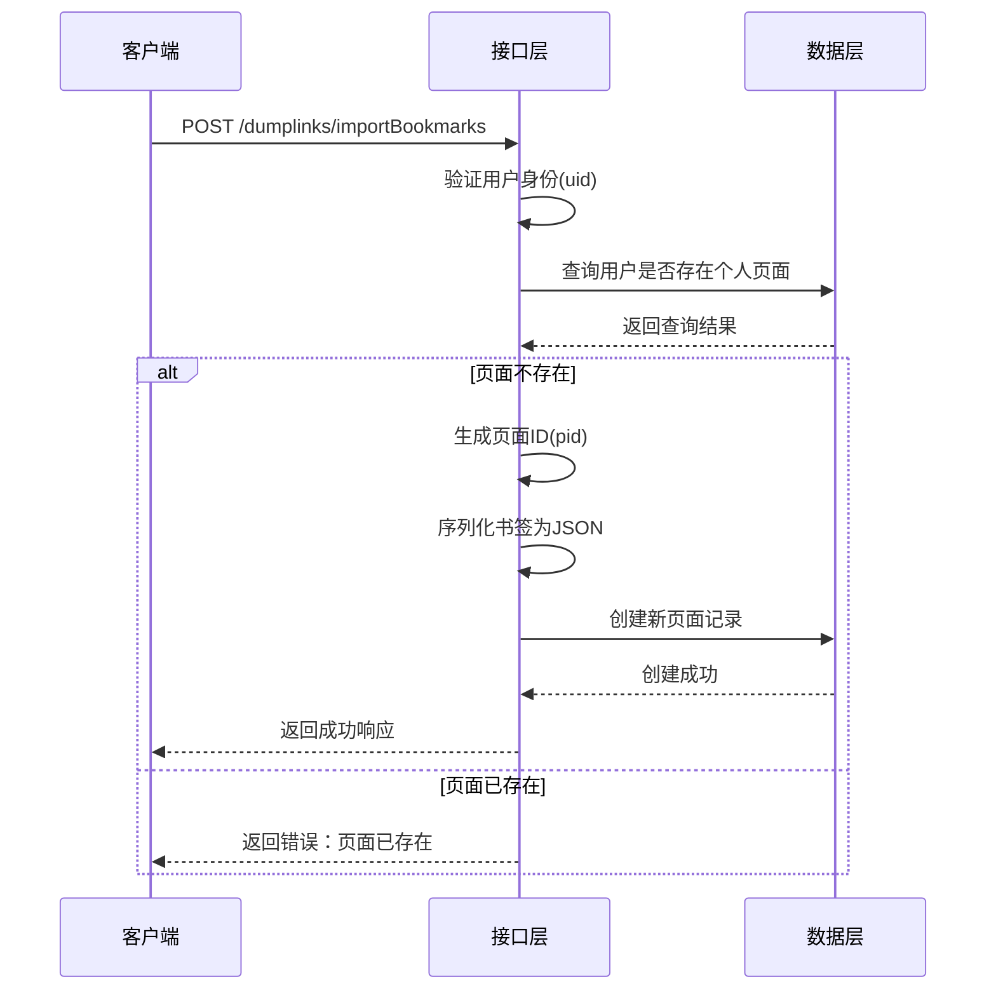
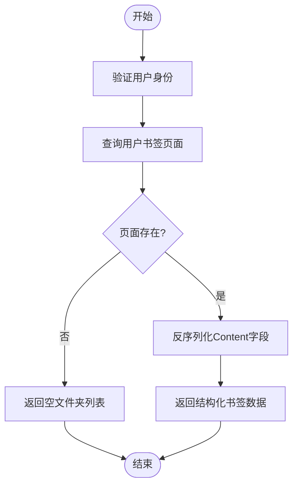
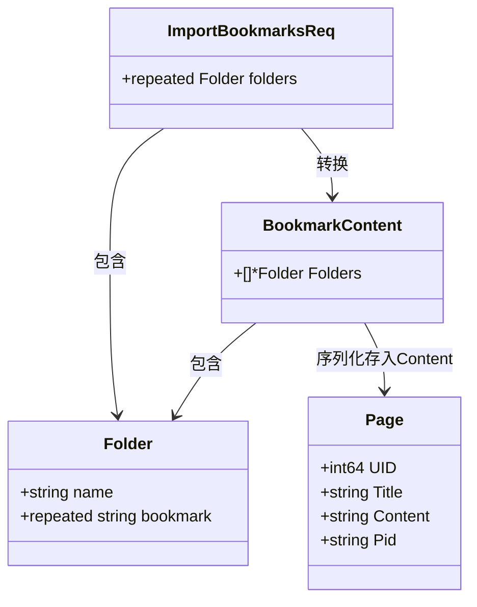

# 书签批量导入导出接口

<cite>
**本文档引用文件**  
- [dumplinks.go](file://app/api/dumplinks.go#L24-L110)
- [dumplinks.proto](file://app/api/proto/dumplinks.proto#L1-L38)
- [page.go](file://app/dal/page.go#L30-L50)
- [page_tool.go](file://app/api/page_tool.go#L96-L107)
</cite>

## 目录
1. [接口概述](#接口概述)
2. [ImportBookmarks 接口详解](#importbookmarks-接口详解)
3. [ExportBookmarks 接口说明](#exportbookmarks-接口说明)
4. [数据结构与请求示例](#数据结构与请求示例)
5. [事务处理与JSON编组流程](#事务处理与json编组流程)

## 接口概述
本接口提供书签的批量导入与导出功能，包含两个核心端点：`ImportBookmarks` 和 `ExportBookmarks`。  
- `ImportBookmarks`：用于将浏览器书签的文件夹结构导入系统，序列化后存储为用户的专属页面。  
- `ExportBookmarks`：用于导出用户已保存的书签结构，当前为桩代码状态，尚未实现完整逻辑。

**Section sources**
- [dumplinks.proto](file://app/api/proto/dumplinks.proto#L1-L38)

## ImportBookmarks 接口详解
`ImportBookmarks` 接口接收用户上传的书签文件夹结构，将其序列化并存储为用户的个人页面。该接口具有以下关键特性：

1. **用户身份验证**：从请求上下文中获取用户ID（`uid`），若未登录或身份无效，则返回 `403 Forbidden`。
2. **唯一性限制**：每个用户仅允许导入一次书签。若用户已存在名为 "Chrome Bookmarks" 的个人页面，则无法再次导入，系统将返回错误提示。
3. **页面创建流程**：
   - 检查用户是否已有个人页面（通过 `dal.Page.GetSelfPage` 查询）。
   - 若不存在，则生成专属页面ID（`pid`），并创建新页面记录。
   - 将书签结构序列化为JSON字符串，存入 `Content` 字段。
4. **事务安全**：整个操作在数据库事务中执行，确保数据一致性。

若用户尝试重复导入，系统将返回如下错误信息：  
`Your self page already exist, please remove them first`



**Diagram sources**
- [dumplinks.go](file://app/api/dumplinks.go#L24-L72)
- [page.go](file://app/dal/page.go#L30-L50)

**Section sources**
- [dumplinks.go](file://app/api/dumplinks.go#L24-L72)

## ExportBookmarks 接口说明
`ExportBookmarks` 接口目前处于桩代码（stub）状态，尚未实现完整的书签导出逻辑。其当前行为如下：

- 方法体被注释，不执行任何实际的数据库查询或数据处理。
- 直接返回一个空的 `ExportBookmarksResp` 响应对象，其中 `Folders` 字段为空数组。

### 未来实现逻辑
该接口未来应实现以下功能：
1. 从请求上下文中获取用户ID。
2. 查询数据库中该用户标题为 "Chrome Bookmarks" 的页面记录。
3. 若页面不存在，返回空的文件夹列表。
4. 若页面存在，反序列化 `Content` 字段中的JSON数据，还原为 `Folder` 结构数组。
5. 将结构化的书签数据返回给客户端。



**Diagram sources**
- [dumplinks.go](file://app/api/dumplinks.go#L74-L110)

**Section sources**
- [dumplinks.go](file://app/api/dumplinks.go#L74-L110)

## 数据结构与请求示例
根据 `dumplinks.proto` 文件定义，接口使用以下数据结构：

### 核心消息定义
- **ImportBookmarksReq / ExportBookmarksResp**
  - `folders` (repeated Folder): 书签文件夹数组

- **Folder**
  - `name` (string): 文件夹名称
  - `bookmark` (repeated string): 书签链接数组

### JSON请求体示例
```json
{
  "folders": [
    {
      "name": "技术博客",
      "bookmark": [
        "https://blog.example.com/go",
        "https://blog.example.com/rust"
      ]
    },
    {
      "name": "社交媒体",
      "bookmark": [
        "https://twitter.com",
        "https://github.com"
      ]
    }
  ]
}
```

**Section sources**
- [dumplinks.proto](file://app/api/proto/dumplinks.proto#L1-L38)

## 事务处理与JSON编组流程
`ImportBookmarks` 接口的实现涉及关键的事务处理和JSON编组过程，具体流程如下：

1. **数据结构定义**：在 `dumplinks.go` 中定义了 `BookmarkContent` 结构体，用于承载 `Folders` 数组，便于JSON序列化。
2. **JSON编组**：使用标准库 `encoding/json` 的 `json.Marshal` 方法将 `BookmarkContent` 对象转换为JSON字符串。若编组失败，返回 `400 Bad Request`。
3. **页面ID生成**：调用 `genOwnerPageId()` 函数生成唯一的页面ID。该函数位于 `page_tool.go`，内部调用 `maths.GenPageID` 生成以特定前缀开头的唯一ID。
4. **数据库操作**：
   - 使用 `dal.Page.GetSelfPage` 检查用户是否已有个人页面。
   - 若无，则创建 `model.Page` 实例，并通过 `dal.Page.Create` 持久化到数据库。
5. **错误处理**：所有数据库操作均通过 `transGormErr` 函数转换错误，确保返回一致的错误码。

该流程确保了书签数据在导入过程中的完整性与一致性。



**Diagram sources**
- [dumplinks.go](file://app/api/dumplinks.go#L24-L72)
- [dumplinks.proto](file://app/api/proto/dumplinks.proto#L1-L38)
- [page_tool.go](file://app/api/page_tool.go#L96-L107)

**Section sources**
- [dumplinks.go](file://app/api/dumplinks.go#L24-L72)
- [page_tool.go](file://app/api/page_tool.go#L96-L107)