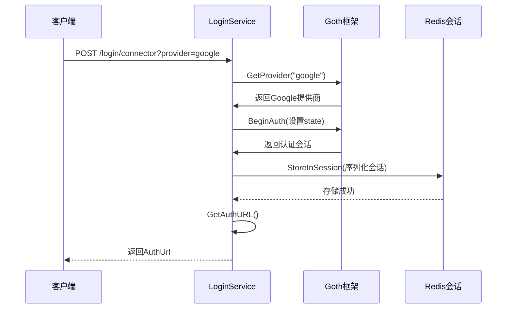
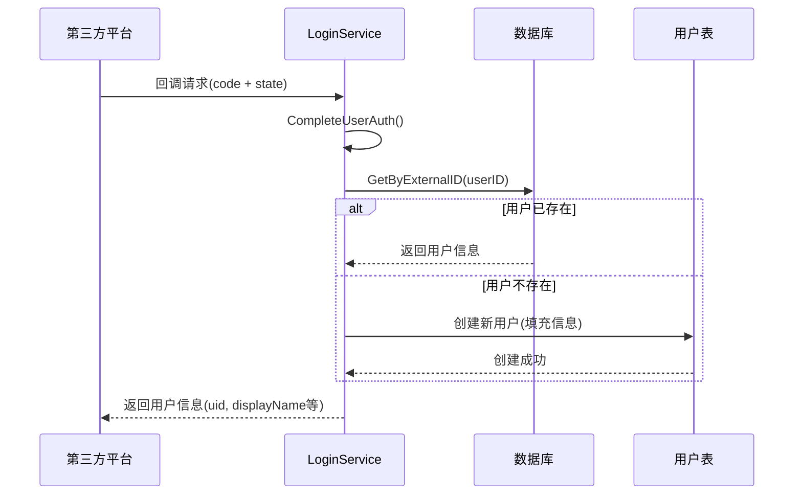
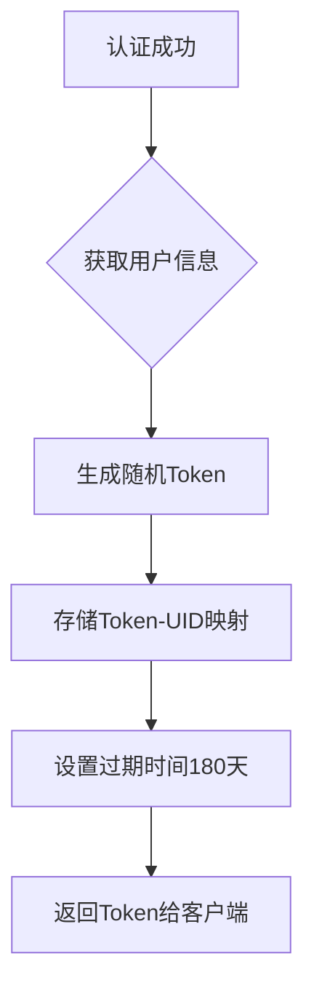
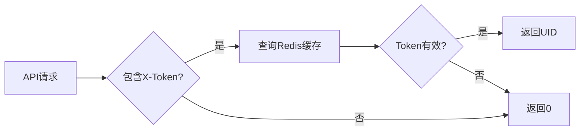

# 用户认证接口

<cite>
**本文档引用文件**  
- [login.go](file://app/api/login.go)
- [provider.go](file://app/pkg/connector-provider/provider.go)
- [google.go](file://app/pkg/connector-google/google.go)
- [user.go](file://app/dal/user.go)
- [redis.go](file://app/dal/redis.go)
- [login.go](file://app/pkg/middleware/login.go)
</cite>

## 目录
1. [简介](#简介)
2. [核心接口机制](#核心接口机制)
3. [X-Token 生成与登录态维持](#x-token-生成与登录态维持)
4. [完整登录流程示例](#完整登录流程示例)
5. [中间件登录态校验](#中间件登录态校验)
6. [认证方式说明](#认证方式说明)

## 简介
本系统采用第三方OAuth认证机制实现用户登录，支持Google、微信、GitHub等提供商。用户无需注册传统账号，系统通过OAuth流程获取用户身份信息并自动创建本地账户。登录成功后，系统生成X-Token用于后续请求的身份验证。

## 核心接口机制

### Connector 接口
`Connector` 接口负责生成第三方授权跳转链接。客户端请求此接口时需指定提供商名称（如 `google`），服务端将根据该名称初始化对应的身份提供商，并生成授权URL。

处理流程如下：
1. 从请求中解析提供商名称
2. 获取对应的身份提供商实例
3. 开始认证流程并生成会话
4. 存储会话状态至Redis
5. 返回授权跳转URL



**Diagram sources**
- [login.go](file://app/api/login.go#L21-L50)

**Section sources**
- [login.go](file://app/api/login.go#L21-L50)
- [provider.go](file://app/pkg/connector-provider/provider.go#L30-L45)

### ConnectorCallback 接口
`ConnectorCallback` 接口处理第三方回调请求，完成用户身份验证并返回用户信息。

处理流程如下：
1. 调用 `gothic.CompleteUserAuth` 完成OAuth回调验证
2. 根据外部用户ID查询本地数据库
3. 若用户不存在，则创建新用户
4. 返回用户基本信息（uid、display_name、avatar等）



**Diagram sources**
- [login.go](file://app/api/login.go#L52-L88)
- [user.go](file://app/dal/user.go#L28-L35)

**Section sources**
- [login.go](file://app/api/login.go#L52-L88)
- [user.go](file://app/dal/user.go#L28-L35)

## X-Token 生成与登录态维持

### X-Token 生成机制
当用户通过第三方认证成功后，系统会为该用户分配一个唯一的X-Token。该Token作为后续所有API请求的身份凭证。

Token生成与存储流程：
1. 系统生成随机Token字符串
2. 将Token与用户UID映射关系存储至Redis
3. 设置过期时间（默认180天）
4. 将Token返回给客户端



**Diagram sources**
- [redis.go](file://app/dal/redis.go#L75-L85)

### 登录状态维持
客户端在后续请求中需在Header中携带X-Token：
```
X-Token: your-generated-token-here
```

服务端通过以下步骤验证登录状态：
1. 从请求Header中提取X-Token
2. 查询Redis中对应的UID
3. 若存在且有效，则认为用户已登录
4. 若不存在或已过期，则返回未认证错误

## 完整登录流程示例

### 发起登录请求
```bash
curl -X POST "http://localhost:8080/login/connector" \
  -H "provider: google" \
  -H "Content-Type: application/json"
```

响应：
```json
{
  "auth_url": "https://accounts.google.com/o/oauth2/auth?response_type=code&client_id=..."
}
```

### 处理回调请求
用户授权后，第三方平台会重定向到回调地址：

```
GET /login/connector/callback?code=auth_code&state=state_value
```

服务端处理后返回用户信息：
```json
{
  "uid": 12345,
  "display_name": "张三",
  "username": "zhangsan",
  "avatar": "https://lh3.googleusercontent.com/a/...",
  "email": "zhangsan@gmail.com"
}
```

**Section sources**
- [login.go](file://app/api/login.go#L21-L88)

## 中间件登录态校验

### GetLoginUid 函数
所有需要认证的API接口都会调用 `GetLoginUid` 函数来获取当前登录用户的UID。

```go
func GetLoginUid(g *api.Context) int64 {
	token := g.GetHeader("X-Token")
	return dal.C.GetXToken(g.Request.Context(), token)
}
```

该函数执行流程：
1. 从请求头获取X-Token
2. 调用Redis缓存层查询对应UID
3. 返回UID（若未登录则返回0）



**Diagram sources**
- [login.go](file://app/pkg/middleware/login.go#L10-L16)

**Section sources**
- [login.go](file://app/pkg/middleware/login.go#L10-L16)

## 认证方式说明
当前系统**未实现**传统的用户名密码登录功能。`Login` 和 `Register` 接口已被注释，系统主要依赖第三方OAuth认证。

支持的第三方提供商：
- Google（通过环境变量配置Client ID和Secret）
- 微信
- GitHub（仅限本地开发环境）

所有提供商的初始化在 `provider.go` 文件中完成，通过 `goth` 框架统一管理。系统使用Redis存储会话信息，确保分布式环境下的认证一致性。

**Section sources**
- [provider.go](file://app/pkg/connector-provider/provider.go#L30-L45)
- [google.go](file://app/pkg/connector-google/google.go#L10-L25)