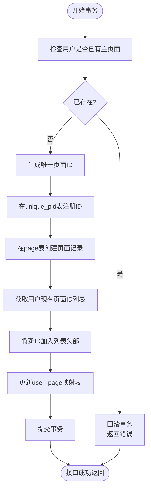
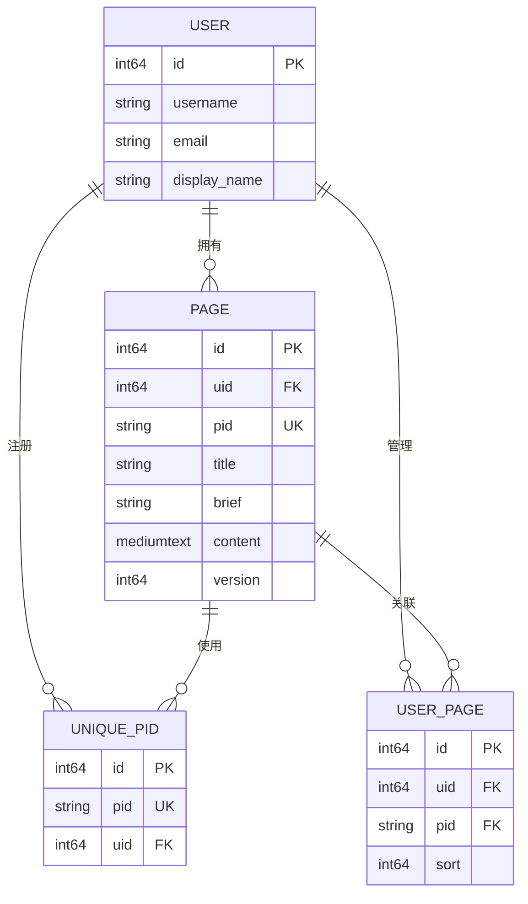

# 创建页面

<cite>
**本文档中引用的文件**  
- [space.go](file://app/api/space.go#L159-L230)
- [page_tool.go](file://app/api/page_tool.go#L96-L98)
- [page.go](file://app/dal/page.go#L20-L35)
- [unique_pid.go](file://app/dal/unique_pid.go#L10-L17)
- [user_page.go](file://app/dal/user_page.go#L10-L40)
- [page.sql](file://app/dal/gensql/page.sql#L1-L25)
- [readme.md](file://app/dal/gensql/readme.md#L1-L13)
</cite>

## 目录
1. [业务规则说明](#业务规则说明)
2. [接口流程详解](#接口流程详解)
3. [事务处理机制](#事务处理机制)
4. [请求参数说明](#请求参数说明)
5. [JSON请求示例](#json请求示例)
6. [响应结构说明](#响应结构说明)
7. [数据模型与表结构](#数据模型与表结构)

## 业务规则说明

创建页面接口遵循以下核心业务规则：

- **普通用户限制**：每个普通用户仅允许创建一个主页面（Owner Page）。系统通过 `dal.Page.GetSelfPage` 方法检查当前用户是否已存在主页面，若已存在则返回错误提示，阻止重复创建。
- **未来扩展性**：当前版本限制单页面创建，为支持未来付费用户创建多个页面的功能预留了扩展空间。该功能可通过调整业务逻辑判断条件实现，无需重构核心流程。
- **权限控制**：用户必须处于登录状态才能调用此接口，系统通过 `middleware.GetLoginUid` 获取当前登录用户的唯一标识（UID），未登录用户将被拒绝访问。

该设计确保了用户主页的唯一性，同时为后续多页面功能提供了清晰的演进路径。

**Section sources**
- [space.go](file://app/api/space.go#L159-L165)
- [page.go](file://app/dal/page.go#L20-L35)

## 接口流程详解

`CreatePage` 接口的执行流程如下，所有操作均在数据库事务中完成以保证数据一致性：

1. **用户身份验证**：首先通过 `middleware.GetLoginUid` 获取当前登录用户的 UID，若未登录则返回“需要登录”错误。
2. **内容序列化**：使用 `sonic.MarshalString` 将请求中的 `collections` 字段（Go 结构体）序列化为 JSON 字符串，存储于数据库的 `content` 字段中。
3. **主页面存在性检查**：调用 `dal.Page.GetSelfPage(ctx, uid, tx)` 查询该用户是否已存在主页面。如果已存在有效页面（`page != nil && page.ID > 0`），则返回“您已拥有主页面，无法创建更多”的错误。
4. **生成唯一页面ID**：调用 `genOwnerPageId()` 函数生成以 'O' 开头的全局唯一页面ID（`pid`）。
5. **注册唯一PID**：将生成的 `pid` 和 `uid` 作为键值对存入 `unique_pid` 表，通过数据库唯一约束防止ID冲突。
6. **创建页面记录**：在 `page` 表中插入新页面记录，包含标题、简介、序列化后的内容及初始版本号。
7. **更新用户页面关系**：查询用户当前的页面ID列表，将新创建的页面ID插入列表头部，然后调用 `dal.UserPage.SaveUserPageIds` 更新 `user_page` 映射表，完成用户与页面的绑定。

**Section sources**
- [space.go](file://app/api/space.go#L166-L229)
- [page_tool.go](file://app/api/page_tool.go#L96-L98)
- [unique_pid.go](file://app/dal/unique_pid.go#L10-L17)
- [user_page.go](file://app/dal/user_page.go#L10-L40)

## 事务处理机制

整个 `CreatePage` 操作被包裹在一个数据库事务（`dal.Q.Transaction`）中执行。事务是确保数据一致性的核心机制。



**Diagram sources**
- [space.go](file://app/api/space.go#L175-L229)

**Section sources**
- [space.go](file://app/api/space.go#L175-L229)

### 事务的作用

- **原子性（Atomicity）**：事务中的所有操作要么全部成功，要么全部失败。例如，如果在更新 `user_page` 表时发生错误，之前创建的 `page` 记录和注册的 `unique_pid` 都将被回滚，避免产生“孤儿”数据。
- **一致性（Consistency）**：确保数据库从一个有效状态转换到另一个有效状态。通过事务，`page`、`unique_pid` 和 `user_page` 三张表的数据始终保持同步和一致。
- **隔离性（Isolation）**：防止并发操作导致的数据错乱。当一个用户正在创建页面时，其他并发请求也会进行相同的 `GetSelfPage` 检查，确保不会创建出两个主页面。
- **持久性（Durability）**：一旦事务提交，所有更改都将永久保存在数据库中。

## 请求参数说明

| 参数名 | 类型 | 必填 | 说明 | 格式要求 |
| :--- | :--- | :--- | :--- | :--- |
| `title` | string | 是 | 页面标题 | 最大长度256个字符，UTF-8编码 |
| `brief` | string | 否 | 页面简要描述 | 最大长度1024个字符，UTF-8编码 |
| `collections` | array | 是 | 页面内容集合，包含文件夹和链接的定义 | 必须是一个有效的JSON数组，其结构需符合后端定义的 `Collections` 模型 |

**Section sources**
- [space.go](file://app/api/space.go#L159-L230)

## JSON请求示例

```json
{
  "title": "我的收藏夹",
  "brief": "整理我的常用网站和学习资料",
  "collections": [
    {
      "id": "fld_1",
      "name": "工作",
      "type": "folder",
      "children": [
        {
          "id": "lnk_1",
          "name": "公司内网",
          "type": "link",
          "url": "https://intranet.example.com"
        }
      ]
    },
    {
      "id": "fld_2",
      "name": "学习",
      "type": "folder",
      "children": []
    }
  ]
}
```

## 响应结构说明

成功创建页面后，接口返回 `CreatePageResp` 结构体，包含以下字段：

- **`pageId`** (string): 新创建页面的唯一ID（即 `pid`），以 'O' 开头。
- **`version`** (int64): 页面的初始版本号，设定为 `0`。此版本号用于乐观锁机制，在后续更新页面时进行并发控制。
- **`pageIds`** (string[]): 用户空间中所有页面ID的有序列表。新创建的页面ID被插入到列表的**最前面**（索引0位置），表示它在用户界面中将作为第一个页面展示。该列表的顺序由 `user_page` 表的 `sort` 字段维护。

```json
{
  "pageId": "O1a2b3c4d5e6f7g8",
  "version": 0,
  "pageIds": [
    "O1a2b3c4d5e6f7g8",
    "R9h8i7j6k5l4m3n2",
    "E5f6g7h8i9j0k1l2"
  ]
}
```

**Section sources**
- [space.go](file://app/api/space.go#L225-L229)

## 数据模型与表结构

系统的数据模型围绕用户（`user`）和页面（`page`）展开，通过 `unique_pid` 和 `user_page` 两张辅助表来保障ID唯一性和管理展示关系。



**Diagram sources**
- [page.sql](file://app/dal/gensql/page.sql#L1-L25)
- [readme.md](file://app/dal/gensql/readme.md#L1-L13)

### 核心表说明

- **`page` 表**：存储页面的核心数据。`pid` 字段是主页面的唯一标识，具有唯一索引（`uk_pid`）。
- **`unique_pid` 表**：作为一个“ID分配池”，确保所有类型的页面ID（Owner、Readonly、Edit、Admin）在全局范围内唯一，防止ID冲突。
- **`user_page` 表**：作为用户与页面之间的多对多关系映射表，其 `sort` 字段用于存储用户自定义的页面排序。