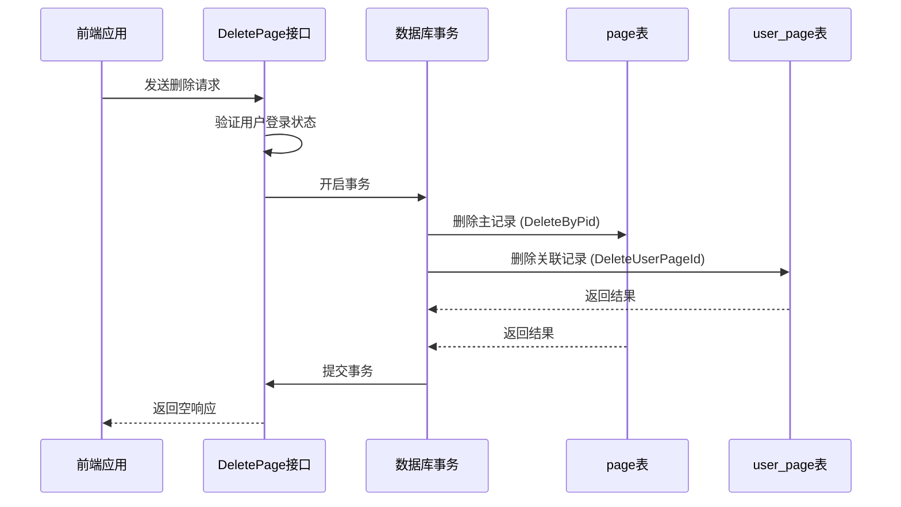
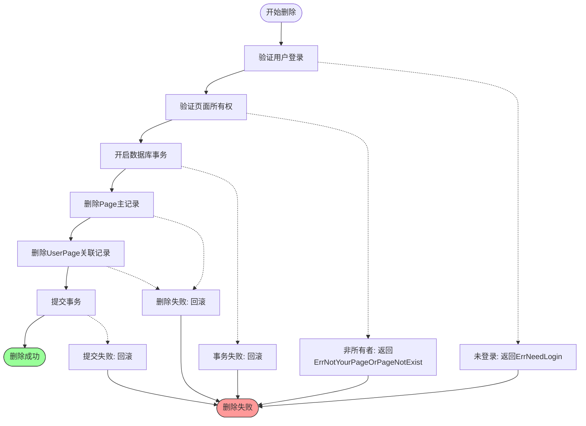
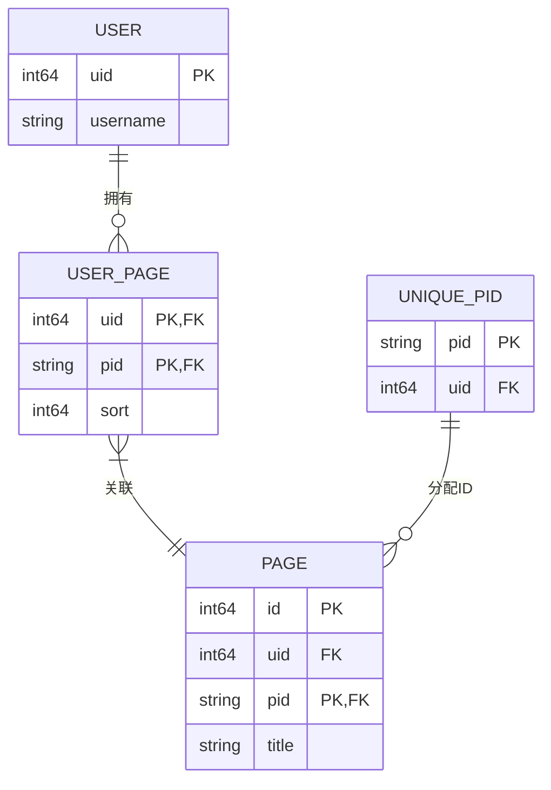

# 删除页面

<cite>
**本文档引用的文件**  
- [app/api/space.go](file://app/api/space.go)
- [app/dal/page.go](file://app/dal/page.go)
- [app/dal/user_page.go](file://app/dal/user_page.go)
- [app/dal/unique_pid.go](file://app/dal/unique_pid.go)
- [app/dal/model/page.gen.go](file://app/dal/model/page.gen.go)
</cite>

## 目录
1. [接口概述](#接口概述)
2. [实现流程](#实现流程)
3. [数据完整性保障](#数据完整性保障)
4. [错误处理与响应](#错误处理与响应)
5. [请求示例](#请求示例)
6. [对用户空间的影响](#对用户空间的影响)
7. [ID保留与清理策略](#id保留与清理策略)
8. [前端提示建议](#前端提示建议)

## 接口概述

`DeletePage` 接口用于删除用户拥有的页面。该操作会永久移除页面的主记录及其在用户空间中的展示关系，但保留其唯一ID以防止ID重复分配。该接口要求用户已登录且为页面所有者。

**接口路径**：`POST /api/space/DeletePage`  
**请求体**：`{ "PageId": "O123456789abcdef" }`  
**响应体**：空对象 `{}`

## 实现流程

删除页面的操作通过 `spaceServiceImpl.DeletePage` 方法实现，其执行流程如下：

1. **验证登录状态**：通过 `middleware.GetLoginUid` 获取当前登录用户的 UID，若未登录则返回 `ErrNeedLogin` 错误。
2. **获取页面ID**：从请求中提取 `PageId`。
3. **事务化删除**：在数据库事务中执行以下两个删除操作：
   - 调用 `dal.Page.DeleteByPid` 删除 `page` 表中的主记录。
   - 调用 `dal.UserPage.DeleteUserPageId` 删除 `user_page` 表中的关联记录。
4. **返回结果**：若事务成功，返回空响应；若失败，返回相应的错误。



**Diagram sources**
- [app/api/space.go](file://app/api/space.go#L256-L284)
- [app/dal/page.go](file://app/dal/page.go#L170-L182)
- [app/dal/user_page.go](file://app/dal/user_page.go#L57-L67)

**Section sources**
- [app/api/space.go](file://app/api/space.go#L256-L284)

## 数据完整性保障

为确保数据一致性，删除操作在数据库事务中执行。`dal.Page.DeleteByPid` 和 `dal.UserPage.DeleteUserPageId` 两个操作必须同时成功或同时失败。

- **`dal.Page.DeleteByPid`**：从 `page` 表中删除指定用户拥有的页面记录。删除条件为 `UID = uid AND Pid = pid`，确保用户只能删除自己的页面。
- **`dal.UserPage.DeleteUserPageId`**：从 `user_page` 表中删除用户空间中的页面展示关系。该表用于维护用户页面的排序和展示顺序。

两个操作在同一个事务中执行，避免了部分删除导致的数据不一致问题。



**Diagram sources**
- [app/dal/page.go](file://app/dal/page.go#L170-L182)
- [app/dal/user_page.go](file://app/dal/user_page.go#L57-L67)

**Section sources**
- [app/dal/page.go](file://app/dal/page.go#L170-L182)
- [app/dal/user_page.go](file://app/dal/user_page.go#L57-L67)

## 错误处理与响应

### 成功响应
- **HTTP状态码**：200 OK
- **响应体**：`{}`（空对象）

### 可能的错误码
- **`ErrNeedLogin`**：用户未登录。HTTP状态码 401。
- **`ErrNotYourPageOrPageNotExist`**：页面不存在或用户不是页面所有者。HTTP状态码 400。
- **数据库错误**：如事务冲突、连接失败等。返回相应的系统错误码。

**Section sources**
- [app/api/space.go](file://app/api/space.go#L256-L284)
- [app/dal/page.go](file://app/dal/page.go#L170-L182)

## 请求示例

```json
POST /api/space/DeletePage
Content-Type: application/json

{
  "PageId": "O1a2b3c4d5e6f7g8"
}
```

**成功响应**：
```json
{}
```

**失败响应（未登录）**：
```json
{
  "error": "need login"
}
```

**失败响应（非所有者）**：
```json
{
  "error": "not your page or page not exist"
}
```

## 对用户空间的影响

删除页面后，该页面将从用户的个人空间（MySpace）中移除。`GetMySpace` 接口通过 `dal.UserPage.GetUserPageIds` 获取用户的所有页面ID，然后逐个查询页面信息。由于 `user_page` 记录已被删除，该页面ID不会出现在 `GetMySpace` 的返回结果中。



**Diagram sources**
- [app/dal/model/page.gen.go](file://app/dal/model/page.gen.go#L0-L20)
- [app/dal/user_page.go](file://app/dal/user_page.go#L0-L88)
- [app/dal/unique_pid.go](file://app/dal/unique_pid.go#L0-L27)

**Section sources**
- [app/api/space.go](file://app/api/space.go#L327-L367)

## ID保留与清理策略

在删除页面时，`unique_pid` 记录被**保留**，不进行删除。这是为了防止该ID被重新分配给其他用户或页面，从而避免ID冲突。

```go
// 还有一个unique_pid先保留，不删除
```

保留的 `unique_pid` 记录后续可能通过后台清理任务进行回收，但当前逻辑中未实现自动清理。这种策略确保了ID的全局唯一性，即使页面被删除，其ID也不会被重复使用。

**Section sources**
- [app/api/space.go](file://app/api/space.go#L278-L280)

## 前端提示建议

由于删除操作是**不可逆的**，前端在调用此接口前应：
1. 显示确认对话框，提示用户“此操作将永久删除页面，是否继续？”
2. 明确告知用户删除后无法恢复。
3. 提供取消选项。

这可以有效防止用户误操作导致数据丢失。