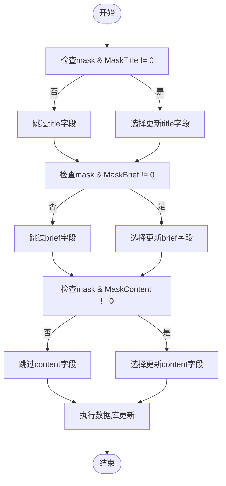
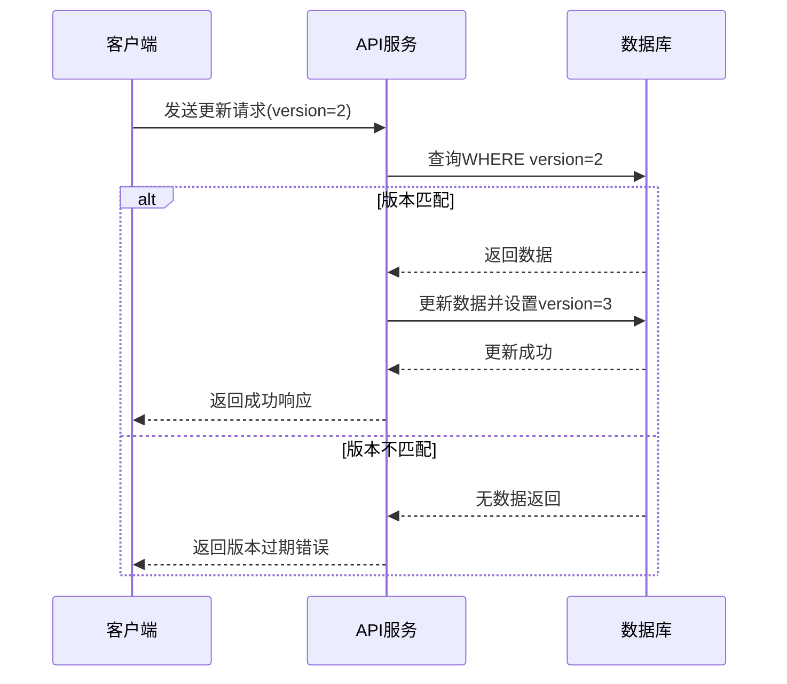
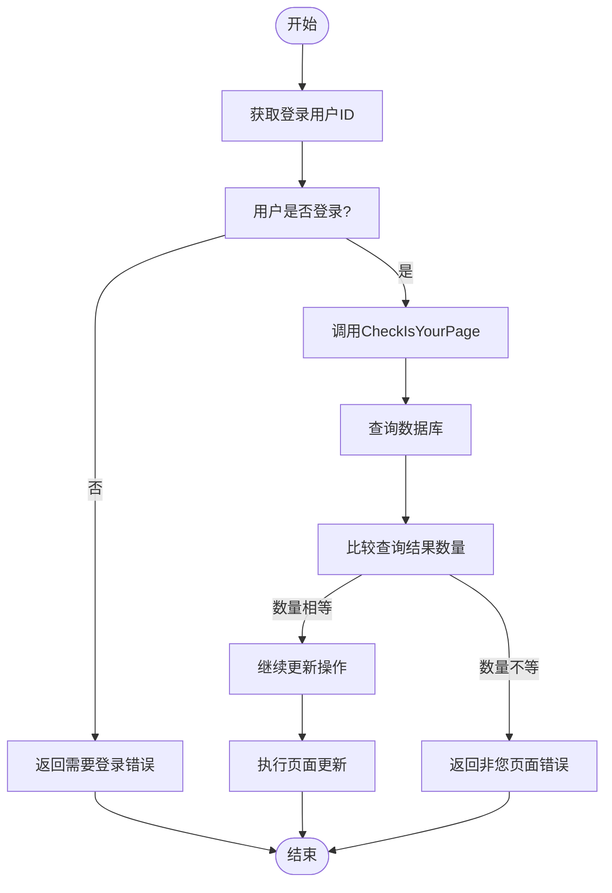

# 更新页面

<cite>
**本文档引用的文件**   
- [page.go](file://app/dal/page.go)
- [space.go](file://app/api/space.go)
- [const.go](file://app/conf/const.go)
- [space.proto](file://app/api/proto/space.proto)
- [page_tool.go](file://app/api/page_tool.go)
</cite>

## 目录
1. [接口概述](#接口概述)
2. [mask字段的位运算机制](#mask字段的位运算机制)
3. [版本控制与乐观锁](#版本控制与乐观锁)
4. [页面所有权验证](#页面所有权验证)
5. [事务处理流程](#事务处理流程)
6. [请求示例](#请求示例)
7. [响应字段说明](#响应字段说明)
8. [常见错误处理](#常见错误处理)

## 接口概述
更新页面接口用于修改用户页面的标题、描述和内容等信息。该接口通过`mask`字段控制更新的字段范围，使用`version`字段实现乐观锁机制，确保数据一致性。接口位于`space.UpdatePage`，通过`/space/updatePage`路径提供服务。

**Section sources**
- [space.go](file://app/api/space.go#L232-L254)
- [space.proto](file://app/api/proto/space.proto#L200-L212)

## mask字段的位运算机制
`mask`字段采用位运算机制来指定需要更新的字段。每个字段对应一个二进制位，通过按位或操作组合多个字段的更新需求。

- `0x01` (1) 表示更新标题（title）
- `0x02` (2) 表示更新描述（brief）
- `0x04` (4) 表示更新内容（collections）

在`dal.Page.UpdatePage`方法中，通过位与运算判断`mask`值是否包含特定字段的更新标志：



**Diagram sources**
- [page.go](file://app/dal/page.go#L137-L168)
- [const.go](file://app/conf/const.go#L30-L34)

**Section sources**
- [page.go](file://app/dal/page.go#L137-L168)
- [const.go](file://app/conf/const.go#L30-L34)

## 版本控制与乐观锁
系统采用乐观锁机制防止并发更新导致的数据冲突。每个页面记录包含`version`字段，初始值为0，每次成功更新后递增1。

在更新操作中，数据库查询条件包含`u.Version.Eq(version)`，确保只有当数据库中的版本号与请求中的版本号一致时才能更新成功。如果版本号不匹配（说明页面已被其他请求更新），则返回`ErrUpdateMissNeedRefreshPage`错误。

版本号递增规则：
- 更新成功时，`version`字段设置为`version + 1`
- 当版本号达到最大值后会回退到0（根据proto文件注释）



**Diagram sources**
- [page.go](file://app/dal/page.go#L137-L168)
- [space.proto](file://app/api/proto/space.proto#L209)

**Section sources**
- [page.go](file://app/dal/page.go#L137-L168)
- [space.proto](file://app/api/proto/space.proto#L209)

## 页面所有权验证
在执行页面更新前，系统通过`CheckIsYourPage`方法验证用户对页面的所有权。该方法检查指定的`pageId`是否属于当前登录用户。

验证逻辑：
1. 使用`uid`和`pageIds`作为查询条件
2. 查询结果数量必须等于请求的`pageIds`数量
3. 如果数量不匹配，返回`ErrNotYourPageOrPageNotExist`错误



**Diagram sources**
- [space.go](file://app/api/space.go#L232-L254)
- [page.go](file://app/dal/page.go#L114-L129)

**Section sources**
- [space.go](file://app/api/space.go#L232-L254)
- [page.go](file://app/dal/page.go#L114-L129)

## 事务处理流程
页面更新操作在一个数据库事务中执行，确保数据的一致性和完整性。虽然代码中没有显式创建事务，但`tx`参数支持传入事务查询对象，为未来扩展提供了可能。

主要处理步骤：
1. 验证用户登录状态
2. 验证页面所有权
3. 序列化collections数据
4. 执行页面更新
5. 返回更新结果

**Section sources**
- [space.go](file://app/api/space.go#L232-L254)

## 请求示例
以下是不同`mask`组合的请求示例：

### 仅更新标题
```json
{
  "page_id": "O123456",
  "title": "新标题",
  "brief": "",
  "collections": [],
  "version": 1,
  "mask": 1
}
```

### 更新描述和内容
```json
{
  "page_id": "O123456",
  "title": "",
  "brief": "新的页面描述",
  "collections": [
    {
      "links": [
        {
          "title": "新链接",
          "url": "https://example.com",
          "tags": ["标签1", "标签2"]
        }
      ]
    }
  ],
  "version": 1,
  "mask": 6
}
```

### 更新所有字段
```json
{
  "page_id": "O123456",
  "title": "新标题",
  "brief": "新的页面描述",
  "collections": [
    {
      "links": [
        {
          "title": "新链接",
          "url": "https://example.com",
          "tags": ["标签1", "标签2"]
        }
      ]
    }
  ],
  "version": 1,
  "mask": 7
}
```

**Section sources**
- [space.proto](file://app/api/proto/space.proto#L190-L209)
- [conftest.py](file://tests/conftest.py#L119-L138)

## 响应字段说明
成功更新页面后，接口返回`UpdatePageResp`对象，包含以下字段：

- `update_time`: 更新时间戳，表示页面最后更新的时间
- `version`: 新的版本号，比请求中的版本号大1

这些字段的变化表明：
- `update_time`会更新为当前时间
- `version`会递增1，用于下一次更新操作

**Section sources**
- [space.proto](file://app/api/proto/space.proto#L211-L212)

## 常见错误处理
### 版本过期
当请求的`version`与数据库中的版本不匹配时，返回`ErrUpdateMissNeedRefreshPage`错误。客户端应先获取最新页面数据，再尝试更新。

### 非法mask值
当`mask`值不在有效范围（1-7）内时，根据proto文件的验证规则，会返回参数验证错误。

### 非您页面或页面不存在
当尝试更新不属于当前用户的页面时，返回`ErrNotYourPageOrPageNotExist`错误。

### 需要登录
未登录用户尝试更新页面时，返回`ErrNeedLogin`错误。

**Section sources**
- [page.go](file://app/dal/page.go#L165-L167)
- [space.go](file://app/api/space.go#L234-L235)
- [page.go](file://app/dal/page.go#L127-L129)
- [space.go](file://app/api/space.go#L232-L233)