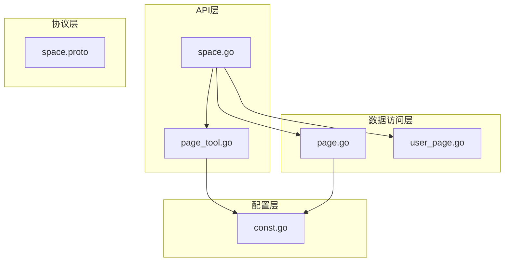
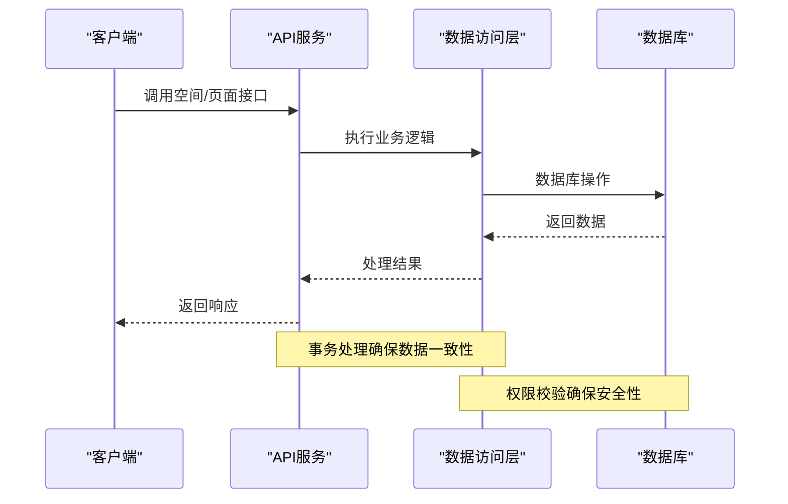
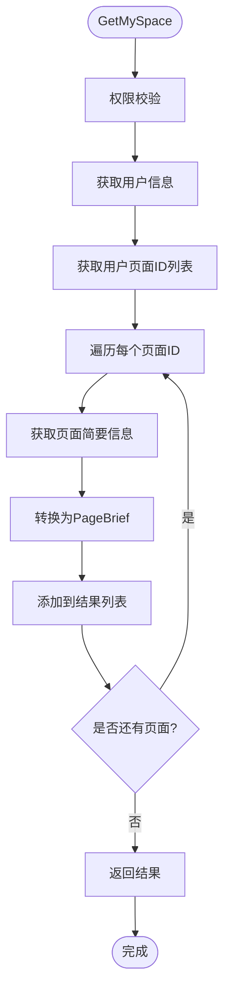
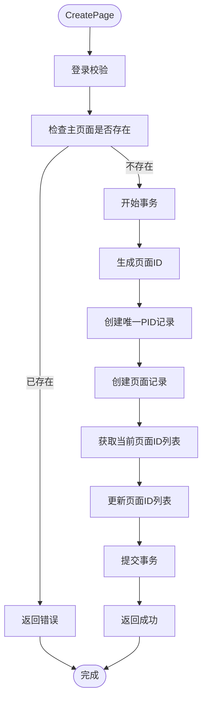
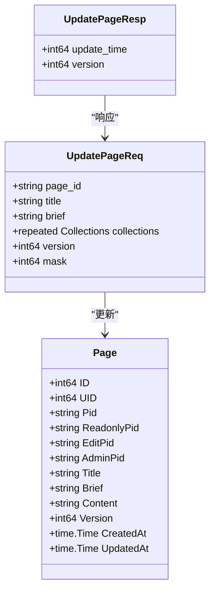
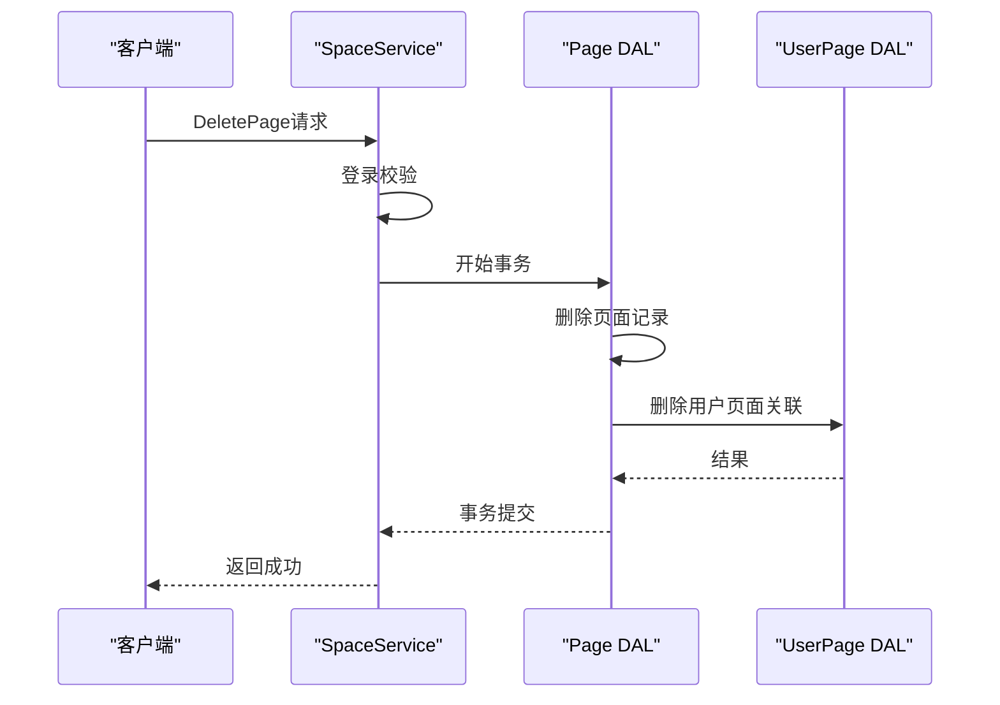
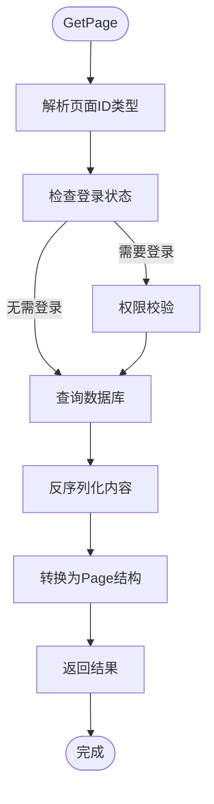
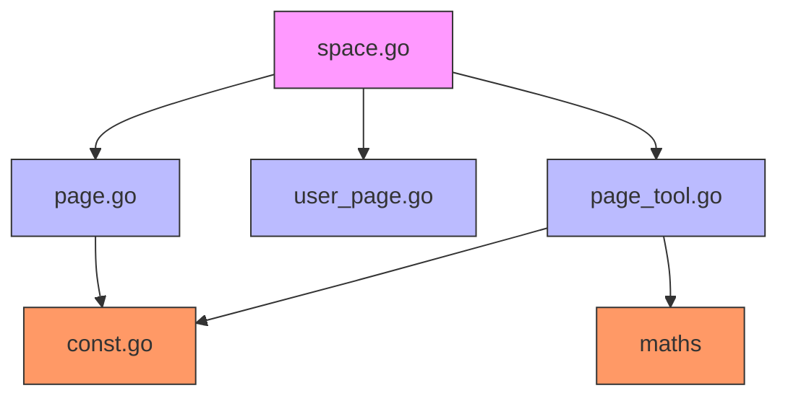

# 空间与页面管理接口

<cite>
**本文档引用的文件**
- [space.go](file://app/api/space.go)
- [space.proto](file://app/api/proto/space.proto)
- [page.go](file://app/dal/page.go)
- [user_page.go](file://app/dal/user_page.go)
- [page_tool.go](file://app/api/page_tool.go)
- [const.go](file://app/conf/const.go)
</cite>

## 目录
1. [简介](#简介)
2. [项目结构](#项目结构)
3. [核心组件](#核心组件)
4. [架构概述](#架构概述)
5. [详细组件分析](#详细组件分析)
6. [依赖分析](#依赖分析)
7. [性能考虑](#性能考虑)
8. [故障排除指南](#故障排除指南)
9. [结论](#结论)

## 简介
本文档详细说明了空间与页面管理功能的核心接口，包括GetMySpace、CreatePage、UpdatePage、DeletePage和GetPage等。重点解释了“我的空间”概念及其与用户页面的关系，创建页面时的唯一性限制，以及更新页面时mask字段的位运算机制。

## 项目结构

**Diagram sources**
- [space.go](file://app/api/space.go#L1-L400)
- [page.go](file://app/dal/page.go#L1-L264)
- [user_page.go](file://app/dal/user_page.go#L1-L89)
- [page_tool.go](file://app/api/page_tool.go#L1-L112)
- [const.go](file://app/conf/const.go#L1-L63)

**Section sources**
- [space.go](file://app/api/space.go#L1-L400)
- [space.proto](file://app/api/proto/space.proto#L1-L319)

## 核心组件

本文档涵盖的核心接口包括：
- **GetMySpace**: 获取用户的空间信息
- **CreatePage**: 创建新页面
- **UpdatePage**: 更新页面内容
- **DeletePage**: 删除页面
- **GetPage**: 获取特定页面数据

这些接口共同构成了空间与页面管理的核心功能，实现了用户对其个人空间的完整控制。

**Section sources**
- [space.go](file://app/api/space.go#L1-L400)
- [space.proto](file://app/api/proto/space.proto#L1-L319)

## 架构概述

**Diagram sources**
- [space.go](file://app/api/space.go#L1-L400)
- [page.go](file://app/dal/page.go#L1-L264)

## 详细组件分析

### GetMySpace 接口分析

`GetMySpace`接口用于获取用户的空间信息，返回包含空间名称和页面简要信息的响应。

**请求参数**
- 无请求参数

**响应结构**
- `space_name`: 空间名称（用户显示名称）
- `page_briefs`: 页面简要信息列表

**业务规则**
1. 用户必须登录才能访问自己的空间
2. 返回的页面列表包含用户拥有的所有页面
3. 每个页面返回简要信息，不包含完整内容

**PageBrief裁剪逻辑**
在`toPageBrief`函数中实现，通过`GetPageBrief`方法从数据库获取数据时使用`Omit(u.Content)`排除内容字段，确保只返回必要的元数据。

**Diagram sources**
- [space.go](file://app/api/space.go#L100-L120)
- [page_tool.go](file://app/api/page_tool.go#L50-L80)
- [page.go](file://app/dal/page.go#L76-L112)

**Section sources**
- [space.go](file://app/api/space.go#L100-L120)
- [page_tool.go](file://app/api/page_tool.go#L50-L80)

### CreatePage 接口分析

`CreatePage`接口用于创建新页面，普通用户仅能创建一个主页面。

**请求参数**
- `title`: 页面标题
- `brief`: 页面描述
- `collections`: 页面中的文件夹集合

**响应结构**
- `page_id`: 新创建的页面ID
- `version`: 版本号（初始为0）
- `page_ids`: 更新后的页面ID列表

**业务规则**
1. 用户必须登录
2. 普通用户只能创建一个主页面（OwnerPage）
3. 使用事务确保数据一致性
4. 创建成功后自动将新页面ID添加到用户页面列表

**唯一性限制实现**
在`CreatePage`方法中，首先调用`GetSelfPage`检查用户是否已存在主页面，如果存在则返回错误："You already have a self page, cannot create more"。

**Diagram sources**
- [space.go](file://app/api/space.go#L150-L200)
- [page.go](file://app/dal/page.go#L20-L40)

**Section sources**
- [space.go](file://app/api/space.go#L150-L200)
- [const.go](file://app/conf/const.go#L1-L63)

### UpdatePage 接口分析

`UpdatePage`接口用于更新页面内容，使用mask字段控制更新范围。

**请求参数**
- `page_id`: 页面ID
- `title`: 新标题
- `brief`: 新描述
- `collections`: 新的文件夹集合
- `version`: 当前版本号
- `mask`: 更新掩码（位运算）

**响应结构**
- `update_time`: 更新时间戳
- `version`: 新版本号

**mask字段位运算机制**
- `0x01` (1): 更新标题
- `0x02` (2): 更新描述
- `0x04` (4): 更新内容

通过位运算`mask & MaskTitle`等操作确定需要更新的字段。

**版本控制实现**
使用乐观锁机制，更新时检查版本号是否匹配，成功更新后版本号递增。

**Diagram sources**
- [space.go](file://app/api/space.go#L200-L230)
- [page.go](file://app/dal/page.go#L105-L168)
- [space.proto](file://app/api/proto/space.proto#L254-L301)

**Section sources**
- [space.go](file://app/api/space.go#L200-L230)
- [page.go](file://app/dal/page.go#L105-L168)

### DeletePage 接口分析

`DeletePage`接口用于删除指定页面。

**请求参数**
- `page_id`: 要删除的页面ID

**响应结构**
- 空响应

**业务规则**
1. 用户必须登录
2. 只能删除自己拥有的页面
3. 使用事务确保数据一致性
4. 同时从用户页面列表中移除该页面ID

**事务处理实现**
在`DeletePage`方法中使用`dal.Q.Transaction`确保页面记录和用户页面关联记录的删除操作在同一个事务中完成。

**Diagram sources**
- [space.go](file://app/api/space.go#L230-L260)
- [page.go](file://app/dal/page.go#L160-L180)

**Section sources**
- [space.go](file://app/api/space.go#L230-L260)
- [user_page.go](file://app/dal/user_page.go#L70-L80)

### GetPage 接口分析

`GetPage`接口用于获取特定页面的完整数据。

**请求参数**
- `page_id`: 页面ID

**响应结构**
- `page`: 页面完整信息

**权限校验机制**
根据页面ID的前缀类型进行不同的权限校验：
- OwnerPage (O): 必须是页面所有者且登录
- ReadOnlyPage (R): 无需登录，任何人都可访问
- EditPage (E): 必须登录
- AdminPage (A): 必须登录

**Diagram sources**
- [space.go](file://app/api/space.go#L80-L100)
- [page.go](file://app/dal/page.go#L54-L81)
- [page_tool.go](file://app/api/page_tool.go#L50-L110)

**Section sources**
- [space.go](file://app/api/space.go#L80-L100)
- [page.go](file://app/dal/page.go#L54-L81)

## 依赖分析

**Diagram sources**
- [space.go](file://app/api/space.go#L1-L400)
- [page.go](file://app/dal/page.go#L1-L264)
- [user_page.go](file://app/dal/user_page.go#L1-L89)
- [page_tool.go](file://app/api/page_tool.go#L1-L112)
- [const.go](file://app/conf/const.go#L1-L63)

**Section sources**
- [space.go](file://app/api/space.go#L1-L400)
- [page.go](file://app/dal/page.go#L1-L264)

## 性能考虑
- 使用GORM的Omit功能在获取简要信息时排除大字段Content
- 通过事务确保数据一致性，避免部分更新
- 使用索引优化数据库查询性能
- 位运算mask字段减少不必要的字段更新

## 故障排除指南
- **创建页面失败**: 检查是否已存在主页面
- **更新页面失败**: 检查版本号是否匹配，mask值是否正确
- **删除页面失败**: 确认页面ID正确且为用户所有
- **权限错误**: 检查登录状态和页面访问权限

## 结论
本文档详细说明了空间与页面管理功能的实现细节，包括核心接口的用途、参数、响应结构和业务规则。系统通过事务处理、权限校验和版本控制确保了数据的安全性和一致性。