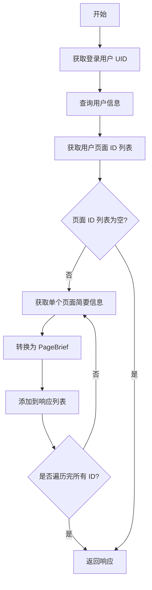
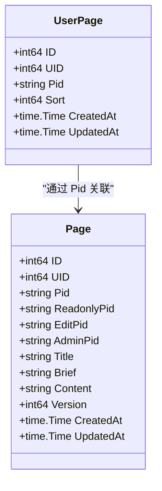
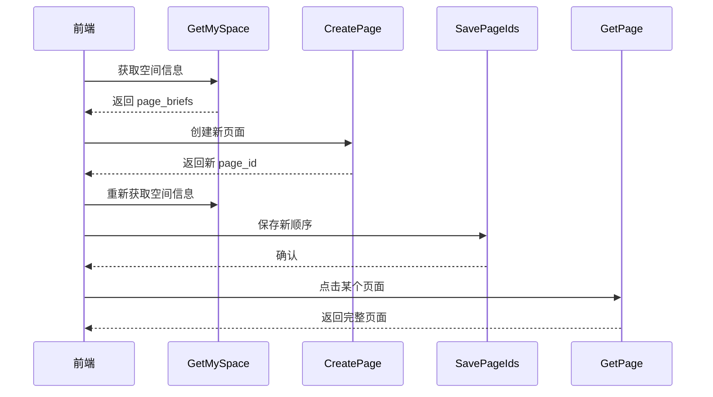

# 获取我的空间

<cite>
**本文档中引用的文件**   
- [space.go](file://app/api/space.go)
- [space.proto](file://app/api/proto/space.proto)
- [login.go](file://app/pkg/middleware/login.go)
- [user_page.go](file://app/dal/user_page.go)
- [page.go](file://app/dal/page.go)
- [page_tool.go](file://app/api/page_tool.go)
</cite>

## 目录
1. [接口概述](#接口概述)
2. [核心功能流程](#核心功能流程)
3. [用户身份验证机制](#用户身份验证机制)
4. [页面数据获取逻辑](#页面数据获取逻辑)
5. [响应结构与隐私保护](#响应结构与隐私保护)
6. [无主页面处理流程](#无主页面处理流程)
7. [请求与响应示例](#请求与响应示例)
8. [与其他接口的关系](#与其他接口的关系)
9. [前端应用场景](#前端应用场景)

## 接口概述

`GetMySpace` 接口用于在用户登录状态下获取其个人空间信息，包括用户名称和其关联的页面列表。该接口是用户进入系统后加载个人主页的核心入口，返回精简的页面信息以优化性能并保护用户隐私。

该接口定义在 `space.proto` 文件中，通过 HTTP POST 方法暴露在 `/space/getMySpace` 路径上。其主要职责是聚合用户基本信息和页面列表，为前端提供渲染“我的空间”视图所需的数据。

**Section sources**
- [space.proto](file://app/api/proto/space.proto#L20-L30)
- [space.go](file://app/api/space.go#L103-L131)

## 核心功能流程

`GetMySpace` 接口的执行流程如下：
1. 通过中间件获取当前登录用户的 UID
2. 查询用户基本信息以获取空间名称
3. 查询用户关联的所有页面 ID 列表
4. 遍历每个页面 ID，获取其简要信息
5. 将原始页面信息转换为对外暴露的简要信息结构
6. 构造并返回响应

该流程确保了在一次请求中高效地聚合所有必要信息，避免了前端进行多次 API 调用。



**Diagram sources**
- [space.go](file://app/api/space.go#L103-L131)

**Section sources**
- [space.go](file://app/api/space.go#L103-L131)

## 用户身份验证机制

接口通过 `middleware.GetLoginUid` 函数获取当前登录用户的身份标识（UID）。该函数从 HTTP 请求头 `X-Token` 中提取令牌，并通过 `dal.C.GetXToken` 方法查询令牌对应的用户 ID。

此机制实现了无状态的身份验证，将用户会话信息存储在服务端（如 Redis），确保了安全性。若令牌无效或未提供，`GetLoginUid` 将返回 0，后续逻辑会因无法查询用户信息而失败。

**Section sources**
- [login.go](file://app/pkg/middleware/login.go#L10-L15)
- [space.go](file://app/api/space.go#L105)

## 页面数据获取逻辑

用户与其页面的关联关系存储在 `user_page` 表中，通过 `dal.UserPage.GetUserPageIds` 方法查询。该方法根据用户 UID 查询所有关联的页面 ID（`pid`），并按 `sort` 字段升序排列，确保页面顺序的一致性。

对于每个获取到的页面 ID，系统调用 `dal.Page.GetPageBrief` 方法获取页面的简要信息。此方法会根据页面 ID 的类型（主页面、只读、编辑、管理）进行权限校验，并从数据库中查询除 `content` 字段外的所有信息，以减少数据传输量。



**Diagram sources**
- [user_page.go](file://app/dal/user_page.go#L17-L28)
- [page.go](file://app/dal/page.go#L100-L118)

**Section sources**
- [user_page.go](file://app/dal/user_page.go#L17-L28)
- [page.go](file://app/dal/page.go#L100-L118)

## 响应结构与隐私保护

`GetMySpaceResp` 响应结构包含两个核心字段：`space_name` 和 `page_briefs`。

- `space_name` 直接取自用户信息中的 `DisplayName`。
- `page_briefs` 是一个 `PageBrief` 对象列表，其生成逻辑封装在 `toPageBrief` 函数中。

`toPageBrief` 函数是实现隐私保护的关键。它将从数据库获取的完整 `Page` 对象转换为对外暴露的 `PageBrief` 对象，过程中：
1. **裁剪敏感信息**：不包含完整的 `content` 字段。
2. **权限计算**：根据当前用户 UID 与页面所有者 UID 的比对，设置 `is_self` 标志。
3. **权限配置**：基于传入的页面 ID 与页面的 `ReadonlyPid`、`EditPid`、`AdminPid` 比较，设置 `PageConf` 中的 `ReadOnly`、`CanEdit`、`CanDelete` 权限。
4. **权限提升**：如果用户是页面所有者（`isSelf` 为 true），则自动赋予最高权限（可编辑、可删除）。

此设计确保了用户只能看到自己有权限访问的信息，同时对所有者用户展示完整的操作权限。

**Section sources**
- [space.proto](file://app/api/proto/space.proto#L150-L158)
- [page_tool.go](file://app/api/page_tool.go#L65-L94)

## 无主页面处理流程

当用户首次登录且尚未创建任何页面时，`GetMySpace` 接口仍能正常执行。此时，`dal.UserPage.GetUserPageIds` 将返回一个空列表，`page_briefs` 字段也将为空。

前端应用应检测到 `page_briefs` 为空的情况，并引导用户调用 `CreatePage` 接口来创建其第一个页面。`CreatePage` 接口在创建时会进行校验，确保普通用户只能拥有一个主页面。

**Section sources**
- [space.go](file://app/api/space.go#L120-L128)
- [space.proto](file://app/api/proto/space.proto#L155)

## 请求与响应示例

### 成功场景

**请求**
```json
POST /space/getMySpace
Headers: { "X-Token": "valid_token_here" }
Body: {}
```

**响应**
```json
{
  "space_name": "张三的收藏夹",
  "page_briefs": [
    {
      "page_id": "O123abc",
      "title": "工作资料",
      "brief": "日常工作相关链接",
      "create_time": 1700000000,
      "update_time": 1700000000,
      "is_self": true,
      "page_conf": {
        "read_only": false,
        "can_edit": true,
        "can_delete": true
      }
    },
    {
      "page_id": "R456def",
      "title": "朋友分享",
      "brief": "朋友分享的只读页面",
      "create_time": 1699000000,
      "update_time": 1699000000,
      "is_self": false,
      "page_conf": {
        "read_only": true,
        "can_edit": false,
        "can_delete": false
      }
    }
  ]
}
```

### 错误场景

**未登录**
```json
{
  "error": "need login"
}
```

**数据库查询失败**
```json
{
  "error": "internal server error"
}
```

**Section sources**
- [space.go](file://app/api/space.go#L103-L131)
- [space.proto](file://app/api/proto/space.proto#L150-L158)

## 与其他接口的关系

`GetMySpace` 接口是空间管理模块的核心，与其他接口紧密协作：
- **`CreatePage`**：当 `GetMySpace` 返回空页面列表时，前端调用此接口创建新页面。
- **`SavePageIds`**：用户调整页面顺序后，调用此接口保存新顺序，后续 `GetMySpace` 将返回更新后的顺序。
- **`GetPage`**：用户点击某个 `PageBrief` 后，调用此接口获取该页面的完整内容（`content` 字段）。
- **`UpdatePage` / `DeletePage`**：对页面进行修改或删除后，通常会重新调用 `GetMySpace` 刷新列表。



**Diagram sources**
- [space.go](file://app/api/space.go#L103-L131)
- [space.go](file://app/api/space.go#L133-L151)

**Section sources**
- [space.go](file://app/api/space.go)

## 前端应用场景

在前端应用中，`GetMySpace` 接口通常在用户登录成功后立即调用。其典型应用场景包括：
1. **初始化主界面**：加载用户的个人空间，展示其收藏的页面列表。
2. **导航菜单构建**：将 `page_briefs` 用于构建侧边栏或顶部导航菜单。
3. **权限控制**：根据 `PageBrief` 中的 `page_conf` 字段，动态显示或隐藏“编辑”、“删除”等操作按钮。
4. **用户体验优化**：由于返回的是简要信息，加载速度快，可提供流畅的初始体验，再根据用户交互按需加载完整内容。

**Section sources**
- [space.go](file://app/api/space.go)
- [space.proto](file://app/api/proto/space.proto)