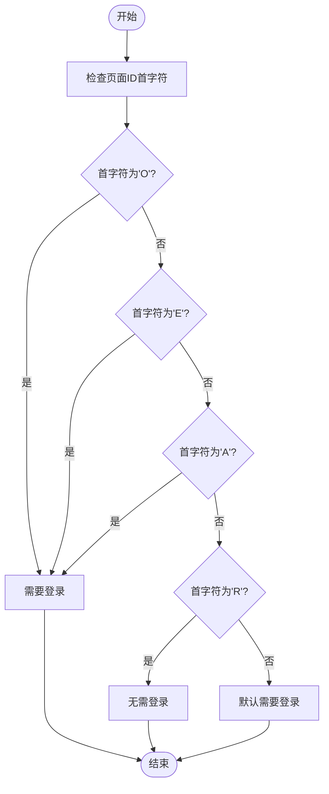
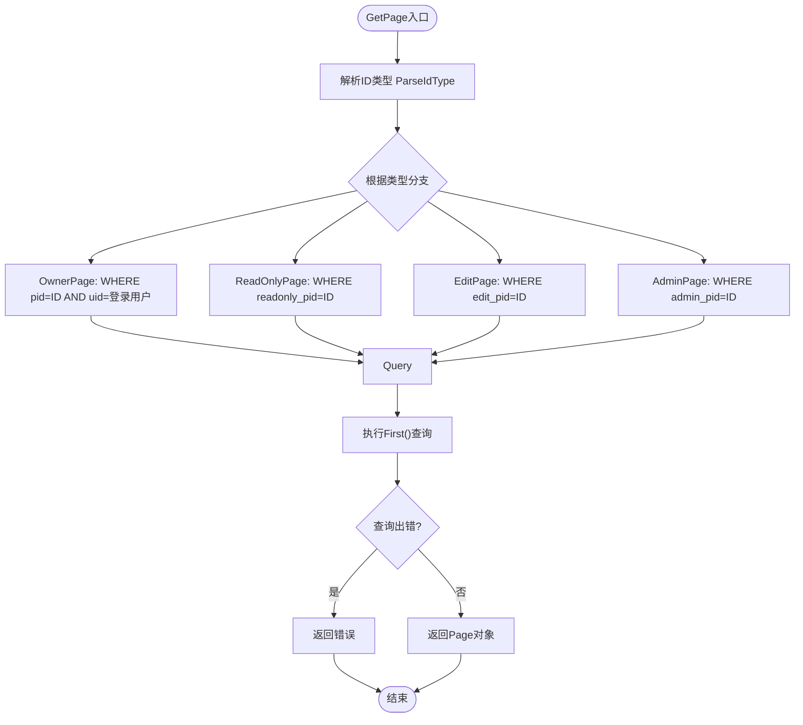
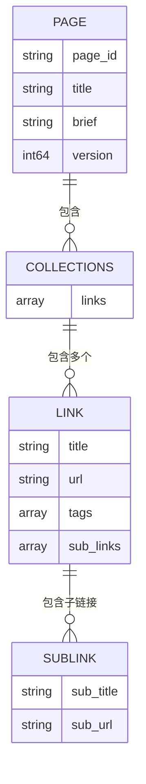

# 获取页面数据

<cite>
**本文档中引用的文件**  
- [space.go](file://app/api/space.go)
- [page_tool.go](file://app/api/page_tool.go)
- [page.go](file://app/dal/page.go)
- [page.gen.go](file://app/dal/model/page.gen.go)
- [const.go](file://app/conf/const.go)
- [space.proto](file://app/api/proto/space.proto)
</cite>

## 目录
1. [简介](#简介)
2. [核心功能分析](#核心功能分析)
3. [权限判断逻辑](#权限判断逻辑)
4. [数据访问层实现](#数据访问层实现)
5. [完整页面与摘要对比](#完整页面与摘要对比)
6. [请求示例与响应结构](#请求示例与响应结构)
7. [页面内容结构说明](#页面内容结构说明)

## 简介
本接口用于获取指定页面的详细数据，支持多种页面ID类型（所有者、只读、编辑、管理）的访问机制。系统根据ID前缀自动识别访问类型，并执行相应的权限校验和数据检索逻辑。接口返回完整的页面内容，包括标题、描述、嵌套的文件夹与链接结构等信息，适用于前端渲染个人空间或共享页面。

## 核心功能分析

该功能由 `GetPage` 接口驱动，位于 `spaceServiceImpl` 服务中，通过不同类型的页面ID实现灵活访问控制。

**Section sources**
- [space.go](file://app/api/space.go#L133-L150)
- [page_tool.go](file://app/api/page_tool.go#L11-L19)

## 权限判断逻辑

系统通过 `isNeedLoginPageId` 函数判断是否需要登录状态才能访问目标页面。该逻辑基于页面ID的首字符前缀进行判定：

- **O（Owner）**：所有者页面，必须登录且为页面拥有者
- **E（Edit）**：编辑页面，必须登录
- **R（Readonly）**：只读页面，无需登录，任何人都可访问
- **A（Admin）**：管理页面，必须登录



**Diagram sources**
- [page_tool.go](file://app/api/page_tool.go#L11-L19)
- [const.go](file://app/conf/const.go#L15-L25)

**Section sources**
- [page_tool.go](file://app/api/page_tool.go#L11-L19)
- [const.go](file://app/conf/const.go#L15-L25)

## 数据访问层实现

`dal.Page.GetPage` 方法根据页面ID类型执行不同的数据库查询条件，并集成权限校验逻辑。

### 查询逻辑分支


**Diagram sources**
- [page.go](file://app/dal/page.go#L55-L81)
- [const.go](file://app/conf/const.go#L30-L45)

**Section sources**
- [page.go](file://app/dal/page.go#L55-L81)
- [const.go](file://app/conf/const.go#L30-L45)

## 完整页面与摘要对比

| 特性 | GetPage | GetPageBrief |
|------|--------|--------------|
| **返回内容** | 完整页面数据，包含Content字段 | 仅返回页面元信息，排除Content |
| **数据库查询** | SELECT 所有字段 | SELECT 并Omit(Content) |
| **使用场景** | 渲染完整页面内容 | 获取页面列表预览 |
| **性能影响** | 较高（加载完整内容） | 较低（轻量查询） |
| **调用位置** | 单个页面详情页 | 我的空间列表页 |

**Section sources**
- [page.go](file://app/dal/page.go#L55-L81)
- [page.go](file://app/dal/page.go#L99-L127)

## 请求示例与响应结构

### 场景一：访问自有页面（Owner）
- **请求参数**: `page_id=Oabc123`
- **要求**: 用户必须登录且为页面所有者
- **用途**: 查看和编辑自己的主页面

### 场景二：通过只读链接访问他人页面
- **请求参数**: `page_id=Rxyz789`
- **要求**: 无需登录，任何人都可访问
- **用途**: 分享页面内容给外部用户查看

### 响应结构（Page消息体）
```json
{
  "page_id": "Oabc123",
  "title": "我的收藏",
  "brief": "常用网站链接汇总",
  "collections": [
    {
      "links": [
        {
          "title": "搜索引擎",
          "url": "https://www.google.com",
          "tags": ["search"],
          "sub_links": [
            {
              "sub_title": "百度",
              "sub_url": "https://www.baidu.com"
            }
          ]
        }
      ]
    }
  ],
  "version": 5,
  "create_time": 1719388800,
  "update_time": 1719475200,
  "is_self": true,
  "page_conf": {
    "read_only": false,
    "can_edit": true,
    "can_delete": true
  },
  "readonly_page_id": "Rxyz789",
  "edit_page_id": "Edef456",
  "admin_page_id": "Aghi789"
}
```

**Section sources**
- [space.proto](file://app/api/proto/space.proto#L140-L200)
- [space.go](file://app/api/space.go#L133-L150)

## 页面内容结构说明

`Page` 消息中的 `collections` 和 `sub_links` 构成了前端渲染的核心嵌套结构：

### 结构层级


### 前端渲染应用
- **collections**: 表示页面中的文件夹集合，每个文件夹对应一个逻辑分组
- **links**: 每个文件夹内的主链接列表，展示标题、URL和标签
- **sub_links**: 主链接下的子链接，用于展示相关站点或备用链接，在UI中通常以折叠菜单形式呈现

此结构支持灵活的页面组织方式，便于用户构建层次化的书签管理系统。

**Diagram sources**
- [space.proto](file://app/api/proto/space.proto#L160-L170)
- [space.proto](file://app/api/proto/space.proto#L180-L190)

**Section sources**
- [space.proto](file://app/api/proto/space.proto#L140-L200)
- [page_tool.go](file://app/api/page_tool.go#L21-L55)