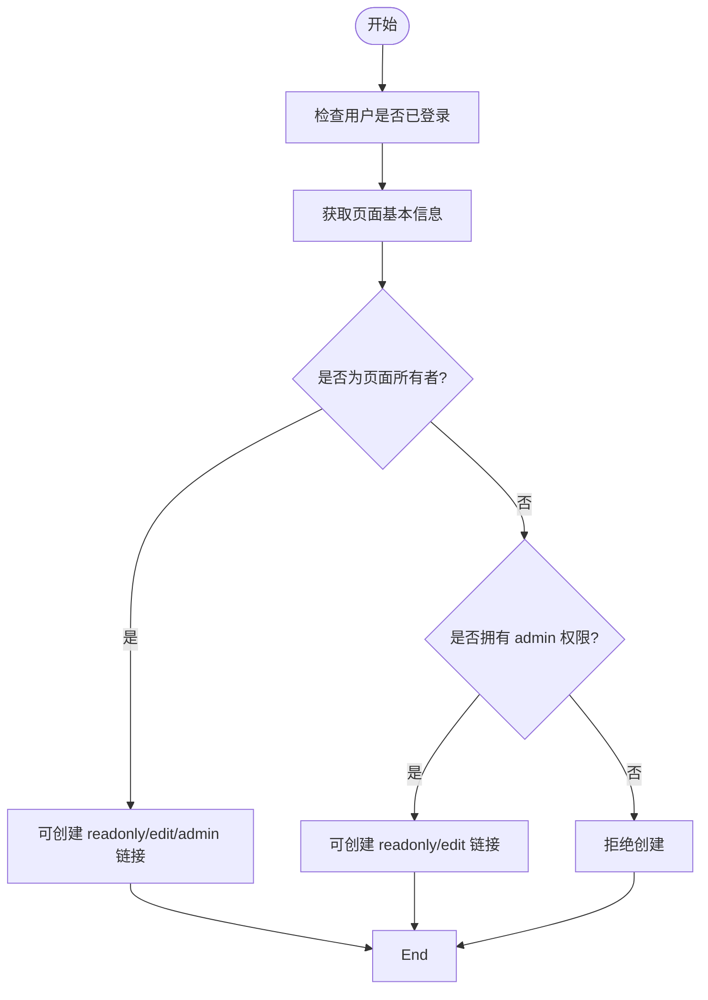
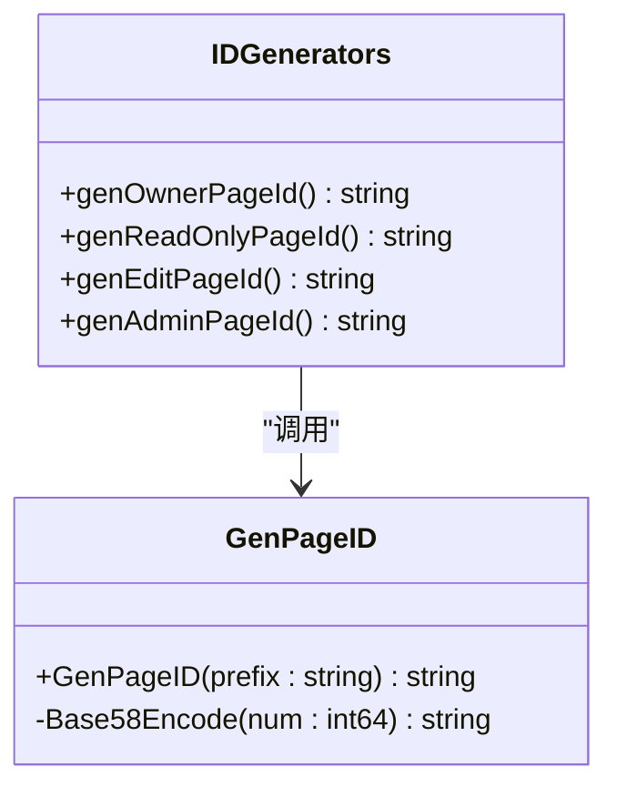

# 创建页面链接

<cite>
**本文档引用的文件**  
- [app/api/space.go](file://app/api/space.go)
- [app/pkg/maths/genid.go](file://app/pkg/maths/genid.go)
- [app/dal/page.go](file://app/dal/page.go)
- [app/dal/model/page.gen.go](file://app/dal/model/page.gen.go)
- [app/conf/const.go](file://app/conf/const.go)
</cite>

## 目录
1. [简介](#简介)
2. [权限控制逻辑](#权限控制逻辑)
3. [防止重复创建的校验机制](#防止重复创建的校验机制)
4. [页面ID生成函数详解](#页面id生成函数详解)
5. [新页面ID的加密生成方式与URL格式](#新页面id的加密生成方式与url格式)
6. [请求/响应示例](#请求响应示例)
7. [团队协作中的实际应用](#团队协作中的实际应用)

## 简介
`AddPageLink` 接口用于为指定页面创建不同权限级别的分享链接，支持只读（readonly）、编辑（edit）和管理（admin）三种类型。该功能允许页面所有者或具有管理员权限的用户生成安全且唯一的分享链接，便于在团队协作中控制访问权限。本文档详细说明其权限控制逻辑、ID生成机制、防重校验策略及实际使用场景。

**Section sources**  
- [app/api/space.go](file://app/api/space.go#L275-L398)

## 权限控制逻辑
`AddPageLink` 接口的权限控制遵循以下规则：

1. **页面所有者（Owner）**：可以创建 `readonly`、`edit` 和 `admin` 三种类型的链接。
2. **拥有 admin 权限的用户**：仅可创建 `readonly` 和 `edit` 类型的链接，不能创建 `admin` 链接。
3. **其他用户**：无权创建任何类型的链接。

权限判断依据是当前登录用户的 UID 是否与目标页面的 `UID` 一致（即是否为页面所有者）。若非所有者，则需检查其是否通过 `adminPid` 拥有管理员权限。

此逻辑在 `spaceServiceImpl.AddPageLink` 方法中实现，通过调用 `dal.Page.GetPageBrief` 获取页面基本信息，并结合 `conf.ParseIdType` 解析输入的 `pageId` 类型来决定权限范围。



**Diagram sources**  
- [app/api/space.go](file://app/api/space.go#L325-L398)
- [app/conf/const.go](file://app/conf/const.go#L20-L62)

**Section sources**  
- [app/api/space.go](file://app/api/space.go#L325-L398)
- [app/conf/const.go](file://app/conf/const.go#L20-L62)

## 防止重复创建的校验机制
为避免同一页面生成多个相同类型的链接，系统在创建前会进行存在性校验。如果对应类型的链接已存在，将返回明确的错误提示，要求用户先调用 `RemovePageLink` 删除旧链接后再创建新链接。

具体校验逻辑如下：

- **只读链接（readonly）**：若 `data.ReadonlyPid` 不为空，返回错误 `"readonly link already exists"`。
- **编辑链接（edit）**：若 `data.EditPid` 不为空，返回错误 `"edit link already exists"`。
- **管理链接（admin）**：若 `data.AdminPid` 不为空，返回错误 `"admin link already exists"`。

此外，若尝试从只读页面（`readonly_pid`）创建编辑链接，系统将拒绝并返回 `"cannot create edit link from readonly page"`。

这些校验确保了每个页面每种权限类型最多只有一个有效链接，提升了链接管理的清晰度和安全性。

**Section sources**  
- [app/api/space.go](file://app/api/space.go#L327-L367)
- [app/dal/model/page.gen.go](file://app/dal/model/page.gen.go#L1-L20)

## 页面ID生成函数详解
系统通过三个专用函数生成不同类型页面的唯一ID：

- `genReadOnlyPageId()`：生成以 `R` 开头的只读页面ID
- `genEditPageId()`：生成以 `E` 开头的编辑页面ID
- `genAdminPageId()`：生成以 `A` 开头的管理页面ID

这三个函数均基于 `maths.GenPageID(prefix string)` 实现，传入不同的前缀字符（`R`、`E`、`A`）作为参数。

`GenPageID` 函数内部调用 `rand.Int31()` 生成一个随机的 32 位整数，然后通过 `Base58Encode` 编码为字符串。Base58 编码使用自定义字符集（排除易混淆字符如 `0`, `O`, `I`, `l`），确保生成的ID具有高可读性和唯一性。



**Diagram sources**  
- [app/pkg/maths/genid.go](file://app/pkg/maths/genid.go#L0-L36)
- [app/api/space.go](file://app/api/space.go#L325-L398)

**Section sources**  
- [app/pkg/maths/genid.go](file://app/pkg/maths/genid.go#L0-L36)

## 新页面ID的加密生成方式与URL格式
新生成的页面ID采用 **Base58 编码**，基于随机 32 位整数生成，长度通常为 6-7 个字符。编码字符集为：

```
123456789ABCDEFGHJKLMNPQRSTUVWXYZabcdefghijkmnopqrstuvwxyz
```

该字符集排除了 `0`, `O`, `I`, `l` 等易混淆字符，提升可读性和输入准确性。

生成的ID根据权限类型添加特定前缀：
- 只读链接：以 `R` 开头
- 编辑链接：以 `E` 开头
- 管理链接：以 `A` 开头

在分享URL中，格式如下：
```
http://2049links.com/share_readonly/R加密字符串
http://2049links.com/share_edit/E加密字符串
http://2049links.com/share_admin/A加密字符串
```

前端通过解析URL路径识别权限类型，并传递给后端进行权限验证。

**Section sources**  
- [app/pkg/maths/genid.go](file://app/pkg/maths/genid.go#L0-L36)
- [app/conf/const.go](file://app/conf/const.go#L20-L62)

## 请求/响应示例
### 请求示例
```json
POST /space/addPageLink
Content-Type: application/json

{
  "page_id": "Oabc123",
  "page_type": "readonly"
}
```

### 成功响应（页面所有者创建只读链接）
```json
{
  "code": 1,
  "message": "OK",
  "data": {
    "page_type": "readonly",
    "new_page_id": "R7xK9mL"
  }
}
```

### 错误响应示例
- **未登录**
  ```json
  { "code": 401, "message": "need login" }
  ```
- **只读链接已存在**
  ```json
  { "code": 400, "message": "readonly link already exists" }
  ```
- **非所有者尝试创建管理链接**
  ```json
  { "code": 400, "message": "you are not the owner of this page, cannot create admin link" }
  ```
- **无效页面类型**
  ```json
  { "code": 400, "message": "invalid page type" }
  ```

**Section sources**  
- [app/api/space.go](file://app/api/space.go#L325-L398)
- [tests/test_space_api.py](file://tests/test_space_api.py#L263-L293)

## 团队协作中的实际应用
在团队协作场景中，`AddPageLink` 接口支持灵活的权限分配机制：

1. **知识共享**：项目负责人可为文档生成 `readonly` 链接，供团队成员查阅，防止误修改。
2. **协同编辑**：对需要多人协作的内容，生成 `edit` 链接，允许多人实时编辑，提升协作效率。
3. **权限分级管理**：仅项目所有者可生成 `admin` 链接，用于授权核心成员管理页面（如删除、重命名等），实现权限隔离。

通过该机制，团队可在保障数据安全的前提下，实现精细化的权限控制，适用于文档共享、项目看板、配置管理等多种协作场景。

**Section sources**  
- [app/api/space.go](file://app/api/space.go#L275-L398)
- [app/dal/page.go](file://app/dal/page.go#L0-L263)