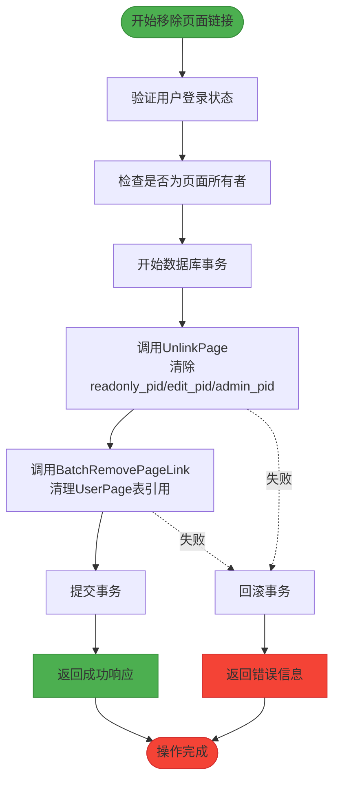
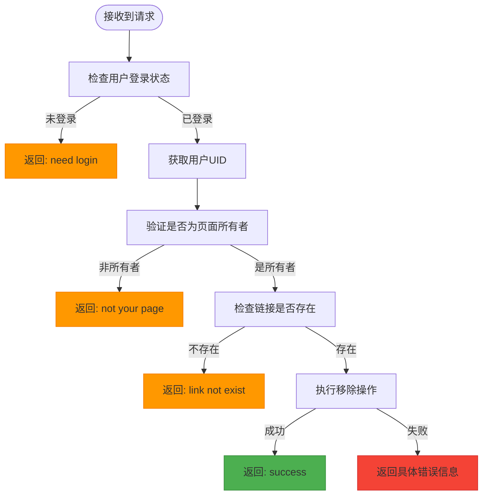
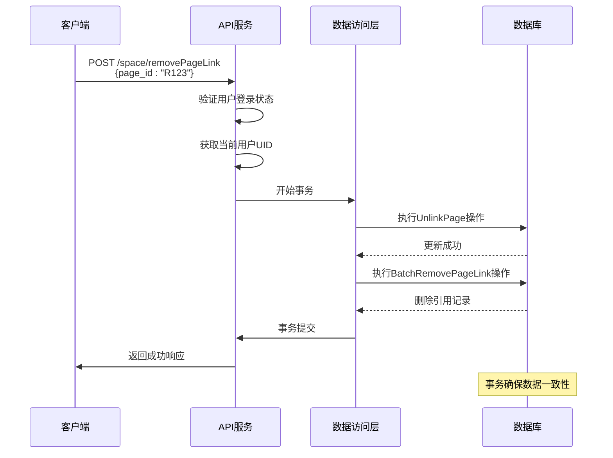

# 移除页面链接

<cite>
**本文档中引用的文件**   
- [space.go](file://app/api/space.go)
- [page.go](file://app/dal/page.go)
- [user_page.go](file://app/dal/user_page.go)
- [space.proto](file://app/api/proto/space.proto)
- [login.go](file://app/pkg/middleware/login.go)
</cite>

## 目录
1. [接口概述](#接口概述)
2. [权限控制机制](#权限控制机制)
3. [数据层操作详解](#数据层操作详解)
4. [事务处理与数据一致性](#事务处理与数据一致性)
5. [分享链接失效机制](#分享链接失效机制)
6. [请求示例](#请求示例)
7. [错误处理场景](#错误处理场景)
8. [调用流程图](#调用流程图)

## 接口概述

`RemovePageLink` 接口用于解除页面的只读、编辑或管理员权限链接。该操作会将页面关联的 `readonly_pid`、`edit_pid` 或 `admin_pid` 字段置空，并清理相关引用记录，从而使对应的分享链接失效。

该接口的主要功能包括：
- 解除页面的只读访问权限链接
- 解除页面的编辑权限链接
- 解除页面的管理员权限链接
- 确保只有页面所有者才能执行此操作

接口定义位于 `space.proto` 文件中，其请求和响应结构如下：

```protobuf
message RemovePageLinkReq {
  string page_id = 1;
}

message RemovePageLinkResp {
}
```

**Section sources**
- [space.proto](file://app/api/proto/space.proto#L293-L318)

## 权限控制机制

只有页面的创建者（所有者）才有权限调用 `RemovePageLink` 接口。任何非所有者的用户尝试调用该接口都将被拒绝。

权限验证流程如下：
1. 通过 `middleware.GetLoginUid(context)` 获取当前登录用户的 UID
2. 检查 UID 是否有效，若未登录则返回需要登录的错误
3. 在 `dal.Page.UnlinkPage` 方法中验证当前用户是否为页面所有者

如果用户不是页面所有者或尝试解除一个不存在的链接，系统将返回 `ErrNotYourPageOrLinkNotExist` 错误。

**Section sources**
- [space.go](file://app/api/space.go#L275-L325)
- [page.go](file://app/dal/page.go#L199-L232)
- [login.go](file://app/pkg/middleware/login.go)

## 数据层操作详解

### UnlinkPage 操作

在数据访问层（DAL），`UnlinkPage` 方法负责解除页面链接的核心逻辑。该方法位于 `page.go` 文件中，通过 `UpdateSimple` 将相应的 PID 字段置空。

具体实现逻辑如下：
- 根据传入的 `page_id` 类型（只读、编辑、管理员）判断需要清除的字段
- 使用 GORM 的 `UpdateSimple` 方法将 `readonly_pid`、`edit_pid` 或 `admin_pid` 字段更新为空字符串
- 确保操作仅由页面所有者执行

```go
switch pT {
case conf.ReadOnlyPage:
	result, err = do.Where(u.ReadonlyPid.Eq(pid)).UpdateSimple(u.ReadonlyPid.Value(""))
case conf.EditPage:
	result, err = do.Where(u.EditPid.Eq(pid)).UpdateSimple(u.EditPid.Value(""))
case conf.AdminPage:
	result, err = do.Where(u.AdminPid.Eq(pid)).UpdateSimple(u.AdminPid.Value(""))
}
```

**Section sources**
- [page.go](file://app/dal/page.go#L199-L232)

### BatchRemovePageLink 操作

`BatchRemovePageLink` 方法负责清理 `UserPage` 表中与指定页面链接相关的所有引用记录。该方法会批量删除所有引用了该页面链接的用户记录。

关键逻辑包括：
- 检查 `page_id` 类型，确保不是所有者页面（OwnerPage）
- 使用 `Where(u.Pid.Eq(pageid))` 条件删除所有匹配的记录
- 返回受影响的行数以供验证

此操作确保了即使有多个用户保存了该分享链接，这些引用也会被彻底清除。

**Section sources**
- [user_page.go](file://app/dal/user_page.go#L57-L87)

## 事务处理与数据一致性

为了确保数据的一致性和完整性，`RemovePageLink` 操作被包裹在一个数据库事务中。整个操作遵循原子性原则：要么全部成功，要么全部回滚。

事务执行流程如下：
1. 开始事务：`dal.Q.Transaction(func(tx *query.Query) error { ... })`
2. 执行 `UnlinkPage` 操作，解除页面链接
3. 执行 `BatchRemovePageLink` 操作，清理引用记录
4. 提交事务（若所有步骤成功）
5. 回滚事务（若任一步骤失败）

这种事务机制确保了即使在高并发环境下，也不会出现部分更新导致的数据不一致问题。



**Diagram sources **
- [space.go](file://app/api/space.go#L275-L325)
- [page.go](file://app/dal/page.go#L199-L232)
- [user_page.go](file://app/dal/user_page.go#L57-L87)

## 分享链接失效机制

当 `RemovePageLink` 接口成功执行后，对应的分享链接将立即失效。失效机制的工作原理如下：

1. **链接解析失效**：由于 `readonly_pid`、`edit_pid` 或 `admin_pid` 已被置空，系统无法再通过这些 PID 找到原始页面
2. **引用清理**：`UserPage` 表中的相关记录已被删除，用户无法再通过个人空间访问该链接
3. **缓存更新**：虽然文档未明确提及缓存机制，但根据常规设计，相关缓存也应被清除

这意味着所有通过该链接访问页面的尝试都将失败，有效防止了未经授权的访问。

**Section sources**
- [page.go](file://app/dal/page.go#L199-L232)
- [user_page.go](file://app/dal/user_page.go#L57-L87)

## 请求示例

### 成功请求示例

```json
POST /space/removePageLink
Content-Type: application/json
Authorization: Bearer <valid_token>

{
  "page_id": "R123456789"
}
```

**响应：**
```json
{
  "code": 1,
  "msg": "success",
  "data": {}
}
```

### 请求字段说明

| 字段名 | 类型 | 必填 | 说明 |
|--------|------|------|------|
| page_id | string | 是 | 要移除的页面链接ID，可以是只读、编辑或管理员链接 |

**Section sources**
- [space.proto](file://app/api/proto/space.proto#L293-L318)

## 错误处理场景

### 常见错误码

| 错误码 | 错误信息 | 触发条件 |
|--------|---------|---------|
| 非1 | "need login" | 用户未登录或认证失败 |
| 非1 | "not your page or link not exist" | 用户不是页面所有者或链接不存在 |
| 非1 | "not support" | 尝试对所有者页面执行 unlink 操作 |

### 错误处理流程



**Diagram sources **
- [space.go](file://app/api/space.go#L275-L325)
- [page.go](file://app/dal/page.go#L199-L232)

## 调用流程图



**Diagram sources **
- [space.go](file://app/api/space.go#L275-L325)
- [page.go](file://app/dal/page.go#L199-L232)
- [user_page.go](file://app/dal/user_page.go#L57-L87)