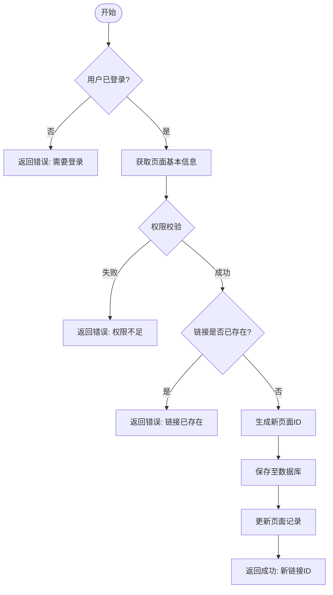
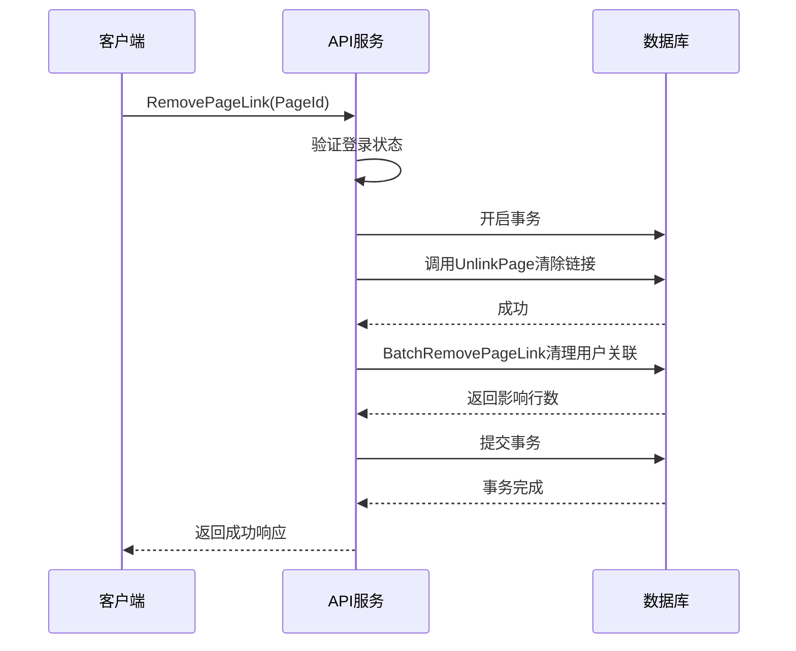
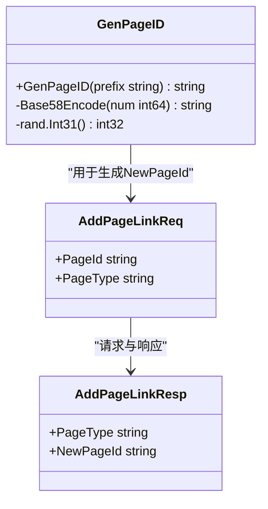

# 页面链接管理

<cite>
**本文档引用文件**  
- [space.go](file://app/api/space.go)
- [user_page.go](file://app/dal/user_page.go)
- [genid.go](file://app/pkg/maths/genid.go)
- [genid_test.go](file://app/pkg/maths/genid_test.go)
- [const.go](file://app/conf/const.go)
</cite>

## 目录
1. [简介](#简介)
2. [核心功能概述](#核心功能概述)
3. [链接类型与权限控制策略](#链接类型与权限控制策略)
4. [AddPageLink 接口详解](#addpagelink-接口详解)
5. [RemovePageLink 接口详解](#removepagelink-接口详解)
6. [页面 ID 生成机制](#页面-id-生成机制)
7. [请求与响应示例](#请求与响应示例)
8. [协作场景中的实际应用](#协作场景中的实际应用)
9. [总结](#总结)

## 简介
本文档详细说明 `forgeturl-server` 项目中页面链接管理功能的实现机制，重点围绕 `AddPageLink` 和 `RemovePageLink` 两个核心接口展开。涵盖三种链接类型（只读、编辑、管理员）的创建规则、权限控制逻辑、ID 生成方式、防重复校验机制以及在协作场景下的实际用途。

**Section sources**  
- [space.go](file://app/api/space.go#L286-L398)

## 核心功能概述
系统通过 `AddPageLink` 接口为指定页面生成不同权限级别的访问链接，支持只读（readonly）、编辑（edit）和管理员（admin）三种类型。通过 `RemovePageLink` 接口移除已创建的链接并清理相关用户关联数据。整个过程在数据库事务中执行，确保数据一致性。



**Diagram sources**  
- [space.go](file://app/api/space.go#L314-L398)

**Section sources**  
- [space.go](file://app/api/space.go#L314-L398)

## 链接类型与权限控制策略
系统支持三种类型的页面链接，每种链接对应不同的访问权限，并遵循严格的创建权限控制：

| 链接类型 | 前缀标识 | 创建权限条件 |
|--------|--------|------------|
| 只读链接（readonly） | `r_` | 页面所有者或拥有 admin 权限者可创建 |
| 编辑链接（edit） | `e_` | 页面所有者或拥有 admin 权限者可创建，但不能从只读页面创建 |
| 管理员链接（admin） | `a_` | 仅页面所有者可创建 |

**权限控制逻辑说明：**
- **页面所有者**：可以创建所有类型的链接。
- **管理员权限持有者**：可以创建只读和编辑链接，但不能创建管理员链接。
- **其他用户**：无权创建任何类型的链接。

此策略确保了页面所有权的安全性，防止权限越界。

**Section sources**  
- [space.go](file://app/api/space.go#L314-L398)
- [const.go](file://app/conf/const.go)

## AddPageLink 接口详解
`AddPageLink` 接口用于为指定页面创建新的访问链接。其核心逻辑包括权限校验、存在性检查、ID 生成和数据库更新。

### 权限与存在性校验
接口首先验证用户登录状态，然后根据请求的链接类型进行权限判断：
- 若用户非页面所有者且请求创建 `admin` 链接，则拒绝。
- 若当前页面为只读类型，则不允许创建 `edit` 链接。
- 若目标类型的链接已存在（如 `readonlyPid` 不为空），则返回错误提示，防止重复创建。

### 事务性操作
所有操作在数据库事务中执行，确保原子性：
1. 查询页面基本信息
2. 校验权限与链接存在性
3. 生成新的页面 ID
4. 在 `unique_pid` 表中注册新 ID
5. 更新主页面记录中的对应字段（如 `ReadonlyPid`）

若任一环节失败，事务回滚，保证数据一致性。

**Section sources**  
- [space.go](file://app/api/space.go#L314-L398)

## RemovePageLink 接口详解
`RemovePageLink` 接口用于删除指定的页面链接及其关联数据。

### 移除逻辑
1. **权限校验**：仅允许页面创建者执行移除操作。
2. **解除链接**：调用 `dal.Page.UnlinkPage` 方法清除页面上的链接信息。
3. **清理用户关联**：通过 `dal.UserPage.BatchRemovePageLink` 批量删除所有用户与该链接的关联记录。

### 数据清理
该操作会从 `user_page` 表中移除所有指向该链接的记录，确保其他用户无法再通过该链接访问页面。但原始的 `unique_pid` 记录会被保留，以避免 ID 冲突。



**Diagram sources**  
- [space.go](file://app/api/space.go#L286-L312)
- [user_page.go](file://app/dal/user_page.go#L75-L88)

**Section sources**  
- [space.go](file://app/api/space.go#L286-L312)
- [user_page.go](file://app/dal/user_page.go#L75-L88)

## 页面 ID 生成机制
系统使用加密方式生成不可预测的页面 ID，确保链接安全性。

### ID 结构
所有页面 ID 均采用前缀 + 随机编码的形式：
- `r_` + Base58 编码 → 只读链接
- `e_` + Base58 编码 → 编辑链接
- `a_` + Base58 编码 → 管理员链接
- `p_` + Base58 编码 → 所有者页面

### Base58 编码实现
`genid.go` 文件中的 `Base58Encode` 函数将随机生成的 `int64` 数值转换为 Base58 字符串，字符集排除易混淆字符（如 0、O、I、l），提高可读性与安全性。

### 随机性保障
`GenPageID` 函数使用 `rand.Int31()` 生成随机数（前期使用 32 位，后期可升级为 64 位），结合自定义前缀生成最终 ID，确保全局唯一性和不可猜测性。



**Diagram sources**  
- [genid.go](file://app/pkg/maths/genid.go#L0-L37)
- [space.go](file://app/api/space.go#L314-L398)

**Section sources**  
- [genid.go](file://app/pkg/maths/genid.go#L0-L37)

## 请求与响应示例
### 创建只读链接（AddPageLink）
**请求：**
```json
{
  "pageId": "p_abc123",
  "pageType": "readonly"
}
```

**成功响应：**
```json
{
  "pageType": "readonly",
  "newPageId": "r_xyz789"
}
```

**错误响应（链接已存在）：**
```json
{
  "error": "readonly link already exists"
}
```

### 移除链接（RemovePageLink）
**请求：**
```json
{
  "pageId": "r_xyz789"
}
```

**成功响应：**
```json
{}
```

**错误响应（非创建者尝试删除）：**
```json
{
  "error": "permission denied"
}
```

**Section sources**  
- [space.go](file://app/api/space.go#L286-L398)

## 协作场景中的实际应用
该功能广泛应用于团队协作环境中：

### 场景一：安全分享
页面所有者可生成只读链接分享给外部人员，确保内容可查看但不可修改。

### 场景二：协同编辑
团队成员通过编辑链接共同维护文档，管理员链接用于权限交接或紧急修改。

### 场景三：权限分级
通过区分 `readonly`、`edit` 和 `admin` 链接，实现精细化的权限管理，符合最小权限原则。

### 场景四：临时访问
可随时通过 `RemovePageLink` 撤销特定链接，立即终止他人访问权限，提升安全性。

## 总结
页面链接管理功能通过 `AddPageLink` 和 `RemovePageLink` 接口实现了灵活且安全的页面共享机制。结合加密 ID 生成、严格的权限控制和事务性操作，确保了系统的可靠性与安全性。该设计适用于多种协作场景，为用户提供高效、可控的页面分享体验。