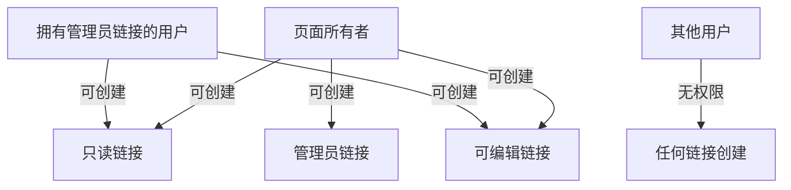
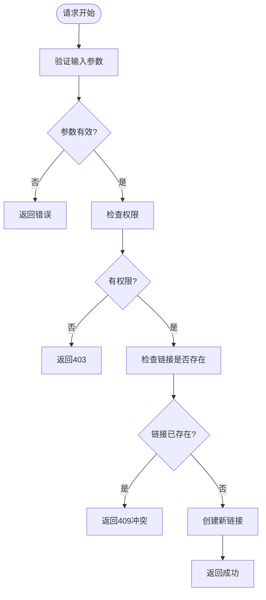

# 页面分享与权限链接接口

<cite>
**本文档引用的文件**  
- [space.go](file://app/api/space.go#L286-L398)
- [const.go](file://app/conf/const.go#L1-L62)
- [page_tool.go](file://app/api/page_tool.go#L0-L111)
- [space.proto](file://app/api/proto/space.proto#L293-L318)
</cite>

## 目录
1. [简介](#简介)
2. [核心接口说明](#核心接口说明)
3. [权限继承规则](#权限继承规则)
4. [页面ID前缀含义](#页面id前缀含义)
5. [使用示例](#使用示例)
6. [错误处理](#错误处理)
7. [总结](#总结)

## 简介
本文档详细说明如何通过API为指定页面生成只读、可编辑或管理员权限的分享链接，以及如何移除已有链接。重点介绍权限控制机制、链接唯一性约束和分享URL的构建方式。

**Section sources**
- [space.go](file://app/api/space.go#L286-L398)

## 核心接口说明

### AddPageLink 接口
用于为指定页面创建具有特定权限的分享链接。

**请求参数：**
- `page_id`：原始页面ID（必填）
- `page_type`：链接类型，可选值为 `readonly`、`edit`、`admin`（必填）

**响应参数：**
- `new_page_id`：新生成的权限链接ID
- `page_type`：链接类型

**Section sources**
- [space.proto](file://app/api/proto/space.proto#L293-L318)
- [space.go](file://app/api/space.go#L314-L398)

### RemovePageLink 接口
用于移除已存在的页面分享链接。

**请求参数：**
- `page_id`：要移除的权限链接ID

**响应参数：**
- 无内容，成功时返回空响应

**Section sources**
- [space.proto](file://app/api/proto/space.proto#L293-L318)
- [space.go](file://app/api/space.go#L286-L312)

## 权限继承规则



**Diagram sources**
- [space.go](file://app/api/space.go#L314-L398)

**规则说明：**
- **页面所有者**：可以为自己的页面创建所有类型的分享链接（只读、可编辑、管理员）
- **管理员链接持有者**：可以基于管理员权限创建只读和可编辑链接，但不能创建新的管理员链接
- **其他用户**：无权创建任何类型的分享链接

同一页面的同类型链接只能存在一个。如果尝试重复创建相同类型的链接，系统将返回错误提示，要求先调用 `RemovePageLink` 移除原有链接。

**Section sources**
- [space.go](file://app/api/space.go#L314-L398)

## 页面ID前缀含义

根据 `conf/const.go` 中的常量定义，不同页面ID前缀代表不同的权限类型：

```mermaid
erDiagram
OWNER ||--o{ PAGE : "拥有"
ADMIN ||--o{ PAGE : "管理"
EDIT ||--o{ PAGE : "编辑"
READONLY ||--o{ PAGE : "查看"
class OWNER "页面所有者"
class ADMIN "管理员权限"
class EDIT "可编辑权限"
class READONLY "只读权限"
```

**Diagram sources**
- [const.go](file://app/conf/const.go#L1-L62)

**前缀定义及含义：**
- **R**：只读权限链接（ReadonlyPrefix），对应 `readonly` 类型
- **E**：可编辑权限链接（EditPrefix），对应 `edit` 类型  
- **A**：管理员权限链接（AdminPrefix），对应 `admin` 类型
- **O**：原始所有者页面（OwnerPrefix）
- **T**：临时页面（TempPrefix）

这些前缀用于标识不同权限级别的页面ID，在系统内部通过 `ParseIdType` 函数进行解析判断。

**Section sources**
- [const.go](file://app/conf/const.go#L1-L62)

## 使用示例

### 生成只读分享链接
```bash
curl -X POST https://api.example.com/AddPageLink \
  -H "Authorization: Bearer <token>" \
  -H "Content-Type: application/json" \
  -d '{
    "page_id": "O123456789",
    "page_type": "readonly"
  }'
```

**响应示例：**
```json
{
  "new_page_id": "Rabcdefghijk",
  "page_type": "readonly"
}
```

构建最终分享URL：
```
https://2049links.com/share_readonly/Rabcdefghijk
```

### 生成可编辑分享链接
```bash
curl -X POST https://api.example.com/AddPageLink \
  -H "Authorization: Bearer <token>" \
  -H "Content-Type: application/json" \
  -d '{
    "page_id": "O123456789",
    "page_type": "edit"
  }'
```

### 移除现有链接
```bash
curl -X POST https://api.example.com/RemovePageLink \
  -H "Authorization: Bearer <token>" \
  -H "Content-Type: application/json" \
  -d '{
    "page_id": "Rabcdefghijk"
  }'
```

**关键说明：**
- `AddPageLinkResp` 返回的 `new_page_id` 直接用于构建分享URL
- 根据权限类型选择对应的域名路径：
  - 只读：`/share_readonly/`
  - 可编辑：`/share_editable/`
  - 管理员：`/share_admin/`

**Section sources**
- [space.proto](file://app/api/proto/space.proto#L293-L318)
- [page_tool.go](file://app/api/page_tool.go#L0-L111)

## 错误处理



**Diagram sources**
- [space.go](file://app/api/space.go#L314-L398)

**常见错误码：**
- `400 Bad Request`：无效的页面类型或已存在同类型链接
- `401 Unauthorized`：用户未登录
- `403 Forbidden`：非页面所有者且无管理员权限
- `409 Conflict`：同类型链接已存在

**Section sources**
- [space.go](file://app/api/space.go#L314-L398)

## 总结
本接口提供了完整的页面分享功能，支持三级权限控制（只读、可编辑、管理员）。通过严格的权限继承规则和链接唯一性约束，确保了分享系统的安全性和一致性。开发者在使用时应注意：
1. 确保用户具有相应权限
2. 处理链接已存在的错误情况
3. 正确使用返回的 `new_page_id` 构建分享URL
4. 及时清理不再需要的分享链接

**Section sources**
- [space.go](file://app/api/space.go#L286-L398)
- [const.go](file://app/conf/const.go#L1-L62)