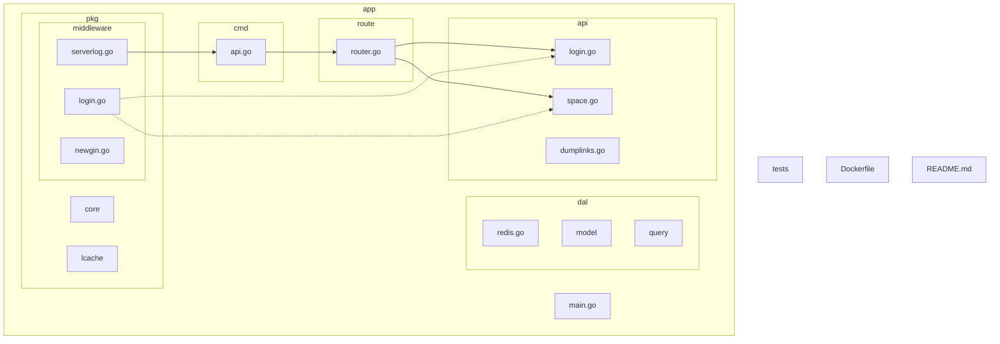
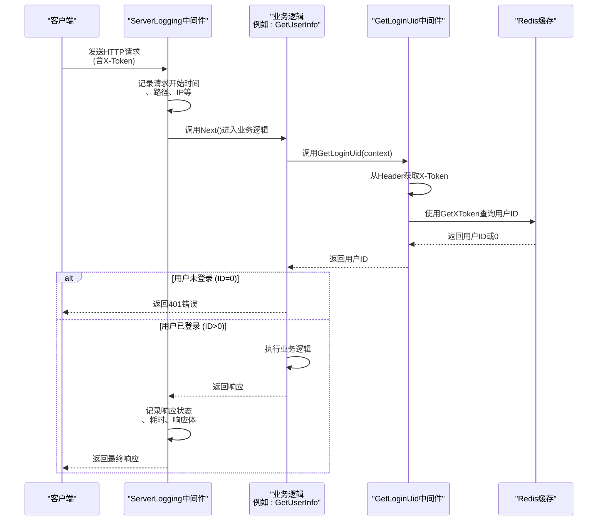
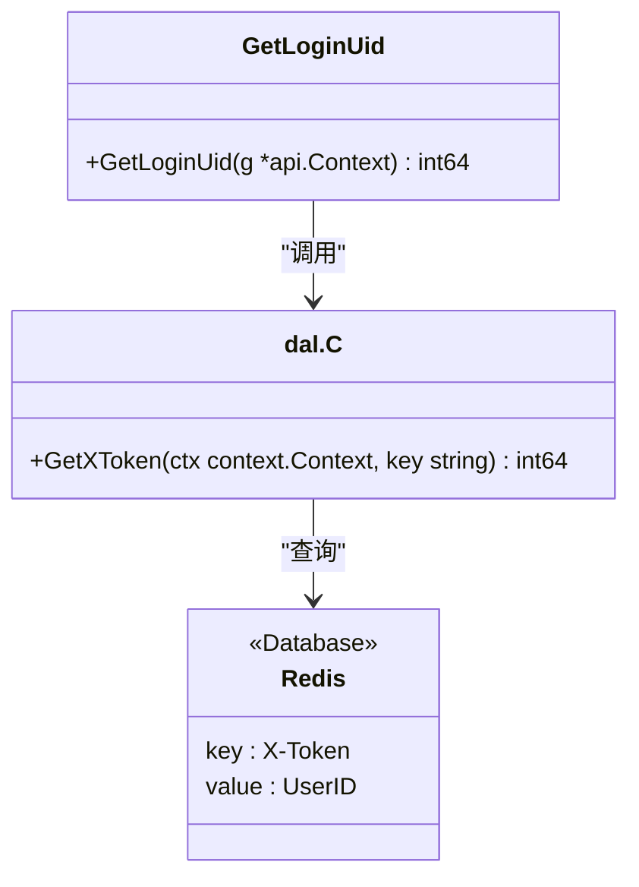
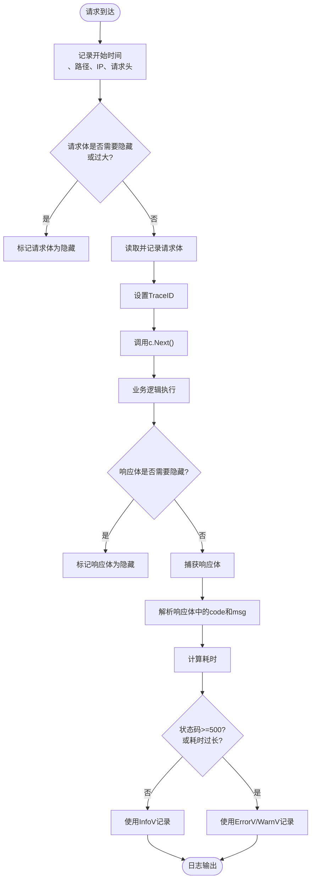
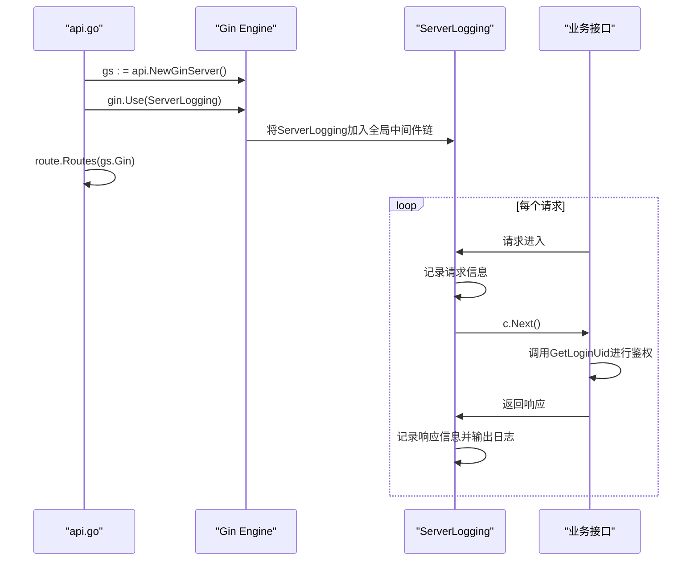
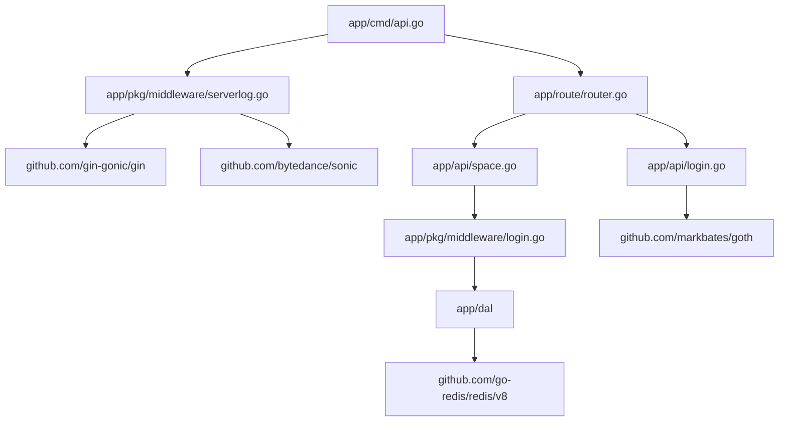

# 中间件与拦截器

<cite>
**本文档引用的文件**
- [login.go](file://app/pkg/middleware/login.go)
- [serverlog.go](file://app/pkg/middleware/serverlog.go)
- [router.go](file://app/route/router.go)
- [api.go](file://app/cmd/api.go)
- [space.go](file://app/api/space.go)
- [login.go](file://app/api/login.go)
- [redis.go](file://app/dal/redis.go)
</cite>

## 目录
1. [简介](#简介)
2. [项目结构](#项目结构)
3. [核心组件](#核心组件)
4. [架构概览](#架构概览)
5. [详细组件分析](#详细组件分析)
6. [依赖分析](#依赖分析)
7. [性能考虑](#性能考虑)
8. [故障排除指南](#故障排除指南)
9. [结论](#结论)

## 简介
本文档旨在深入解析 `forgeturl-server` 项目中的中间件机制，重点介绍 `login.go` 和 `serverlog.go` 的实现原理。文档将详细说明身份验证中间件如何通过 `X-Token` 头部校验用户身份，并将用户信息注入上下文；日志中间件如何记录请求的完整信息以支持监控和调试；以及这些中间件如何在 Gin 路由框架中被注册和应用。为开发者提供清晰的中间件工作流程和自定义指导。

## 项目结构
项目采用分层架构设计，主要分为 `app`、`tests` 和根目录配置文件。`app` 目录下包含 API 接口、命令行启动、配置、数据访问层（DAL）、核心包和路由等模块。中间件位于 `app/pkg/middleware` 目录，是连接路由与业务逻辑的关键组件。

**Diagram sources**
- [app/pkg/middleware/login.go](file://app/pkg/middleware/login.go)
- [app/route/router.go](file://app/route/router.go)
- [app/cmd/api.go](file://app/cmd/api.go)

**Section sources**
- [app/pkg/middleware/login.go](file://app/pkg/middleware/login.go)
- [app/route/router.go](file://app/route/router.go)
- [app/cmd/api.go](file://app/cmd/api.go)

## 核心组件
本文档的核心组件是 `login.go` 中的身份验证中间件和 `serverlog.go` 中的日志记录中间件。`login.go` 提供了 `GetLoginUid` 函数，用于从请求头中提取 `X-Token` 并查询对应的用户 ID。`serverlog.go` 提供了 `ServerLogging` 函数，用于记录详细的访问日志。这两个组件通过 `router.go` 在 Gin 框架中被集成，构成了服务的基础拦截层。

**Section sources**
- [app/pkg/middleware/login.go](file://app/pkg/middleware/login.go#L1-L15)
- [app/pkg/middleware/serverlog.go](file://app/pkg/middleware/serverlog.go#L1-L57)
- [app/route/router.go](file://app/route/router.go#L1-L17)

## 架构概览
系统的架构基于 Gin Web 框架，采用中间件模式进行请求处理。当客户端请求到达时，首先经过 `ServerLogging` 中间件进行日志记录，然后业务处理函数（如 `GetUserInfo`）会调用 `GetLoginUid` 来获取当前登录用户的 ID，完成身份验证。整个流程确保了所有敏感操作都经过身份校验，并且所有请求都有迹可循。

**Diagram sources**
- [app/pkg/middleware/serverlog.go](file://app/pkg/middleware/serverlog.go#L50-L200)
- [app/pkg/middleware/login.go](file://app/pkg/middleware/login.go#L10-L15)
- [app/dal/redis.go](file://app/dal/redis.go#L66-L75)
- [app/api/space.go](file://app/api/space.go#L20-L30)

## 详细组件分析

### 登录中间件 (login.go) 分析
`login.go` 文件中的 `GetLoginUid` 函数是身份验证的核心。它从 Gin 上下文 `*api.Context` 中获取名为 `X-Token` 的 HTTP 请求头。该 Token 作为键，调用 `dal.C.GetXToken` 方法从 Redis 缓存中查询对应的用户 ID。如果 Token 无效或未找到，`GetXToken` 会返回 0，表示用户未登录。此设计将身份验证逻辑集中化，避免了在每个业务接口中重复编写。

**Diagram sources**
- [app/pkg/middleware/login.go](file://app/pkg/middleware/login.go#L10-L15)
- [app/dal/redis.go](file://app/dal/redis.go#L66-L75)

**Section sources**
- [app/pkg/middleware/login.go](file://app/pkg/middleware/login.go#L1-L15)
- [app/dal/redis.go](file://app/dal/redis.go#L66-L90)

### 服务器日志中间件 (serverlog.go) 分析
`serverlog.go` 实现了一个功能强大的日志中间件 `ServerLogging`。它通过创建一个实现了 `gin.ResponseWriter` 接口的 `responseWriter` 结构体，来拦截并捕获响应体。在请求处理前，它记录开始时间、客户端 IP、请求路径等信息。在 `c.Next()` 执行业务逻辑后，它计算耗时，解析响应体中的业务错误码 (`code`) 和消息 (`msg`)，并根据状态码和耗时决定使用 `InfoV`、`WarnV` 或 `ErrorV` 等级记录日志。

**Diagram sources**
- [app/pkg/middleware/serverlog.go](file://app/pkg/middleware/serverlog.go#L50-L250)

**Section sources**
- [app/pkg/middleware/serverlog.go](file://app/pkg/middleware/serverlog.go#L1-L320)

### 路由与中间件注册分析
中间件的全局应用发生在 `app/cmd/api.go` 文件的 `RunApi` 函数中。通过 `gs.Gin.Use(middleware.ServerLogging(...))`，`ServerLogging` 中间件被注册为全局中间件，意味着所有请求都会经过它。而身份验证逻辑并非通过 Gin 的 `Use` 方法注册，而是由各个需要鉴权的业务接口（如 `space.go` 中的 `GetUserInfo`）主动调用 `middleware.GetLoginUid` 来实现的，这是一种更灵活的局部鉴权方式。

**Diagram sources**
- [app/cmd/api.go](file://app/cmd/api.go#L40-L50)
- [app/route/router.go](file://app/route/router.go#L1-L17)
- [app/api/space.go](file://app/api/space.go#L20-L30)

**Section sources**
- [app/cmd/api.go](file://app/cmd/api.go#L1-L65)
- [app/route/router.go](file://app/route/router.go#L1-L17)

## 依赖分析
`login.go` 依赖于 `dal` 包来访问 Redis 缓存，以验证 Token。`serverlog.go` 依赖于多个第三方库，如 `gin-gonic/gin` 用于框架集成，`bytedance/sonic` 用于高性能 JSON 解析，`google/uuid` 用于生成 TraceID。`router.go` 依赖于具体的业务实现（如 `api.NewSpaceService()`）来注册路由。`api.go` 是顶层入口，依赖于 `middleware` 和 `route` 来构建完整的 HTTP 服务。

**Diagram sources**
- [go.mod](file://go.mod#L1-L20)
- [app/cmd/api.go](file://app/cmd/api.go#L1-L10)
- [app/pkg/middleware/serverlog.go](file://app/pkg/middleware/serverlog.go#L1-L10)

**Section sources**
- [go.mod](file://go.mod#L1-L30)
- [app/cmd/api.go](file://app/cmd/api.go#L1-L65)

## 性能考虑
`ServerLogging` 中间件对性能有潜在影响，因为它需要读取和缓冲请求/响应体。为减轻影响，代码中设置了 `maxBodySize` (1MB) 限制，超过此大小的请求体会被标记为隐藏，避免内存溢出。同时，通过 `hideReqBodyWithPath` 和 `hideRespBodWithPath` 配置，可以对特定路径（如大文件上传/下载）禁用请求/响应体的日志记录。`GetLoginUid` 通过 Redis 缓存实现了 O(1) 的查询复杂度，保证了鉴权的高效性。

## 故障排除指南
- **问题：用户无法登录，`GetLoginUid` 始终返回 0。**
  **检查点**：确认客户端请求头中是否正确包含了 `X-Token`。检查 Redis 服务是否正常运行，以及 `X-Token` 是否已正确写入缓存（可通过 `dal.C.SetXToken` 调用确认）。

- **问题：访问日志缺失或不完整。**
  **检查点**：检查 `api.go` 中 `ServerLogging` 的配置，确认 `WithHideLogsPath` 是否意外屏蔽了目标路径。确认 `glog` 的日志级别设置是否足够低（如 `InfoV`）以捕获日志。

- **问题：服务响应缓慢。**
  **检查点**：`ServerLogging` 会记录耗时超过 `slowThresholdMs` (默认10秒) 的请求。检查慢日志，定位具体是哪个接口或数据库查询导致了延迟。

**Section sources**
- [app/pkg/middleware/login.go](file://app/pkg/middleware/login.go#L10-L15)
- [app/dal/redis.go](file://app/dal/redis.go#L66-L90)
- [app/cmd/api.go](file://app/cmd/api.go#L45-L50)

## 结论
`forgeturl-server` 的中间件设计清晰且高效。`login.go` 通过集中式的 Token 验证简化了业务逻辑，`serverlog.go` 提供了详尽的可配置日志功能，为系统的可观测性奠定了基础。开发者在自定义中间件时，应遵循类似模式：利用 Gin 的 `Use` 方法进行全局拦截，或在业务逻辑中主动调用工具函数进行局部处理。理解 `c.Next()` 的作用和上下文（Context）的传递机制，是掌握 Gin 中间件开发的关键。