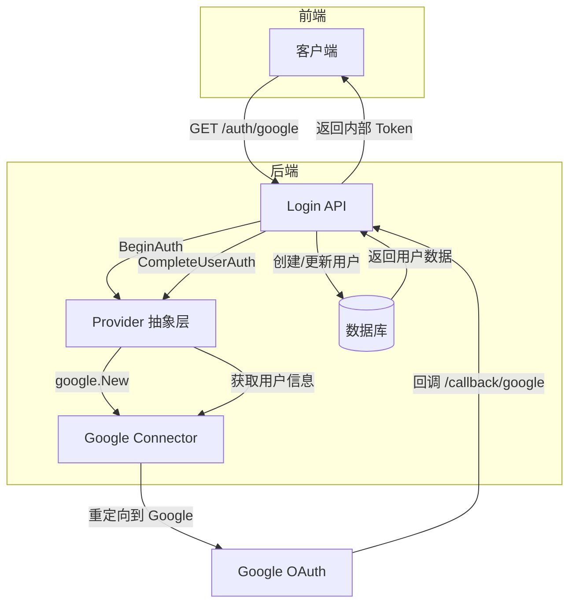
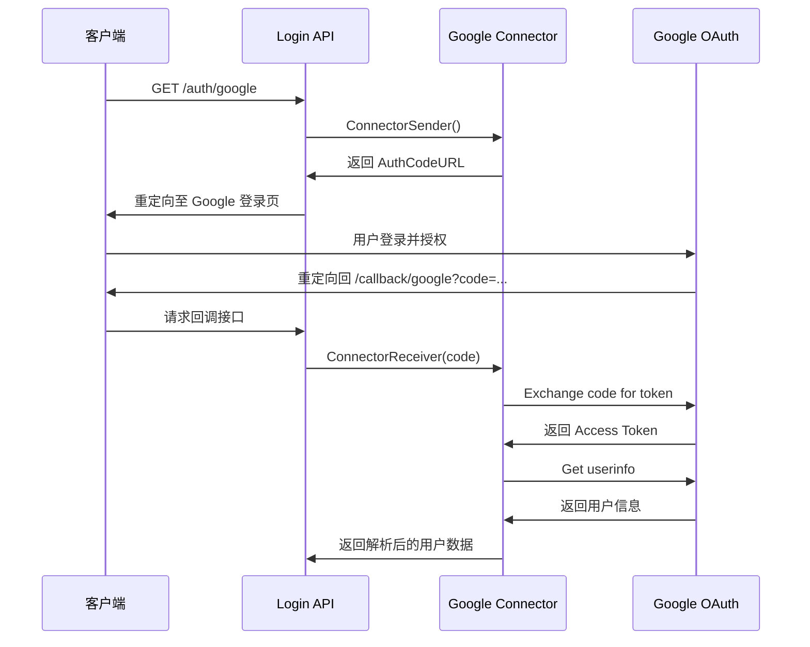
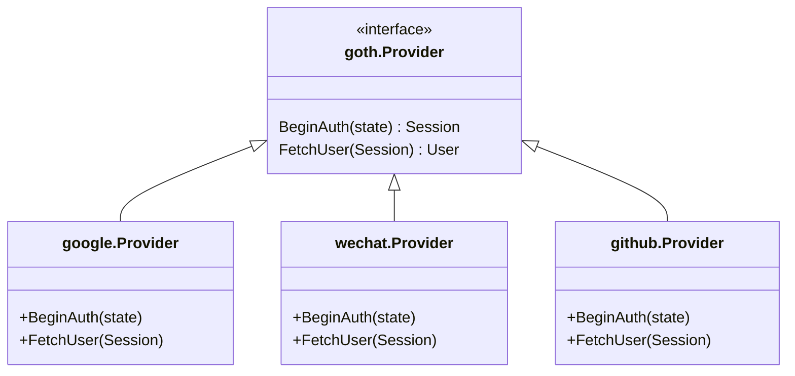
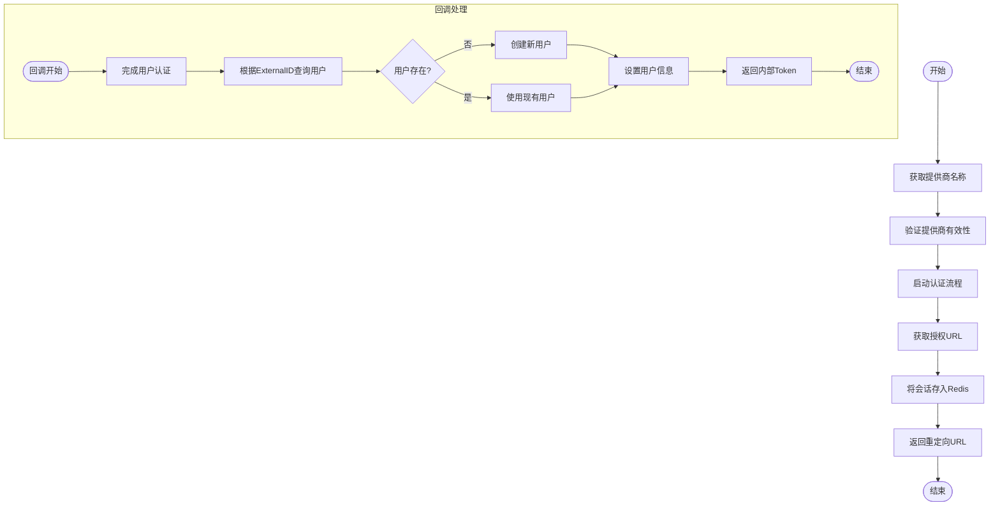
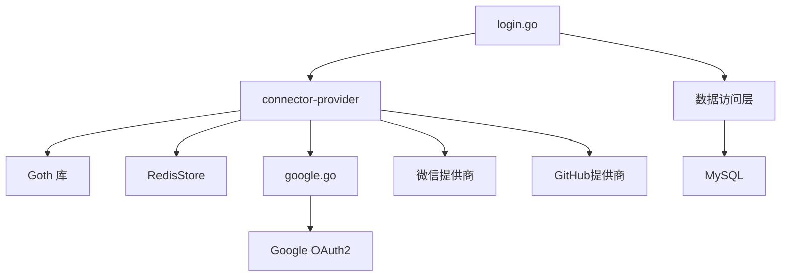

# 外部集成

<cite>
**本文档引用的文件**  
- [google.go](file://app/pkg/connector-google/google.go)
- [provider.go](file://app/pkg/connector-provider/provider.go)
- [login.go](file://app/api/login.go)
- [user.gen.go](file://app/dal/model/user.gen.go)
- [local.toml](file://app/conf/local.toml)
</cite>

## 目录
1. [简介](#简介)
2. [项目结构](#项目结构)
3. [核心组件](#核心组件)
4. [架构概览](#架构概览)
5. [详细组件分析](#详细组件分析)
6. [依赖分析](#依赖分析)
7. [性能考虑](#性能考虑)
8. [故障排除指南](#故障排除指南)
9. [结论](#结论)

## 简介
本文档详细记录了第三方登录集成的实现机制，重点分析 Google OAuth 的接入流程。系统通过 `connector-google/google.go` 实现 OAuth2 授权码流程，包括重定向至 Google 登录页、处理回调、交换 Access Token 及获取用户信息。`connector-provider/provider.go` 提供抽象层设计，支持未来接入 GitHub、Apple 等更多第三方登录提供商。`login.go` 中的 `/auth/{name}` 和 `/callback/{name}` 接口与这些组件协同工作，完成用户身份验证并生成内部 Token。同时提供 Google OAuth Client ID/Secret 的配置指引及安全存储凭证的最佳实践。

## 项目结构
项目采用分层架构设计，主要目录包括：
- `app/api`：API 接口定义与实现
- `app/dal`：数据访问层，包含数据库模型与操作
- `app/pkg`：核心功能包，包括第三方登录集成
- `app/conf`：配置文件管理
- `tests`：测试用例

关键文件分布：
- 第三方登录实现：`app/pkg/connector-google/google.go`
- 抽象提供商层：`app/pkg/connector-provider/provider.go`
- 登录接口逻辑：`app/api/login.go`
- 用户数据模型：`app/dal/model/user.gen.go`
- 环境配置：`app/conf/local.toml`

**Section sources**
- [google.go](file://app/pkg/connector-google/google.go#L1-L90)
- [provider.go](file://app/pkg/connector-provider/provider.go#L1-L50)
- [login.go](file://app/api/login.go#L1-L90)

## 核心组件

`connector-google/google.go` 实现了 Google OAuth2 的完整授权流程，`connector-provider/provider.go` 提供统一的第三方登录抽象层，`login.go` 定义了标准接口用于触发和处理登录流程。这些组件共同构成了可扩展的第三方身份验证系统。

**Section sources**
- [google.go](file://app/pkg/connector-google/google.go#L1-L90)
- [provider.go](file://app/pkg/connector-provider/provider.go#L1-L50)
- [login.go](file://app/api/login.go#L1-L90)

## 架构概览

**Diagram sources**
- [login.go](file://app/api/login.go#L1-L90)
- [provider.go](file://app/pkg/connector-provider/provider.go#L1-L50)
- [google.go](file://app/pkg/connector-google/google.go#L1-L90)

## 详细组件分析

### Google OAuth 实现分析

`connector-google/google.go` 文件实现了 Google OAuth2 的核心逻辑。

#### 初始化与配置
该模块通过 `Init()` 函数从环境变量加载 `GOOGLE_CLIENT_ID` 和 `GOOGLE_CLIENT_SECRET`，并初始化全局 `Connector` 配置对象。

#### 授权码流程实现
`ConnectorConfig` 结构体实现了 `ConnectorSender` 和 `ConnectorReceiver` 方法，分别处理授权请求发送和回调接收。

**Diagram sources**
- [google.go](file://app/pkg/connector-google/google.go#L42-L88)

#### 用户信息结构
`AuthUserInfo` 结构体定义了从 Google 获取的用户信息字段，包括唯一标识 `Sub`、显示名称 `Name`、邮箱 `Email` 等。

**Section sources**
- [google.go](file://app/pkg/connector-google/google.go#L30-L40)

### 抽象提供商层设计

`connector-provider/provider.go` 使用 Goth 库实现多提供商支持。

#### 多提供商注册
`Init()` 函数注册了 Google、微信和 GitHub（仅本地环境）提供商，并配置 Redis 会话存储以安全保存认证状态。

#### 扩展性设计
通过 `goth.UseProviders()` 注册多个提供商，系统可轻松扩展支持 Apple、Facebook 等其他 OAuth 提供商，体现了良好的可扩展架构。

**Diagram sources**
- [provider.go](file://app/pkg/connector-provider/provider.go#L20-L45)

**Section sources**
- [provider.go](file://app/pkg/connector-provider/provider.go#L1-L50)

### 登录接口工作流分析

`login.go` 中的 `loginServiceImpl` 实现了标准登录接口。

#### 认证发起流程
`Connector` 方法根据请求路径中的 `{name}` 参数获取对应提供商，调用 `BeginAuth` 启动认证流程，并将会话信息存储在 Redis 中。

#### 回调处理流程
`ConnectorCallback` 方法调用 `gothic.CompleteUserAuth` 完成用户认证，然后在数据库中查找或创建用户记录。

**Diagram sources**
- [login.go](file://app/api/login.go#L20-L60)

#### 用户数据映射
成功认证后，系统将第三方用户信息映射到内部 `User` 模型，关键字段包括：
- `ExternalID`: 第三方唯一标识（如 Google Sub）
- `Provider`: 登录来源（google/wechat/github）
- `DisplayName`: 显示名称
- `Email`: 邮箱地址
- `Avatar`: 头像 URL

**Section sources**
- [login.go](file://app/api/login.go#L1-L90)
- [user.gen.go](file://app/dal/model/user.gen.go#L1-L38)

## 依赖分析

**Diagram sources**
- [login.go](file://app/api/login.go#L1-L90)
- [provider.go](file://app/pkg/connector-provider/provider.go#L1-L50)
- [google.go](file://app/pkg/connector-google/google.go#L1-L90)

**Section sources**
- [login.go](file://app/api/login.go#L1-L90)
- [provider.go](file://app/pkg/connector-provider/provider.go#L1-L50)
- [google.go](file://app/pkg/connector-google/google.go#L1-L90)

## 性能考虑
- 使用 Redis 存储会话信息，提高会话读写性能
- OAuth2 Token 交换设置 15 秒超时，防止请求挂起
- 数据库对 `external_id` 和 `provider` 字段建立联合唯一索引，优化用户查询性能
- Goth 库的异步处理能力支持高并发认证请求

## 故障排除指南
常见问题及解决方案：
- **回调失败**：检查 `RedirectURL` 配置是否与 Google Cloud Console 中注册的回调 URL 一致
- **会话丢失**：确保 Redis 服务正常运行且连接配置正确
- **用户信息获取失败**：验证 Google OAuth2 范围权限是否包含 `userinfo.email` 和 `userinfo.profile`
- **环境变量未加载**：确认 `GOOGLE_CLIENT_ID` 和 `GOOGLE_CLIENT_SECRET` 已正确设置在环境变量中

**Section sources**
- [google.go](file://app/pkg/connector-google/google.go#L1-L90)
- [provider.go](file://app/pkg/connector-provider/provider.go#L1-L50)
- [local.toml](file://app/conf/local.toml#L1-L30)

## 结论
本系统通过分层设计实现了安全、可扩展的第三方登录功能。`connector-google/google.go` 专注 Google OAuth2 协议实现，`connector-provider/provider.go` 提供统一抽象层支持多提供商，`login.go` 定义标准化接口协调整个流程。该架构既满足当前需求，又为未来扩展其他登录方式提供了良好基础。