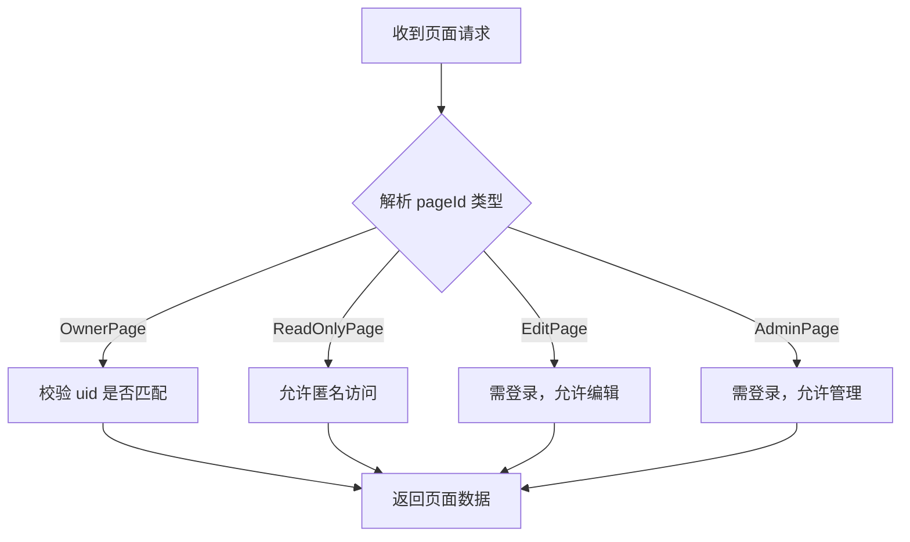

# 安全考虑

<cite>
**本文档引用的文件**  
- [local.toml](file://app/conf/local.toml)
- [redis.go](file://app/dal/redis.go)
- [login.go](file://app/api/login.go)
- [page_tool.go](file://app/api/page_tool.go)
- [page.go](file://app/dal/page.go)
- [login.go](file://app/pkg/middleware/login.go)
</cite>

## 目录
1. [简介](#简介)
2. [X-Token 认证机制](#x-token-认证机制)
3. [权限分级控制](#权限分级控制)
4. [敏感信息管理](#敏感信息管理)
5. [输入验证与安全防护](#输入验证与安全防护)
6. [安全增强建议](#安全增强建议)

## 简介
`forgeturl-server` 是一个基于 Go 语言开发的后端服务，支持用户通过第三方 OAuth 登录，并提供多级页面访问控制。本文档系统性地分析其安全设计，涵盖认证机制、权限控制、敏感信息管理及潜在安全风险，并提出改进建议，以帮助运维人员构建更安全的生产环境。

## X-Token 认证机制

系统采用基于 `X-Token` 的无状态认证机制，用户登录后由服务端生成唯一 Token 并通过 Redis 存储，后续请求需携带该 Token 进行身份校验。

### Token 生成与存储
- 用户通过第三方 OAuth（如 Google）完成认证后，系统生成唯一 `X-Token`。
- Token 与用户 `uid` 的映射关系存储于 Redis 中，有效期为 **180 天**（`LoginTimeout = time.Hour * 24 * 180`）。
- 使用 `SetXToken` 方法将 `token -> uid` 写入 Redis，确保登录状态持久化。

### Token 校验流程
- 每次 API 请求通过中间件 `GetLoginUid` 提取请求头中的 `X-Token`。
- 调用 `GetXToken` 方法查询 Redis，若存在有效映射则返回对应 `uid`，否则返回 0 表示未认证。
- 该机制避免了频繁数据库查询，提升了性能，同时依赖 Redis 实现集中式会话管理。

### 安全性分析
- **优点**：Token 存储于服务端（Redis），客户端仅持有引用，降低泄露风险；支持快速注销（删除 Redis 记录）。
- **风险**：Token 未设置刷新机制，长期有效可能增加被盗用风险；建议引入短期 Token + Refresh Token 机制。

**Section sources**
- [redis.go](file://app/dal/redis.go#L66-L90)
- [login.go](file://app/pkg/middleware/login.go#L7-L15)

## 权限分级控制

系统通过 `PageConf` 结构体实现三级权限控制：只读（readonly）、编辑（edit）、管理（admin），并结合页面 ID 类型进行细粒度访问控制。

### 权限模型设计
- 每个页面（`Page`）拥有四种 ID：
  - `Pid`：所有者 ID，仅创建者可访问。
  - `ReadonlyPid`：只读 ID，任何人可查看。
  - `EditPid`：编辑 ID，持有者可修改内容。
  - `AdminPid`：管理 ID，持有者可删除或修改页面配置。
- 权限通过 `PageConf` 结构体在响应中返回，前端据此控制 UI 显示。

### 权限校验逻辑
- 在 `GetPage` 和 `GetPageBrief` 方法中，根据传入 `pageId` 的前缀判断其类型（`OwnerPage`, `ReadOnlyPage`, `EditPage`, `AdminPage`）。
- 不同类型执行不同数据库查询条件：
  - `OwnerPage`：需匹配 `uid` 且为页面所有者。
  - `EditPage` / `AdminPage`：需登录，但不强制为所有者（存在越权风险）。
  - `ReadOnlyPage`：无需登录，公开访问。

### 越权访问风险
- 当前实现中，`EditPage` 和 `AdminPage` 仅通过链接访问控制，未验证用户与页面的归属关系，可能导致非所有者通过链接进行编辑或管理操作。
- 建议在 `EditPage` 和 `AdminPage` 的查询条件中增加 `uid` 校验，或引入更严格的权限令牌机制。



**Diagram sources**
- [page.go](file://app/dal/page.go#L54-L81)
- [page_tool.go](file://app/api/page_tool.go#L50-L110)

**Section sources**
- [page.go](file://app/dal/page.go#L54-L112)
- [page_tool.go](file://app/api/page_tool.go#L0-L111)

## 敏感信息管理

系统配置文件 `local.toml` 中明文存储了数据库密码、Redis 认证信息等敏感数据，存在安全风险。

### 当前配置示例
```toml
[mysql]
User = "root"
Passwd = "pwdTest"

[redisServer]
auth = ""
```

### 安全隐患
- 配置文件若被泄露（如误提交至 Git 仓库），攻击者可直接获取数据库访问权限。
- 环境变量未被使用，缺乏动态配置能力，不利于多环境（开发、测试、生产）管理。

### 改进建议
- **使用环境变量替代明文配置**：将 `Passwd`、`auth` 等敏感字段替换为环境变量读取。
- **配置文件权限控制**：确保 `local.toml` 文件权限为 `600`，仅允许服务账户读取。
- **引入密钥管理服务（KMS）**：在生产环境中使用 AWS KMS、Hashicorp Vault 等工具集中管理密钥。

**Section sources**
- [local.toml](file://app/conf/local.toml#L0-L29)

## 输入验证与安全防护

系统在部分接口中缺乏严格的输入验证，可能面临恶意数据注入风险。

### 已知防护机制
- 使用 `gin` 框架的中间件进行日志记录和错误恢复。
- 在 `serverlog.go` 中对请求头进行过滤，限制日志中打印的敏感头信息（如 `Authorization`）。
- 对某些路径（如 `/health`）禁用日志输出，减少信息暴露。

### 潜在风险点
- 未发现对用户输入内容（如页面标题、简介、内容）进行 XSS 过滤或 SQL 注入防护。
- 页面 ID 生成依赖 `GenPageID`，但未验证其唯一性和随机性强度。
- 缺少对上传内容类型和大小的限制。

### 建议措施
- 引入输入校验库（如 `validator`）对请求参数进行结构化校验。
- 对富文本内容进行 HTML 转义或使用白名单过滤。
- 设置请求体大小限制，防止大 payload 攻击。

**Section sources**
- [serverlog.go](file://app/pkg/middleware/serverlog.go#L161-L254)

## 安全增强建议

为提升系统整体安全性，建议实施以下增强措施：

### 强制启用 HTTPS
- 当前配置中 `domain = "http://localhost"` 使用 HTTP 协议，生产环境必须切换为 HTTPS。
- 配置反向代理（如 Nginx）或使用 Let's Encrypt 免费证书实现全站加密传输。

### Token 传输安全
- **推荐使用 `Authorization: Bearer <token>`** 替代自定义 `X-Token` 头，符合行业标准。
- 若使用 Cookie 传输 Token，必须设置 `HttpOnly` 和 `Secure` 标志，防止 XSS 窃取。

### 速率限制（Rate Limiting）
- 系统已集成 `ratelimiter.RedisRateLimiter`，可用于限制登录、API 调用频率。
- 建议对 `/login`、`/api/*` 等关键接口配置速率限制（如 1000 次/分钟），防止暴力破解和 DDoS 攻击。

### 安全头配置
- 启用安全响应头，如：
  - `X-Content-Type-Options: nosniff`
  - `X-Frame-Options: DENY`
  - `Content-Security-Policy` 限制资源加载
- 可通过 Gin 中间件统一注入。