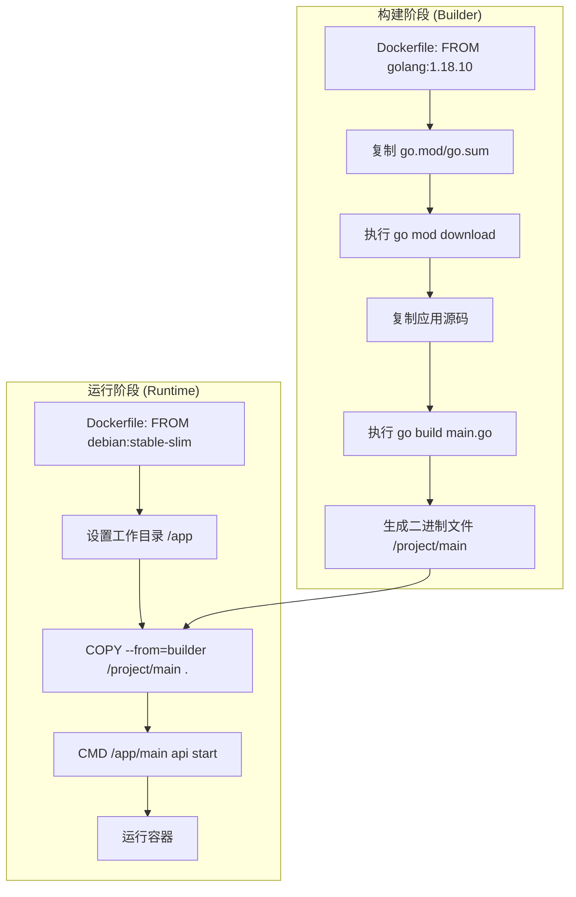

# 技术栈与依赖

<cite>
**本文档引用的文件**   
- [Dockerfile](file://Dockerfile)
- [go.mod](file://app/go.mod)
- [init.go](file://app/cmd/init.go)
- [init.go](file://app/dal/init.go)
- [newgin.go](file://app/pkg/middleware/newgin.go)
- [redis.go](file://app/dal/redis.go)
</cite>

## 目录
1. [Go 语言版本与构建流程](#go-语言版本与构建流程)
2. [核心依赖分析](#核心依赖分析)
3. [容器化部署策略](#容器化部署策略)
4. [开发者环境搭建建议](#开发者环境搭建建议)

## Go 语言版本与构建流程

`forgeturl-server` 项目在 `Dockerfile` 中明确指定了 Go 语言的版本为 `1.18.10`。该版本通过基础镜像 `sunmi-docker-images-registry.cn-hangzhou.cr.aliyuncs.com/public/golang:1.18.10` 进行指定。此做法确保了构建环境的稳定性和可复现性，避免了因不同开发或构建机器上 Go 版本不一致而导致的潜在问题。

项目的构建流程采用多阶段构建（Multi-stage Build）策略，主要分为两个阶段：`builder` 阶段和运行阶段。

1.  **Builder 阶段**：此阶段使用包含 Go 工具链的镜像。首先，它将 `app/go.mod` 和 `app/go.sum` 文件复制到工作目录 `/go/cache` 中，并执行 `go mod download` 命令来预先下载所有依赖项。这一步可以利用 Docker 的层缓存机制，当 `go.mod` 或 `go.sum` 文件未发生变化时，无需重复下载依赖，从而显著加快后续构建速度。随后，工作目录切换到 `/project`，并将整个 `app/` 目录复制进来。最后，执行 `go build main.go` 命令，将项目源代码编译成一个静态链接的二进制可执行文件 `main`。

2.  **运行阶段**：此阶段使用一个轻量级的基础镜像 `sunmi-docker-images-registry.cn-hangzhou.cr.aliyuncs.com/public/debian:stable-slim`，该镜像不包含 Go 编译器和源代码，因此体积非常小，提高了部署效率和安全性。在该阶段，工作目录设置为 `/app`，并通过 `COPY --from=builder /project/main .` 命令，将 `builder` 阶段生成的 `main` 二进制文件从构建容器中复制到运行容器的 `/app` 目录下。最后，通过 `CMD [ "/app/main","api","start"]` 指令定义了容器启动时执行的命令，即运行 `/app/main` 二进制文件，并传入 `api` 和 `start` 两个参数来启动 API 服务。

**Section sources**
- [Dockerfile](file://Dockerfile#L1-L25)

## 核心依赖分析

`go.mod` 文件定义了项目所依赖的关键第三方库，这些库在项目中扮演着至关重要的角色。

- **`github.com/sunmi-OS/gocore/v2` (v2.1.59)**: 这是项目的核心依赖，它封装了 Gin Web 框架和日志系统。通过 `gocore/v2`，项目无需直接与 Gin 交互，而是使用其提供的更高层次的抽象。例如，在 `app/pkg/middleware/newgin.go` 文件中，`NewGin()` 函数调用了 `gocore/v2` 提供的 `gin.DefaultWriter`、`gin.DefaultErrorWriter` 以及 `prometheus.NewPrometheus().Use(r)` 等功能，实现了日志重定向、性能监控（Prometheus）和调试工具（pprof）的集成。这极大地简化了 Web 服务的初始化和配置。

- **`gorm.io/gorm` (v1.25.12) 和 `gorm.io/gen` (v0.3.26)**: 这两个库共同构成了项目的 ORM（对象关系映射）解决方案。`gorm` 是一个功能强大的 ORM 库，而 `gorm/gen` 是其代码生成工具。项目通过 `app/dal/gensql/gorm_gen.go` 脚本，根据数据库表结构自动生成了 `app/dal/query/` 目录下的所有查询代码（如 `user.gen.go`, `page.gen.go`）。这使得开发者可以使用类型安全的 Go 代码来操作数据库，避免了手写 SQL 的繁琐和易错性。`app/dal/init.go` 文件中的 `Init()` 函数负责初始化数据库连接，并通过 `query.Use(db)` 将 `gorm` 的 `*gorm.DB` 实例注入到 `gorm/gen` 生成的查询器中。

- **`google.golang.org/protobuf` (v1.36.2)**: 该库提供了对 Protocol Buffers（Protobuf）的支持。Protobuf 是一种高效的数据序列化格式，常用于 API 通信和数据存储。项目在 `app/api/proto/` 目录下定义了多个 `.proto` 文件（如 `login.proto`, `space.proto`），并通过 Protobuf 工具链生成了对应的 Go 语言代码，实现了数据结构的定义和序列化/反序列化。

- **`github.com/redis/go-redis/v9` (v9.5.5)**: 这是 Redis 的 Go 客户端库。项目使用 Redis 作为缓存和会话存储。在 `app/dal/redis.go` 文件中，通过 `gocore/v2` 提供的 `gredis` 模块来管理 Redis 连接，并初始化了两个独立的 Redis 客户端：一个用于用户缓存 (`C.user`)，另一个用于分布式锁 (`C.lock`)。`initRedis()` 函数确保了 Redis 连接的正确建立和初始化。

**Section sources**
- [go.mod](file://app/go.mod#L1-L145)
- [newgin.go](file://app/pkg/middleware/newgin.go#L1-L55)
- [init.go](file://app/dal/init.go#L1-L71)
- [redis.go](file://app/dal/redis.go#L1-L65)

## 容器化部署策略

`forgeturl-server` 采用了标准的多阶段 Docker 构建策略，以优化部署效率和安全性。

如前所述，该策略分为 `builder` 和运行两个阶段。`builder` 阶段负责下载依赖和编译二进制文件，而运行阶段则使用一个极简的 `debian:stable-slim` 镜像来运行编译好的二进制文件。这种分离确保了最终的运行镜像不包含任何源代码、编译器或开发工具，从而减小了镜像体积，降低了攻击面。

构建流程清晰地定义了工作目录（`WORKDIR`），并在 `builder` 阶段设置了 Go 模块代理（`GOPROXY`）和模块模式（`GO111MODULE`），以保证依赖下载的稳定性和正确性。最终，`CMD` 指令指定了容器启动时执行的命令，即 `/app/main api start`，这与项目的启动逻辑相匹配。

**Diagram sources**
- [Dockerfile](file://Dockerfile#L1-L25)

## 开发者环境搭建建议

为了确保开发者能够顺利搭建环境并理解各技术组件的集成方式，建议遵循以下步骤：

1.  **Go 环境**：安装与 `Dockerfile` 中指定版本（1.18.10）兼容的 Go 环境，以保证本地构建行为与容器化构建一致。
2.  **依赖管理**：使用 `go mod` 工具管理依赖。项目已提供 `go.mod` 和 `go.sum` 文件，开发者只需在项目根目录执行 `go mod tidy` 即可自动下载所有声明的依赖。
3.  **数据库与缓存**：确保 MySQL 和 Redis 服务已启动并可访问。项目通过 `gocore/v2` 的 Nacos 配置中心（在 `app/cmd/init.go` 中通过 `nacos.SetLocalConfigFile` 和 `vt.SetDataIds` 初始化）来获取数据库和 Redis 的连接信息。
4.  **代码生成**：当数据库表结构发生变更时，需要重新运行 `app/dal/gensql.sh` 脚本来生成最新的 ORM 查询代码。
5.  **版本兼容性**：严格遵循 `go.mod` 文件中声明的依赖版本，避免因版本不兼容导致的运行时错误。所有核心功能（Web 服务、ORM、日志、缓存）都通过 `gocore/v2` 这个统一的封装层进行集成，开发者应优先使用其提供的接口。

**Section sources**
- [Dockerfile](file://Dockerfile#L1-L25)
- [go.mod](file://app/go.mod#L1-L145)
- [init.go](file://app/cmd/init.go#L1-L53)
- [init.go](file://app/dal/init.go#L1-L71)
- [redis.go](file://app/dal/redis.go#L1-L65)