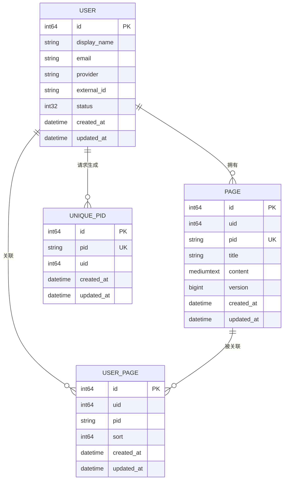

# 数据模型与 ORM 映射

<cite>
**本文档引用文件**  
- [user.gen.go](file://app/dal/model/user.gen.go)
- [page.gen.go](file://app/dal/model/page.gen.go)
- [user_page.gen.go](file://app/dal/model/user_page.gen.go)
- [unique_pid.gen.go](file://app/dal/model/unique_pid.gen.go)
- [user.gen.go](file://app/dal/query/user.gen.go)
- [page.gen.go](file://app/dal/query/page.gen.go)
- [user_page.gen.go](file://app/dal/query/user_page.gen.go)
- [unique_pid.gen.go](file://app/dal/query/unique_pid.gen.go)
- [user.sql](file://app/dal/gensql/user.sql)
- [page.sql](file://app/dal/gensql/page.sql)
- [user_page.sql](file://app/dal/gensql/user_page.sql)
- [unique_pid.sql](file://app/dal/gensql/unique_pid.sql)
- [init.go](file://app/dal/init.go)
- [redis.go](file://app/dal/redis.go)
- [user.go](file://app/pkg/lcache/user.go)
</cite>

## 目录
1. [引言](#引言)
2. [核心数据模型定义](#核心数据模型定义)
3. [数据库表结构与 SQL 脚本分析](#数据库表结构与-sql-脚本分析)
4. [GORM Gen 类型安全查询 API](#gorm-gen-类型安全查询-api)
5. [数据访问层（DAL）架构与初始化](#数据访问层dal架构与初始化)
6. [Redis 缓存机制在用户信息读取中的应用](#redis-缓存机制在用户信息读取中的应用)
7. [实体关系与数据访问流程图](#实体关系与数据访问流程图)
8. [总结](#总结)

## 引言
本文档全面记录 `forgeturl-server` 项目中核心数据模型的设计与实现。重点分析 `User`、`Page`、`Link`、`Collections` 和 `PageConf` 等实体（其中 `Link` 和 `Collections` 逻辑上包含于 `Page.Content` 字段）的字段定义、数据类型、业务含义及相互关系。结合 GORM Gen 自动生成的 model 和 query 文件，说明如何通过类型安全的 API 操作数据库。同时，解析 SQL 脚本中的表结构、主键、索引和约束，并与 Go 结构体字段进行对应。最后，阐述数据访问层（dal）的封装机制及 Redis 缓存的优化作用。

## 核心数据模型定义

本节详细描述由 GORM Gen 生成的核心数据模型 Go 结构体。

### User 实体
`User` 结构体映射到 `user` 表，代表系统用户。

**字段定义与业务含义：**
- **ID**: `int64`，主键，自增 ID。
- **DisplayName**: `string`，用户的显示名称。
- **Username**: `string`，用户名。
- **Email**: `string`，用户邮箱，来自第三方登录提供商。
- **Avatar**: `string`，用户头像 URL。
- **Status**: `int32`，用户状态（正常 0，已暂停 2，已删除 4）。
- **LastLoginDate**: `time.Time`，最后登录时间。
- **Provider**: `string`，登录来源（如 google, facebook, weixin）。
- **ExternalID**: `string`，登录来源的唯一 ID（如 Gmail 的 sub 或微信的 unionid）。
- **IPInfo**: `string`，IP 信息。
- **IsAdmin**: `int32`，是否为管理员。
- **SuspendedAt**: `time.Time`，被暂停的时间。
- **DeletedAt**: `gorm.DeletedAt`，软删除时间戳。
- **CreatedAt**: `*time.Time`，创建时间。
- **UpdatedAt**: `*time.Time`，更新时间。

该结构体通过 `uk_provider_external_id` 唯一索引保证同一登录源的用户唯一性。

**Section sources**
- [user.gen.go](file://app/dal/model/user.gen.go#L1-L38)

### Page 实体
`Page` 结构体映射到 `page` 表，代表一个页面。

**字段定义与业务含义：**
- **ID**: `int64`，主键，自增 ID。
- **UID**: `int64`，页面所有者的用户 ID。
- **Pid**: `string`，原始页面 ID，以 'O' 开头，全局唯一。
- **ReadonlyPid**: `string`，只读页面 ID，以 'R' 开头。
- **EditPid**: `string`，编辑页面 ID，以 'E' 开头。
- **AdminPid**: `string`，超级管理员页面 ID，以 'A' 开头。
- **Title**: `string`，页面标题。
- **Brief**: `string`，页面简要描述。
- **Content**: `string`，页面实体内容，存储文件夹、链接等定义（JSON 格式）。
- **Version**: `int64`，版本号，用于乐观锁。
- **CreatedAt**: `*time.Time`，创建时间。
- **UpdatedAt**: `*time.Time`，更新时间。

该结构体通过 `uk_pid` 唯一索引保证 `Pid` 的全局唯一性，并为其他 PID 字段创建了普通索引以加速查询。

**Section sources**
- [page.gen.go](file://app/dal/model/page.gen.go#L1-L33)

### UserPage 实体
`UserPage` 结构体映射到 `user_page` 表，代表用户空间中可见的页面及其排序。

**字段定义与业务含义：**
- **ID**: `int64`，主键，自增 ID。
- **UID**: `int64`，用户 ID。
- **Pid**: `string`，关联的页面原始 ID。
- **Sort**: `int64`，页面在用户空间中的排序序号。
- **DeletedAt**: `gorm.DeletedAt`，软删除时间戳。
- **CreatedAt**: `*time.Time`，创建时间。
- **UpdatedAt**: `*time.Time`，更新时间。

该结构体通过 `uk_uid_pid` 唯一索引保证一个用户不能重复添加同一个页面。

**Section sources**
- [user_page.gen.go](file://app/dal/model/user_page.gen.go#L1-L30)

### UniquePid 实体
`UniquePid` 结构体映射到 `unique_pid` 表，用于生成全局唯一的 PID。

**字段定义与业务含义：**
- **ID**: `int64`，主键，自增 ID。
- **Pid**: `string`，生成的唯一 PID。
- **UID**: `int64`，请求生成 PID 的用户 ID。
- **CreatedAt**: `*time.Time`，创建时间。
- **UpdatedAt**: `*time.Time`，更新时间。

该结构体通过 `uk_pid` 唯一索引确保生成的 PID 全局唯一。

**Section sources**
- [unique_pid.gen.go](file://app/dal/model/unique_pid.gen.go#L1-L26)

## 数据库表结构与 SQL 脚本分析

本节分析 SQL 脚本定义的表结构，并与 Go 结构体进行对应。

### user.sql 表结构
`user` 表是用户信息的核心存储。

**关键约束与索引：**
- **主键 (PRIMARY KEY)**: `id` 字段。
- **唯一索引 (UNIQUE KEY)**: `uk_provider_external_id` 联合索引，由 `provider` 和 `external_id` 组成，确保同一登录源的用户唯一性。
- **字符集**: 使用 `utf8mb4` 字符集和 `utf8mb4_general_ci` 排序规则，支持完整的 Unicode（如 emoji）。

**字段映射：**
SQL 脚本中的字段定义与 `model.User` 结构体的 `gorm` 标签完全对应。例如，`VARCHAR(64)` 对应 `type:varchar(64)`，`NOT NULL` 对应 `not null`，`COMMENT` 对应 `comment`。

**Section sources**
- [user.sql](file://app/dal/gensql/user.sql#L1-L24)

### page.sql 表结构
`page` 表存储页面的核心数据。

**关键约束与索引：**
- **主键 (PRIMARY KEY)**: `id` 字段。
- **唯一索引 (UNIQUE KEY)**: `uk_pid` 确保 `pid` 字段的唯一性。
- **普通索引 (KEY)**: 为 `readonly_pid`、`edit_pid`、`admin_pid`、`created_at` 和 `updated_at` 创建了索引，以加速基于这些字段的查询。
- **字符集**: 同样使用 `utf8mb4` 字符集，确保标题和描述能存储中文及特殊字符。

**字段映射：**
`content` 字段使用 `MEDIUMTEXT` 类型，对应 Go 中的 `string`，能够存储较大的 JSON 数据。`created_at` 和 `updated_at` 字段设置了 `DEFAULT CURRENT_TIMESTAMP` 和 `ON UPDATE CURRENT_TIMESTAMP`，自动维护时间戳。

**Section sources**
- [page.sql](file://app/dal/gensql/page.sql#L1-L28)

### user_page.sql 表结构
`user_page` 表是用户与页面之间的多对多关系表。

**关键约束与索引：**
- **主键 (PRIMARY KEY)**: `id` 字段。
- **唯一索引 (UNIQUE KEY)**: `uk_uid_pid` 联合索引，由 `uid` 和 `pid` 组成，防止用户重复添加同一页面。
- **软删除**: 通过 `deleted_at` 字段实现软删除功能。

**字段映射：**
`sort` 字段用于存储用户自定义的页面排序，`uid` 和 `pid` 分别关联 `User` 和 `Page` 实体。

**Section sources**
- [user_page.sql](file://app/dal/gensql/user_page.sql#L1-L18)

### unique_pid.sql 表结构
`unique_pid` 表用于生成和管理全局唯一的 PID。

**关键约束与索引：**
- **主键 (PRIMARY KEY)**: `id` 字段。
- **唯一索引 (UNIQUE KEY)**: `uk_pid` 确保 `pid` 字段的值在表中是唯一的，这是保证 PID 全局唯一性的核心机制。

**字段映射：**
该表结构简单，`pid` 字段的唯一性由数据库层面强制保证，为上层应用提供了可靠的唯一 ID 生成服务。

**Section sources**
- [unique_pid.sql](file://app/dal/gensql/unique_pid.sql#L1-L12)

## GORM Gen 类型安全查询 API

GORM Gen 为每个模型生成了类型安全的查询 API，位于 `app/dal/query` 目录下。

### 类型安全优势
传统的 GORM 查询使用字符串作为字段名（如 `db.Where("status = ?", 0)`），容易因拼写错误导致运行时错误。GORM Gen 生成的 API 将字段名转换为 Go 结构体字段，例如 `query.Q.User.Status.Eq(0)`。这使得查询在编译时就能检查字段名的正确性，极大地提高了代码的健壮性和可维护性。

### Query 对象的使用
项目通过 `dal.Q` 全局变量暴露所有生成的查询对象。`Q` 是一个 `*query.Query` 类型的指针，在 `dal.Init()` 函数中通过 `query.Use(db)` 初始化。

**典型查询示例：**
- **查询单个用户**: `dal.Q.User.Where(dal.Q.User.Email.Eq("user@example.com")).First()`
- **查询用户的页面列表**: `dal.Q.UserPage.Where(dal.Q.UserPage.UID.Eq(uid)).Order(dal.Q.UserPage.Sort.Asc()).Find()`
- **创建页面**: `dal.Q.Page.Create(&model.Page{...})`

这些 API 提供了链式调用的语法，使代码更加清晰。

**Section sources**
- [user.gen.go](file://app/dal/query/user.gen.go#L1-L384)
- [page.gen.go](file://app/dal/query/page.gen.go#L1-L372)

## 数据访问层（DAL）架构与初始化

数据访问层（DAL）封装了所有数据库和缓存的访问逻辑。

### 初始化流程
`dal.Init()` 函数负责初始化整个数据访问层：
1.  通过 `orm.NewOrUpdateDB(nacosDBKey)` 从 Nacos 配置中心获取数据库配置并建立连接。
2.  获取 `*gorm.DB` 实例并配置 `CreateBatchSize` 和 `TranslateError`。
3.  调用 `query.Use(db)` 初始化 GORM Gen 的全局查询对象 `Q`。
4.  调用 `initRedis()` 初始化 Redis 客户端。

**错误处理：**
`transGormErr` 函数将 GORM 的原生错误（如 `ErrRecordNotFound`、`ErrDuplicatedKey`）转换为项目自定义的业务错误码，便于上层 API 统一处理。

**Section sources**
- [init.go](file://app/dal/init.go#L0-L70)

### 封装的 CRUD 操作
虽然 `query` 包提供了基础的 CRUD 方法，但项目中通常会在 `dal` 包下创建 `.go` 文件（如 `user.go`, `page.go`），在这些文件中封装更高级的业务逻辑。例如，`dal.GetUserByEmail()` 方法会组合 `Q.User.Where(...).First()` 并处理错误转换。这些封装后的函数被上层 `api` 模块直接调用，实现了清晰的分层。

## Redis 缓存机制在用户信息读取中的应用

项目利用 Redis 作为缓存层，优化高频读取操作。

### 缓存实现
`dal.C` 是一个 `*cacheImpl` 结构体指针，包含两个 Redis 客户端：
- **C.user**: 用于存储用户相关的缓存。
- **C.lock**: 用于分布式锁和限流。

`initRedis()` 函数在 `dal.Init()` 中被调用，负责初始化这些客户端。

### 用户信息缓存
`lcache/user.go` 文件（尽管内容为空，但其包名表明了用途）暗示了用户缓存的逻辑。根据 `redis.go` 中的 `GetXToken` 和 `SetXToken` 方法，可以推断其主要用途是缓存用户的登录会话（Token）。

**工作流程：**
1.  用户登录成功后，调用 `SetXToken(ctx, token, uid)` 将 Token 与用户 ID 的映射关系存入 Redis，设置 180 天的过期时间。
2.  后续请求携带 Token 时，中间件或业务逻辑调用 `GetXToken(ctx, token)` 从 Redis 中快速获取用户 ID，避免了每次请求都查询数据库。
3.  如果缓存未命中（`redis.Nil`），则返回 0，表示需要重新验证或登录。

这种缓存机制显著降低了数据库的查询压力，提升了系统的整体性能和响应速度。

**Section sources**
- [redis.go](file://app/dal/redis.go#L0-L91)
- [user.go](file://app/pkg/lcache/user.go#L0-L1)

## 实体关系与数据访问流程图



**Diagram sources**
- [user.gen.go](file://app/dal/model/user.gen.go#L1-L38)
- [page.gen.go](file://app/dal/model/page.gen.go#L1-L33)
- [user_page.gen.go](file://app/dal/model/user_page.gen.go#L1-L30)
- [unique_pid.gen.go](file://app/dal/model/unique_pid.gen.go#L1-L26)

```mermaid
flowchart TD
A[API 请求] --> B{需要用户身份?}
B --> |是| C[从请求头获取 Token]
C --> D[调用 C.GetXToken]
D --> E{Redis 中存在?}
E --> |是| F[获取 UID, 继续业务逻辑]
E --> |否| G[查询数据库验证用户]
G --> H[调用 C.SetXToken 存入 Redis]
H --> F
F --> I[调用 dal.Q.UserPage.Find()]
I --> J[调用 dal.Q.Page.Find()]
J --> K[返回数据给 API]
B --> |否| K
```

**Diagram sources**
- [redis.go](file://app/dal/redis.go#L0-L91)
- [query/user.gen.go](file://app/dal/query/user.gen.go#L1-L384)
- [query/page.gen.go](file://app/dal/query/page.gen.go#L1-L372)

## 总结
本项目通过 GORM Gen 实现了数据模型的代码与数据库表结构的高度一致性，并利用其类型安全的查询 API 提升了开发效率和代码质量。`user`、`page`、`user_page` 和 `unique_pid` 四个核心表通过主键、唯一索引和普通索引构建了高效的数据存储和查询基础。数据访问层（DAL）通过全局 `Q` 对象和封装的函数，为上层业务提供了清晰、稳定的接口。Redis 缓存的引入，特别是对用户会话（Token）的缓存，有效减轻了数据库的负载，是系统性能优化的关键一环。整体架构体现了分层清晰、关注点分离的设计原则。