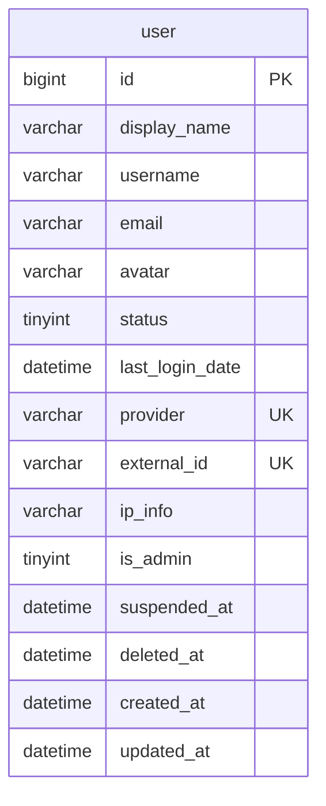
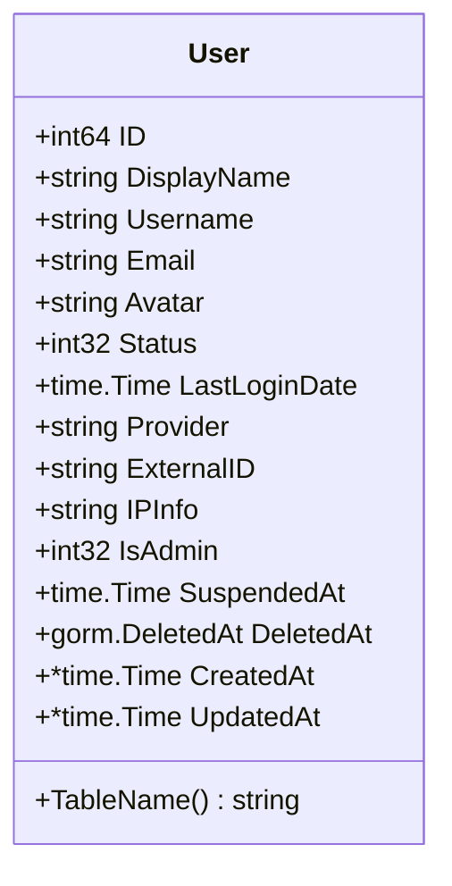
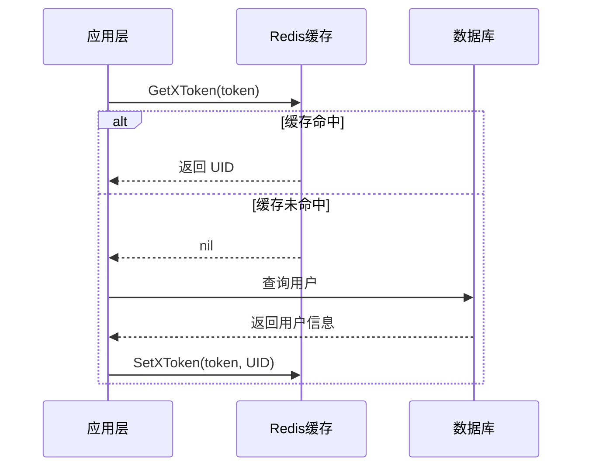

# 用户数据模型

<cite>
**本文档中引用的文件**  
- [user.sql](file://app/dal/gensql/user.sql)
- [user.gen.go](file://app/dal/model/user.gen.go)
- [user.gen.go](file://app/dal/query/user.gen.go)
- [redis.go](file://app/dal/redis.go)
- [user.go](file://app/pkg/lcache/user.go)
</cite>

## 目录
1. [简介](#简介)
2. [数据库表结构](#数据库表结构)
3. [GORM 模型映射](#gorm-模型映射)
4. [GORM Gen 查询 API](#gorm-gen-查询-api)
5. [Redis 缓存机制](#redis-缓存机制)
6. [用户操作流程示例](#用户操作流程示例)
7. [缓存一致性策略](#缓存一致性策略)
8. [常见问题与应对](#常见问题与应对)
9. [总结](#总结)

## 简介
本文档详细描述了系统中用户数据模型的设计与实现，涵盖数据库表结构、GORM 模型映射、类型安全的查询 API 以及 Redis 缓存优化策略。重点分析 `user` 表在数据库中的定义，其与 Go 结构体的映射关系，以及如何通过 GORM Gen 实现类型安全的数据库操作。同时，结合 Redis 缓存机制说明高频读取场景下的性能优化方案，并提供实际代码流程与缓存一致性策略分析。

## 数据库表结构
`user` 表是系统的核心实体之一，用于存储用户的基本信息、登录来源、状态及时间戳等元数据。该表通过 `provider` 和 `external_id` 联合唯一索引确保跨平台用户身份的唯一性。

### 字段定义
| 字段名 | 类型 | 是否为空 | 默认值 | 注释 |
|--------|------|----------|--------|------|
| id | BIGINT(20) | NOT NULL | AUTO_INCREMENT | 自增主键 |
| display_name | VARCHAR(64) | NOT NULL | '' | 用户显示名称 |
| username | VARCHAR(64) | NOT NULL | '' | 用户名 |
| email | VARCHAR(100) | NOT NULL | 无 | 来自认证提供商的邮箱 |
| avatar | VARCHAR(1024) | NOT NULL | '' | 用户头像 URL |
| status | TINYINT | NOT NULL | 0 | 用户状态（正常 0，停用 2，删除 4） |
| last_login_date | DATETIME | NOT NULL | 无 | 最后登录时间 |
| provider | VARCHAR(32) | NOT NULL | '' | 登录来源（如 google、weixin） |
| external_id | VARCHAR(255) | NOT NULL | '' | 第三方平台唯一 ID |
| ip_info | VARCHAR(255) | NOT NULL | '' | IP 地理信息 |
| is_admin | TINYINT | NOT NULL | 0 | 是否为管理员 |
| suspended_at | DATETIME | NULL | NULL | 停用时间 |
| deleted_at | DATETIME | NULL | NULL | 删除时间 |
| created_at | DATETIME | NOT NULL | CURRENT_TIMESTAMP | 创建时间 |
| updated_at | DATETIME | NOT NULL | CURRENT_TIMESTAMP ON UPDATE CURRENT_TIMESTAMP | 更新时间 |

### 约束与索引
- **主键**: `PRIMARY KEY (id)`
- **唯一索引**: `UNIQUE KEY uk_provider_external_id (provider, external_id)` —— 确保同一登录源下的用户 ID 唯一



**图示来源**  
- [user.sql](file://app/dal/gensql/user.sql#L1-L23)

**本节来源**  
- [user.sql](file://app/dal/gensql/user.sql#L1-L23)

## GORM 模型映射
GORM 使用 `user.gen.go` 中的 `User` 结构体将数据库表映射为 Go 语言对象，字段通过 `gorm` 标签与数据库列一一对应。

### 结构体字段与数据库映射
| Go 字段 | 数据库列 | 类型 | 约束说明 |
|--------|--------|------|----------|
| ID | id | int64 | 主键，自增 |
| DisplayName | display_name | string | 非空，最大 64 字符 |
| Username | username | string | 非空，最大 64 字符 |
| Email | email | string | 非空，最大 100 字符 |
| Avatar | avatar | string | 非空，最大 1024 字符 |
| Status | status | int32 | 非空，状态码 |
| LastLoginDate | last_login_date | time.Time | 非空 |
| Provider | provider | string | 非空，联合唯一索引优先级 1 |
| ExternalID | external_id | string | 非空，联合唯一索引优先级 2 |
| IPInfo | ip_info | string | 非空 |
| IsAdmin | is_admin | int32 | 非空 |
| SuspendedAt | suspended_at | time.Time | 可为空 |
| DeletedAt | deleted_at | gorm.DeletedAt | 软删除字段 |
| CreatedAt | created_at | *time.Time | 非空，默认当前时间 |
| UpdatedAt | updated_at | *time.Time | 非空，默认当前时间并自动更新 |

该结构体实现了 `TableName()` 方法返回常量 `TableNameUser`，确保 GORM 正确识别表名。



**图示来源**  
- [user.gen.go](file://app/dal/model/user.gen.go#L15-L37)

**本节来源**  
- [user.gen.go](file://app/dal/model/user.gen.go#L1-L37)

## GORM Gen 查询 API
通过 GORM Gen 自动生成的 `query/user.gen.go` 提供了类型安全的数据库操作接口，避免了字符串拼接带来的 SQL 注入风险和字段错误。

### 核心查询方法
- `First()`：返回第一条记录
- `Take()`：返回任意一条匹配记录
- `Find()`：返回所有匹配记录
- `Where()`：构建条件查询
- `FindByPage(offset, limit)`：分页查询并返回总数

### 类型安全查询示例
```go
// 根据 UID 查询用户
user, err := query.User.Where(query.User.ID.Eq(uid)).First()

// 根据 provider 和 external_id 查询用户（如 Google 登录）
user, err := query.User.Where(
    query.User.Provider.Eq("google"),
    query.User.ExternalID.Eq(sub),
).First()
```

这些方法返回的是字段级别的表达式对象（如 `field.String`, `field.Int64`），在编译期即可检查字段是否存在，极大提升了代码安全性与可维护性。

**本节来源**  
- [user.gen.go](file://app/dal/query/user.gen.go#L1-L383)

## Redis 缓存机制
为优化高频用户信息读取性能，系统通过 Redis 缓存用户登录令牌与 UID 映射关系，减少数据库压力。

### 缓存客户端初始化
在 `dal/redis.go` 中，初始化了名为 `userCache` 的 Redis 客户端，用于存储用户相关缓存数据。配置项 `redisServer.userCache` 指定了 Redis 实例。

### 缓存操作接口
- `GetXToken(ctx, key) int64`：根据 token key 获取 UID，若不存在返回 0
- `SetXToken(ctx, key, uid) error`：设置 token 与 UID 的映射，过期时间为 180 天（`LoginTimeout`）

缓存键通常为 JWT 或会话 token，值为用户 ID。通过 `c.user.Get()` 和 `c.user.Set()` 实现读写操作，并处理 `redis.Nil` 异常情况。



**图示来源**  
- [redis.go](file://app/dal/redis.go#L66-L90)

**本节来源**  
- [redis.go](file://app/dal/redis.go#L0-L90)

## 用户操作流程示例
以下为用户创建、查询与缓存更新的典型流程：

1. **用户登录**：通过 Google 等第三方认证获取 `provider` 和 `external_id`
2. **查询用户**：使用 GORM Gen 查询是否存在对应用户
   ```go
   user, err := query.User.Where(
       query.User.Provider.Eq(provider),
       query.User.ExternalID.Eq(externalID),
   ).First()
   ```
3. **创建用户**：若不存在，则构造 `User` 对象并保存
   ```go
   newUser := &model.User{...}
   err := query.User.Create(newUser)
   ```
4. **生成 Token 并缓存**：生成登录 token，并将 `token -> UID` 写入 Redis
   ```go
   err := dal.C.SetXToken(ctx, token, newUser.ID)
   ```

该流程确保了用户信息的持久化与快速访问。

**本节来源**  
- [user.gen.go](file://app/dal/query/user.gen.go#L266-L282)
- [redis.go](file://app/dal/redis.go#L78-L90)

## 缓存一致性策略
系统采用“先更新数据库，再删除缓存”的策略来保证数据一致性：

- **写操作**：用户信息更新后，先更新数据库，然后删除 Redis 中对应的缓存条目
- **读操作**：优先从 Redis 读取，未命中则从数据库加载并回填缓存

此策略避免了并发写入导致的脏数据问题，同时保障了读取性能。

## 常见问题与应对
### 缓存穿透
当恶意请求大量不存在的 token 时，会导致频繁查询数据库。

**应对方案**：
- **布隆过滤器**：前置过滤非法 token
- **空值缓存**：对确认不存在的 token 缓存空结果（短过期时间）
- **限流机制**：通过 `ratelimiter.RedisRateLimiter` 对高频请求进行限制

当前系统已在 `redis.go` 中集成限流器 `lockRateLimiter`，可用于防御此类攻击。

**本节来源**  
- [redis.go](file://app/dal/redis.go#L60-L64)

## 总结
本文档全面解析了用户数据模型的实现细节，涵盖数据库设计、GORM 映射、类型安全查询与 Redis 缓存优化。通过 GORM Gen 实现了安全高效的数据库操作，结合 Redis 显著提升了高频读取场景的性能表现。缓存一致性策略与限流机制进一步保障了系统的稳定性与安全性。