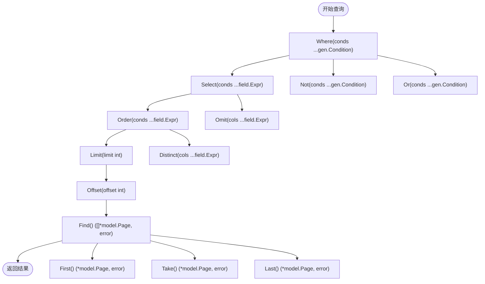

# 页面数据模型

<cite>
**本文档中引用的文件**
- [page.sql](file://app/dal/gensql/page.sql)
- [page.gen.go](file://app/dal/model/page.gen.go)
- [page.gen.go](file://app/dal/query/page.gen.go)
- [page.go](file://app/dal/page.go)
- [const.go](file://app/conf/const.go)
- [page_tool.go](file://app/api/page_tool.go)
- [genid.go](file://app/pkg/maths/genid.go)
</cite>

## 目录
1. [引言](#引言)
2. [数据库表结构设计](#数据库表结构设计)
3. [Go结构体映射与GORM Tag解析](#go结构体映射与gorm-tag解析)
4. [GORM Gen链式查询API使用详解](#gorm-gen链式查询api使用详解)
5. [页面数据存储结构与序列化机制](#页面数据存储结构与序列化机制)
6. [典型查询场景代码示例](#典型查询场景代码示例)
7. [查询性能优化建议](#查询性能优化建议)
8. [结论](#结论)

## 引言
本文档深入解析 `Page` 实体的设计与实现，基于 `page.sql` 定义的数据库表结构，详细说明各字段的数据类型、默认值和业务含义。将数据库字段映射到 `page.gen.go` 中的 Go 结构体，并解释 GORM Tag 的使用方式。结合 `page.gen.go` 查询文件，展示如何使用 GORM Gen 提供的链式调用 API 进行条件查询、分页、排序等操作。阐述页面数据的存储结构设计如何支持书签集合（Collections）与嵌套链接（Link）的序列化存储。提供典型查询场景的代码示例，如根据 PID 获取页面、按用户 UID 查询所有页面，并分析查询性能优化建议。

**Section sources**
- [page.sql](file://app/dal/gensql/page.sql#L1-L27)
- [page.gen.go](file://app/dal/model/page.gen.go#L1-L32)

## 数据库表结构设计
`page` 表是系统中用于存储用户页面信息的核心表，其设计支持多种访问权限模式和版本控制。

### 字段说明
| 字段名 | 数据类型 | 默认值 | 是否非空 | 索引 | 业务含义 |
|--------|--------|--------|--------|--------|--------|
| id | BIGINT(20) | 无 | 是 | 主键，自增 | 自增ID，唯一标识每条记录 |
| uid | BIGINT | 0 | 是 | 无 | 页面所有者的用户ID |
| pid | VARCHAR(16) | '' | 是 | uk_pid（唯一） | 原始页面ID，以'O'开头，代表所有者访问 |
| readonly_pid | VARCHAR(16) | '' | 是 | idx_readonly_pid | 只读页面ID，以'R'开头，允许只读访问 |
| edit_pid | VARCHAR(16) | '' | 是 | idx_edit_pid | 编辑页面ID，以'E'开头，允许编辑访问 |
| admin_pid | VARCHAR(16) | '' | 是 | idx_admin_pid | 管理页面ID，以'A'开头，允许管理访问 |
| title | VARCHAR(256) | '' | 是 | 无 | 页面标题，UTF8MB4编码 |
| brief | VARCHAR(1024) | '' | 是 | 无 | 页面简要描述 |
| content | MEDIUMTEXT | 无 | 是 | 无 | 实体内容，存储文件夹、链接定义的JSON序列化数据 |
| version | BIGINT(20) | 0 | 是 | 无 | 版本号，用于乐观锁控制 |
| created_at | DATETIME | CURRENT_TIMESTAMP | 是 | idx_created_at | 创建时间 |
| updated_at | DATETIME | CURRENT_TIMESTAMP | 是 | idx_updated_at | 更新时间，自动更新 |

### 设计特点
- **多权限ID设计**：通过 `pid`、`readonly_pid`、`edit_pid`、`admin_pid` 四个字段支持不同权限级别的访问，避免了复杂的权限表关联。
- **版本控制**：`version` 字段用于实现乐观锁，防止并发更新冲突。
- **时间戳自动管理**：`created_at` 和 `updated_at` 由数据库自动维护，确保时间一致性。
- **唯一性约束**：`pid` 字段具有唯一索引 `uk_pid`，保证页面ID的全局唯一性。

**Section sources**
- [page.sql](file://app/dal/gensql/page.sql#L1-L27)

## Go结构体映射与GORM Tag解析
`Page` 结构体位于 `app/dal/model/page.gen.go` 文件中，是数据库表 `page` 的 Go 语言映射。

### 结构体定义
```go
type Page struct {
	ID          int64      `gorm:"column:id;type:bigint(20);primaryKey;autoIncrement:true;comment:auto increment id" json:"id"`
	UID         int64      `gorm:"column:uid;type:bigint(20);not null;comment:page owner of uid" json:"uid"`
	Pid         string     `gorm:"column:pid;type:varchar(16);not null;uniqueIndex:uk_pid,priority:1;comment:origin page id，start with O" json:"pid"`
	ReadonlyPid string     `gorm:"column:readonly_pid;type:varchar(16);not null;index:idx_readonly_pid,priority:1;comment:read only page id, start with R" json:"readonly_pid"`
	EditPid     string     `gorm:"column:edit_pid;type:varchar(16);not null;index:idx_edit_pid,priority:1;comment:edit page id, start with E" json:"edit_pid"`
	AdminPid    string     `gorm:"column:admin_pid;type:varchar(16);not null;index:idx_admin_pid,priority:1;comment:super admin page id, start with A" json:"admin_pid"`
	Title       string     `gorm:"column:title;type:varchar(256);not null;comment:标题" json:"title"`
	Brief       string     `gorm:"column:brief;type:varchar(1024);not null;comment:简要描述" json:"brief"`
	Content     string     `gorm:"column:content;type:mediumtext;not null;comment:实体内容(文件夹、链接定义)" json:"content"`
	Version     int64      `gorm:"column:version;type:bigint(20);not null;comment:版本号" json:"version"`
	CreatedAt   *time.Time `gorm:"column:created_at;type:datetime;not null;index:idx_created_at,priority:1;default:CURRENT_TIMESTAMP;comment:创建时间" json:"created_at"`
	UpdatedAt   *time.Time `gorm:"column:updated_at;type:datetime;not null;index:idx_updated_at,priority:1;default:CURRENT_TIMESTAMP;comment:更新时间" json:"updated_at"`
}
```

### GORM Tag 详解
| Tag 属性 | 说明 |
|---------|------|
| `column` | 指定数据库列名，实现结构体字段与数据库字段的映射 |
| `type` | 指定数据库列的数据类型 |
| `primaryKey` | 标记为主键 |
| `autoIncrement` | 标记为自增字段 |
| `not null` | 标记为非空字段 |
| `uniqueIndex` | 创建唯一索引，`uk_pid` 为索引名 |
| `index` | 创建普通索引，`idx_readonly_pid` 等为索引名 |
| `default` | 指定默认值，`CURRENT_TIMESTAMP` 由数据库填充 |
| `comment` | 字段注释，增强代码可读性 |
| `priority` | 索引优先级，用于复合索引 |

**Section sources**
- [page.gen.go](file://app/dal/model/page.gen.go#L1-L32)

## GORM Gen链式查询API使用详解
`app/dal/query/page.gen.go` 文件由 GORM Gen 自动生成，提供了类型安全的链式查询 API。

### 查询构建器方法


**Diagram sources**
- [page.gen.go](file://app/dal/query/page.gen.go#L170-L224)

### 核心查询方法
- **条件查询**：`Where(u.Pid.Eq(pageId))` 构建 WHERE 子句。
- **逻辑操作**：`Or()` 和 `Not()` 支持复杂的条件组合。
- **字段选择**：`Select()` 指定返回字段，`Omit(u.Content)` 排除大字段以提升性能。
- **排序**：`Order(u.ID.Asc())` 按 ID 升序排列。
- **分页**：`Limit(10).Offset(0)` 实现分页查询。
- **结果获取**：
  - `Find()`：获取所有匹配记录。
  - `First()`：获取第一条记录。
  - `Take()`：获取任意一条记录。
  - `Last()`：获取最后一条记录。

### 分页查询封装
`FindByPage` 方法封装了分页逻辑，返回结果列表、总数和错误：
```go
func (p pageDo) FindByPage(offset int, limit int) (result []*model.Page, count int64, err error)
```

**Section sources**
- [page.gen.go](file://app/dal/query/page.gen.go#L170-L370)

## 页面数据存储结构与序列化机制
页面的 `content` 字段存储了书签集合（Collections）与嵌套链接（Link）的结构化数据。

### 数据结构设计
- **存储格式**：`content` 字段使用 `MEDIUMTEXT` 类型存储 JSON 序列化字符串。
- **序列化/反序列化**：使用 `github.com/bytedance/sonic` 库进行高性能的 JSON 编解码。
- **数据模型**：`space.Collections` 结构体定义了书签集合的层级结构，支持无限嵌套。

### 序列化示例
```go
// 反序列化
var collections []*space.Collections
err := sonic.UnmarshalString(page.Content, &collections)

// 序列化
content, err := sonic.MarshalString(collections)
```

### 设计优势
- **灵活性**：JSON 格式支持动态结构，易于扩展。
- **性能**：`sonic` 库提供比标准库更快的编解码速度。
- **可读性**：直接在数据库中查看原始数据，便于调试。

**Section sources**
- [page.gen.go](file://app/dal/model/page.gen.go#L1-L32)
- [page_tool.go](file://app/api/page_tool.go#L1-L111)

## 典型查询场景代码示例
### 根据 PID 获取页面
```go
func GetPage(ctx context.Context, uid int64, pageId string) (*model.Page, error) {
	pageIdType := conf.ParseIdType(pageId)
	do := Q.Page.WithContext(ctx)
	
	switch pageIdType {
	case conf.OwnerPage:
		do = do.Where(Q.Page.Pid.Eq(pageId), Q.Page.UID.Eq(uid))
	case conf.ReadOnlyPage:
		do = do.Where(Q.Page.ReadonlyPid.Eq(pageId))
	case conf.EditPage:
		do = do.Where(Q.Page.EditPid.Eq(pageId))
	case conf.AdminPage:
		do = do.Where(Q.Page.AdminPid.Eq(pageId))
	default:
		return nil, common.ErrBadRequest("invalid page id type")
	}
	
	return do.First()
}
```

### 按用户 UID 查询所有页面
```go
func GetAllSelfPages(ctx context.Context, uid int64) ([]*model.Page, error) {
	return Q.Page.WithContext(ctx).
		Where(Q.Page.UID.Eq(uid)).
		Order(Q.Page.ID.Asc()).
		Find()
}
```

### 获取页面简要信息（排除 content）
```go
func GetPageBrief(ctx context.Context, uid int64, pageId string) (*model.Page, error) {
	// ... 权限判断逻辑
	do := do.Omit(Q.Page.Content)
	return do.First()
}
```

### 分页查询用户页面
```go
func GetPagesByPage(ctx context.Context, uid int64, offset, limit int) ([]*model.Page, int64, error) {
	return Q.Page.WithContext(ctx).
		Where(Q.Page.UID.Eq(uid)).
		FindByPage(offset, limit)
}
```

**Section sources**
- [page.go](file://app/dal/page.go#L1-L263)
- [const.go](file://app/conf/const.go#L1-L62)

## 查询性能优化建议
### 索引优化
- **已存在索引**：`pid` (唯一索引), `readonly_pid`, `edit_pid`, `admin_pid`, `created_at`, `updated_at`。
- **建议补充索引**：在 `uid` 字段上添加索引，因为 `GetAllSelfPages` 等查询频繁使用 `uid` 作为查询条件。

### 查询优化
- **避免 SELECT ***：使用 `Select()` 或 `Omit()` 明确指定所需字段，特别是避免在列表查询中返回 `content` 大字段。
- **合理使用分页**：对于用户页面列表，必须使用 `Limit` 和 `Offset` 防止全表扫描。
- **利用缓存**：对于频繁读取但不常更新的页面（如只读页面），应引入 Redis 缓存层。

### 代码层面优化
- **复用 Query 对象**：在事务中复用 `*query.Query` 对象，避免重复创建。
- **预编译语句**：GORM 支持预编译，可减少 SQL 解析开销。
- **连接池配置**：合理配置数据库连接池大小，避免连接耗尽。

**Section sources**
- [page.go](file://app/dal/page.go#L1-L263)
- [page.gen.go](file://app/dal/query/page.gen.go#L1-L371)

## 结论
`Page` 实体的设计体现了高内聚、低耦合的原则。通过多权限 ID 字段的设计，巧妙地实现了不同访问级别的控制，避免了复杂的权限系统。GORM Gen 的使用提供了类型安全、可读性强的链式查询 API，极大地提升了开发效率和代码质量。JSON 序列化存储 `content` 字段的设计保证了数据的灵活性和可扩展性。未来可通过补充 `uid` 索引和引入缓存机制进一步提升系统性能。