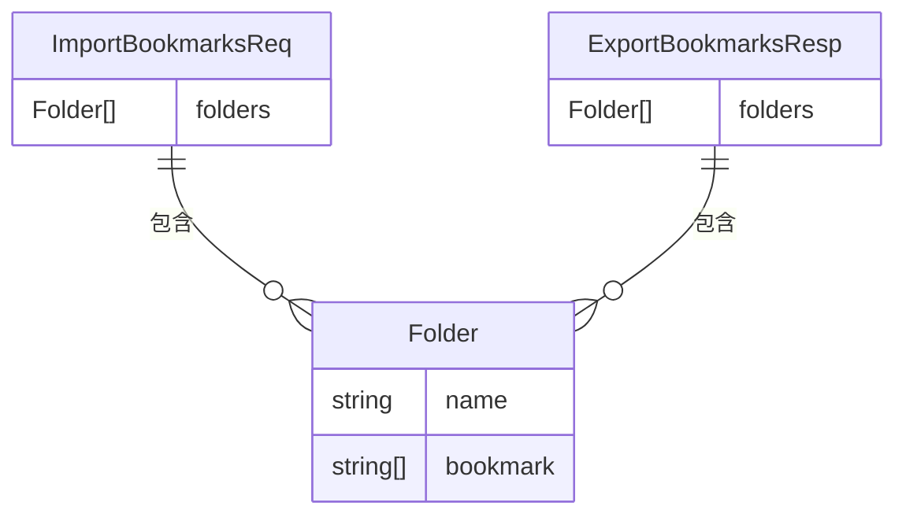
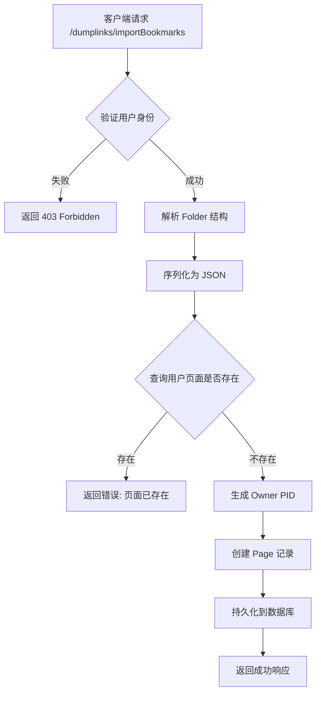
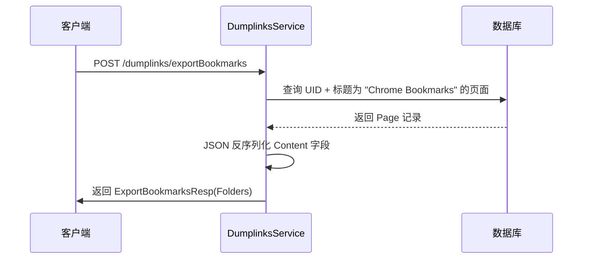
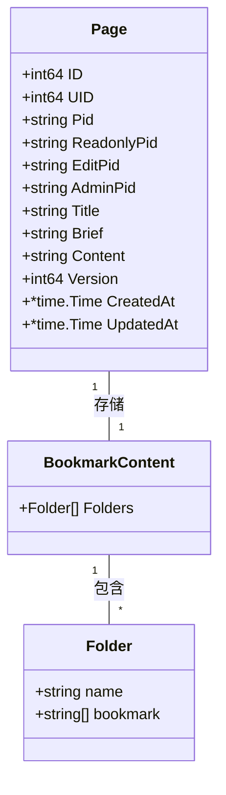

# 书签导入导出模块

<cite>
**本文档引用文件**  
- [dumplinks.proto](file://app/api/proto/dumplinks.proto#L1-L38)
- [dumplinks.go](file://app/api/dumplinks.go#L1-L111)
- [page_tool.go](file://app/api/page_tool.go#L1-L111)
- [page.go](file://app/dal/page.go#L1-L263)
- [page.gen.go](file://app/dal/model/page.gen.go#L1-L32)
- [const.go](file://app/conf/const.go#L1-L62)
</cite>

## 目录
1. [功能概述](#功能概述)
2. [数据结构定义](#数据结构定义)
3. [书签导入流程](#书签导入流程)
4. [书签导出流程](#书签导出流程)
5. [数据持久化机制](#数据持久化机制)
6. [容错与异常处理](#容错与异常处理)
7. [性能问题与优化建议](#性能问题与优化建议)

## 功能概述

本模块实现了浏览器书签的批量导入（`importBookmarks`）与导出（`exportBookmarks`）功能，支持将用户本地的书签树结构通过标准 JSON 格式上传至服务器，并可随时将其序列化为浏览器兼容格式下载。该功能主要由 `dumplinks.go` 中的服务接口驱动，结合 `page_tool.go` 的工具函数与 `page.go` 的数据访问层，完成从请求接收、数据处理到持久化存储的完整流程。

**Section sources**  
- [dumplinks.go](file://app/api/dumplinks.go#L1-L111)

## 数据结构定义

书签数据的传输基于 Protocol Buffers 定义，确保跨语言兼容性与高效序列化。核心消息结构如下：

### BookmarksRequest（导入请求）
- **ImportBookmarksReq**
  - `folders`: `repeated Folder` —— 书签文件夹列表

- **Folder**
  - `name`: `string` —— 文件夹名称
  - `bookmark`: `repeated string` —— 该文件夹下收藏的 URL 列表

### BookmarksResponse（导出响应）
- **ExportBookmarksResp**
  - `folders`: `repeated Folder` —— 返回的书签文件夹结构

上述结构通过 `dumplinks.proto` 定义，并映射为 Go 结构体用于服务端处理。

**Diagram sources**  
- [dumplinks.proto](file://app/api/proto/dumplinks.proto#L1-L38)

## 书签导入流程

`importBookmarks` 接口接收客户端上传的书签结构，执行以下步骤：

1. **身份验证**：从上下文获取用户 ID（`uid`），确保用户已登录。
2. **数据封装**：将 `ImportBookmarksReq` 中的 `folders` 封装为 `BookmarkContent` 结构。
3. **JSON 序列化**：将 `BookmarkContent` 对象序列化为 JSON 字符串。
4. **页面存在性检查**：调用 `dal.Page.GetSelfPage()` 查询用户是否已存在个人页面。
5. **创建新页面**：
   - 若不存在，则生成唯一 `pid`（Owner 类型），并通过 `UniquePid.Create()` 注册。
   - 构造 `model.Page` 实例，标题设为 `"Chrome Bookmarks"`，内容为序列化后的 JSON。
   - 调用 `dal.Page.Create()` 将书签数据持久化。

若用户已存在书签页面，则返回错误提示，要求先删除原有页面。

**Diagram sources**  
- [dumplinks.go](file://app/api/dumplinks.go#L44-L72)
- [page.go](file://app/dal/page.go#L50-L62)

**Section sources**  
- [dumplinks.go](file://app/api/dumplinks.go#L1-L111)

## 书签导出流程

`exportBookmarks` 接口将数据库中存储的书签结构重新序列化为标准格式返回：

1. **身份验证**：获取当前用户 `uid`（当前代码中注释了验证逻辑，需确认是否启用）。
2. **查询页面**：根据 `uid` 和固定标题 `"Chrome Bookmarks"` 查询 `Page` 记录。
3. **反序列化内容**：将 `Page.Content` 字段的 JSON 字符串解析为 `BookmarkContent` 对象。
4. **构造响应**：提取 `Folders` 列表，填充至 `ExportBookmarksResp` 并返回。

若未找到对应页面或内容解析失败，返回空文件夹列表或系统错误。

**Diagram sources**  
- [dumplinks.go](file://app/api/dumplinks.go#L71-L110)

**Section sources**  
- [dumplinks.go](file://app/api/dumplinks.go#L71-L110)

## 数据持久化机制

书签数据以扁平化方式存储在 `page` 表中，关键字段如下：

- **UID**：用户唯一标识
- **Pid**：页面主 ID（Owner 类型，以 'O' 开头）
- **Title**：页面标题（固定为 `"Chrome Bookmarks"`）
- **Content**：书签树的 JSON 序列化字符串
- **ReadonlyPid/EditPid/AdminPid**：不同权限访问的页面 ID（当前未启用）

每条书签记录对应一个 `Page` 实体，通过 `GetSelfPage()` 方法按 `UID` 查询。页面 ID 的生成由 `page_tool.go` 中的 `genOwnerPageId()` 完成，依赖 `conf.const.go` 中定义的前缀规则（如 `OwnerPrefix = 'O'`）。

**Diagram sources**  
- [page.gen.go](file://app/dal/model/page.gen.go#L1-L32)
- [const.go](file://app/conf/const.go#L1-L62)

**Section sources**  
- [page.go](file://app/dal/page.go#L1-L263)

## 容错与异常处理

系统在多个层面实现容错机制：

- **非法输入处理**：若 `json.Marshal` 失败，返回 `BadRequest` 错误。
- **重复导入限制**：若用户已存在书签页面，拒绝再次导入，防止数据覆盖。
- **URL 合法性**：当前逻辑未对 URL 格式进行校验，依赖客户端保障。
- **深度嵌套处理**：JSON 序列化天然支持任意层级嵌套，无深度限制。
- **事务安全**：使用 GORM 的事务机制保证创建操作的原子性。

错误码由 `common.ErrXXX()` 统一定义，确保前后端一致。

**Section sources**  
- [dumplinks.go](file://app/api/dumplinks.go#L1-L111)

## 性能问题与优化建议

### 潜在问题
- **大文件上传超时**：当书签数量庞大（如数万条），JSON 序列化与数据库写入可能耗时较长，导致 HTTP 请求超时。
- **单条记录过大**：所有书签集中存储于 `Content` 字段，可能突破单行大小限制（如 MySQL 的 `max_allowed_packet`）。
- **缺乏分页机制**：导出时一次性加载全部数据，内存压力大。

### 优化建议
1. **分批导入策略**：
   - 客户端将书签按文件夹分批提交。
   - 服务端提供 `batchImport` 接口，支持增量更新。
2. **异步处理机制**：
   - 接收请求后立即返回 `Accepted` 状态。
   - 使用后台任务队列处理大规模导入/导出。
3. **数据分片存储**：
   - 将书签按文件夹拆分为多个 `Page` 记录。
   - 或引入专用的 `bookmark_item` 表进行细粒度管理。
4. **压缩传输**：
   - 支持 `gzip` 压缩请求体，减少网络传输时间。
5. **前端预处理**：
   - 在上传前过滤无效 URL，减少无效请求。

**Section sources**  
- [dumplinks.go](file://app/api/dumplinks.go#L1-L111)
- [page.go](file://app/dal/page.go#L1-L263)