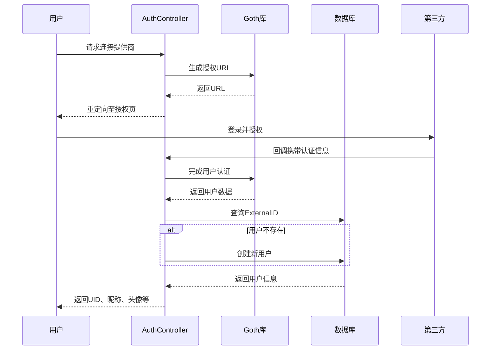
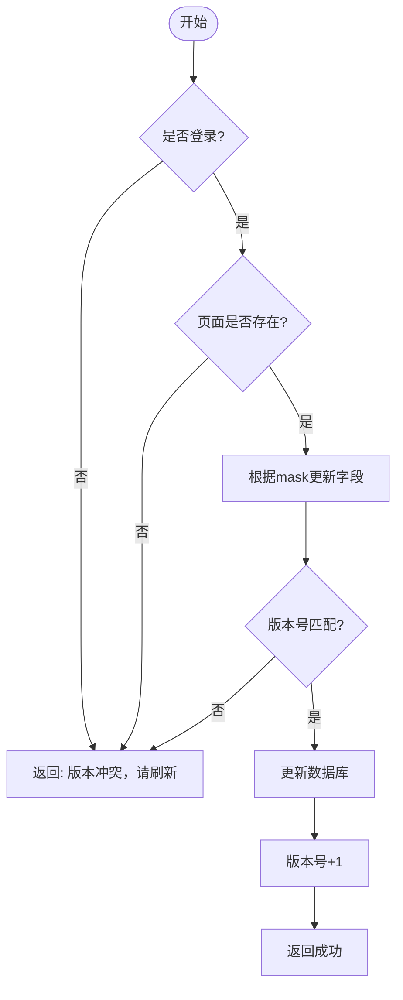
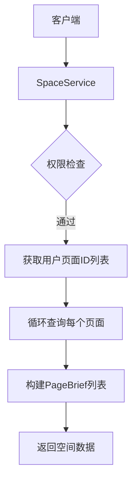
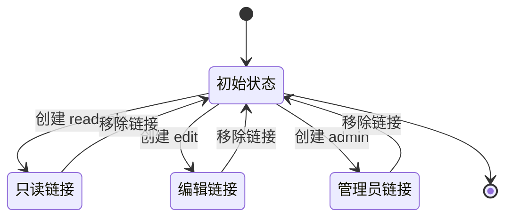
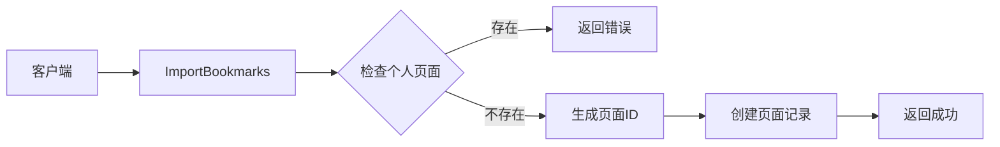
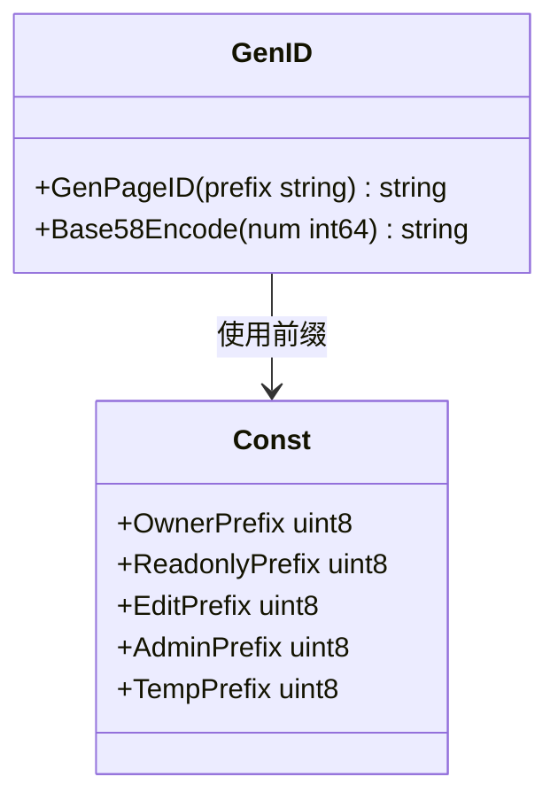
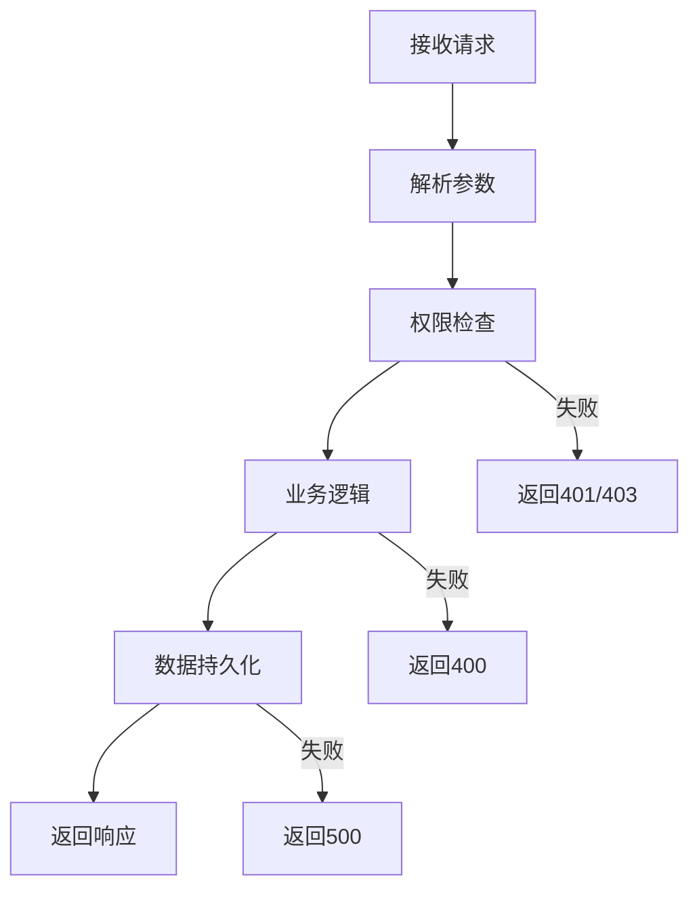

# 核心功能模块设计

<cite>
**本文档引用的文件**  
- [login.go](file://app/api/login.go)
- [space.go](file://app/api/space.go)
- [dumplinks.go](file://app/api/dumplinks.go)
- [page_tool.go](file://app/api/page_tool.go)
- [page.go](file://app/dal/page.go)
- [user_page.go](file://app/dal/user_page.go)
- [user.go](file://app/dal/user.go)
- [genid.go](file://app/pkg/maths/genid.go)
- [const.go](file://app/conf/const.go)
</cite>

## 目录
1. [用户认证模块](#用户认证模块)  
2. [页面管理模块](#页面管理模块)  
3. [空间管理模块](#空间管理模块)  
4. [页面分享模块](#页面分享模块)  
5. [书签导入导出模块](#书签导入导出模块)  
6. [ID生成算法](#id生成算法)  
7. [异常处理机制](#异常处理机制)

## 用户认证模块

该模块负责用户通过第三方提供商（如Gmail、微信）进行身份验证。`login.go` 文件中的 `Connector` 方法生成授权URL，引导用户跳转至第三方登录页面。`ConnectorCallback` 方法处理回调，验证用户身份并创建或更新本地用户记录。

**模块流程：**
1. 用户请求连接第三方提供商
2. 系统生成授权URL并重定向
3. 第三方完成认证后回调系统
4. 系统获取用户信息并创建本地账户（若不存在）
5. 返回用户唯一标识（UID）及基本信息



**图示来源**  
- [login.go](file://app/api/login.go#L0-L90)

**本节来源**  
- [login.go](file://app/api/login.go#L0-L90)
- [user.go](file://app/dal/user.go#L0-L41)

## 页面管理模块

该模块实现页面的创建、更新和删除功能，支持基于 `mask` 字段的选择性更新。所有操作均需登录并验证用户权限。

### 创建页面（createPage）

`CreatePage` 接口用于创建用户的个人页面。系统首先检查用户是否已拥有页面（普通用户仅限一个），然后生成唯一页面ID，创建页面记录，并将其加入用户页面列表。

### 更新页面（updatePage）

`UpdatePage` 接口支持选择性更新。通过 `mask` 参数指定更新字段：
- `0x01`：更新标题
- `0x02`：更新简介
- `0x04`：更新内容集合

系统采用乐观锁机制，通过 `version` 字段防止并发冲突。每次更新成功后版本号递增。

### 删除页面（deletePage）

`DeletePage` 接口在事务中执行以下操作：
1. 删除页面主记录
2. 从用户页面列表中移除该页面ID
3. 保留 `unique_pid` 记录以防止ID重复



**图示来源**  
- [space.go](file://app/api/space.go#L168-L284)
- [page.go](file://app/dal/page.go#L100-L150)

**本节来源**  
- [space.go](file://app/api/space.go#L168-L284)
- [page.go](file://app/dal/page.go#L100-L150)

## 空间管理模块

该模块提供用户空间的整体视图，包括获取用户信息、拉取我的空间、调整页面顺序等功能。

### 获取我的空间（getMySpace）

该接口返回用户所有页面的简要信息，包括标题、简介、创建/更新时间及权限配置。系统通过 `UserPage` 表获取页面ID顺序，并逐个查询页面基本信息。

### 调整页面顺序（savePageIds）

该接口允许用户重新排列其页面顺序。系统在事务中执行：
1. 删除用户现有页面顺序记录
2. 按新顺序批量插入 `UserPage` 记录



**图示来源**  
- [space.go](file://app/api/space.go#L116-L166)
- [user_page.go](file://app/dal/user_page.go#L0-L30)

**本节来源**  
- [space.go](file://app/api/space.go#L116-L166)
- [user_page.go](file://app/dal/user_page.go#L0-L30)

## 页面分享模块

该模块支持生成不同权限级别的页面访问链接，包括只读、编辑和管理员权限。

### 添加页面链接（addPageLink）

`AddPageLink` 接口根据 `page_type` 生成相应权限的页面ID：
- **只读（readonly）**：以 'R' 开头，任何持有链接者可查看
- **编辑（edit）**：以 'E' 开头，持有链接者可修改内容
- **管理员（admin）**：以 'A' 开头，持有链接者可删除页面

权限规则：
1. 页面所有者可创建任意类型链接
2. 拥有管理员链接者可创建只读和编辑链接
3. 同一权限类型链接只能存在一个

### 移除页面链接（removePageLink）

`RemovePageLink` 接口撤销已生成的访问链接。只有页面创建者有权移除链接。系统更新主页面记录，清空相应的 `ReadonlyPid`、`EditPid` 或 `AdminPid` 字段。



**图示来源**  
- [space.go](file://app/api/space.go#L275-L398)
- [page.go](file://app/dal/page.go#L200-L263)

**本节来源**  
- [space.go](file://app/api/space.go#L275-L398)
- [page.go](file://app/dal/page.go#L200-L263)

## 书签导入导出模块

该模块实现浏览器书签的导入与导出功能，便于用户迁移数据。

### 导入书签（importBookmarks）

1. 检查用户是否已存在个人页面
2. 生成新的页面ID
3. 将书签数据序列化为JSON存储
4. 创建页面记录

### 导出书签（exportBookmarks）

1. 查询用户书签页面
2. 反序列化内容字段
3. 返回书签文件夹结构



**图示来源**  
- [dumplinks.go](file://app/api/dumplinks.go#L0-L111)

**本节来源**  
- [dumplinks.go](file://app/api/dumplinks.go#L0-L111)

## ID生成算法

系统采用自定义的Base58编码算法生成短ID，确保ID的唯一性和可读性。

### 算法实现（genid.go）

1. 使用 `rand.Int31()` 生成32位随机数
2. 通过Base58编码转换为字符串
3. 添加前缀标识类型：
   - 'O'：所有者页面
   - 'R'：只读页面
   - 'E'：编辑页面
   - 'A'：管理员页面
   - 'T'：临时页面

### 字符集设计

使用58个字符（去除了易混淆的0、O、I、l），提高可读性：
```
123456789ABCDEFGHJKLMNPQRSTUVWXYZabcdefghijkmnopqrstuvwxyz
```



**图示来源**  
- [genid.go](file://app/pkg/maths/genid.go#L0-L37)
- [const.go](file://app/conf/const.go#L0-L62)

**本节来源**  
- [genid.go](file://app/pkg/maths/genid.go#L0-L37)
- [const.go](file://app/conf/const.go#L0-L62)

## 异常处理机制

系统采用分层异常处理策略，确保错误信息清晰且安全。

### 错误类型

- `ErrNeedLogin`：未登录访问受保护资源
- `ErrNotYourPage`：操作非本人页面
- `ErrUpdateMissNeedRefreshPage`：版本冲突
- `ErrBadRequest`：请求参数无效
- `ErrNotSupport`：操作不支持

### 处理原则

1. **权限验证**：所有敏感操作前检查用户身份
2. **事务保护**：多步操作使用数据库事务
3. **输入校验**：使用ProtoBuf约束请求参数
4. **错误隔离**：不暴露系统内部细节



**本节来源**  
- [common包](file://app/api/common)
- [space.go](file://app/api/space.go)
- [page.go](file://app/dal/page.go)