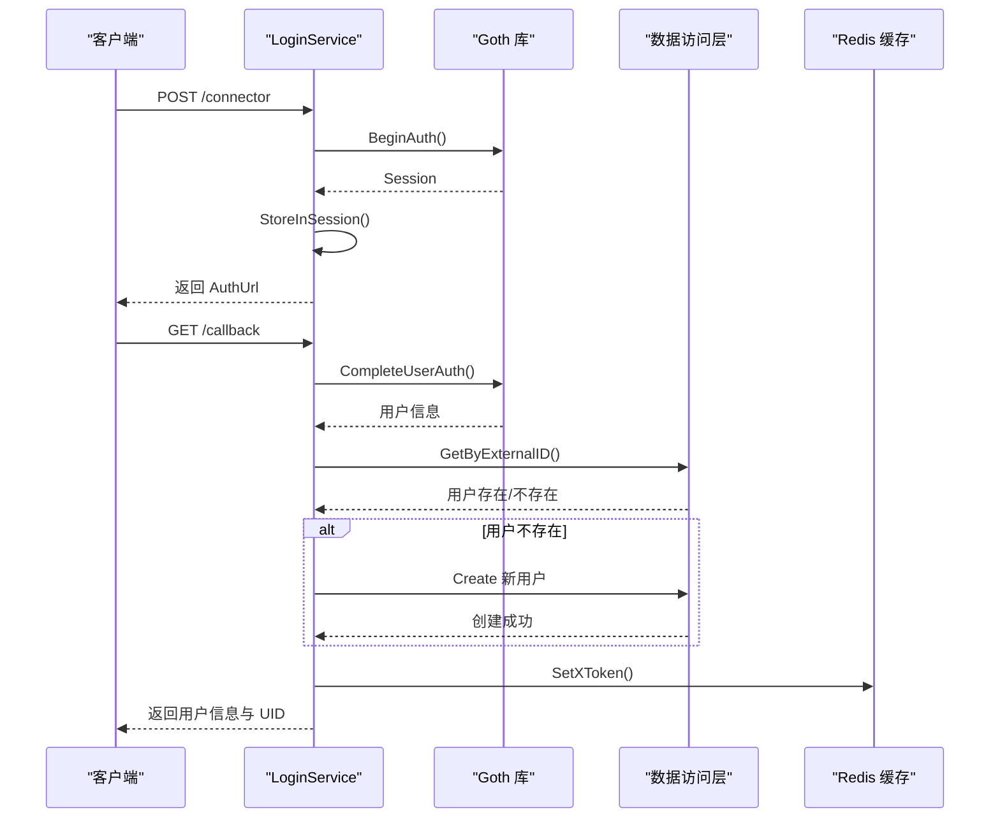
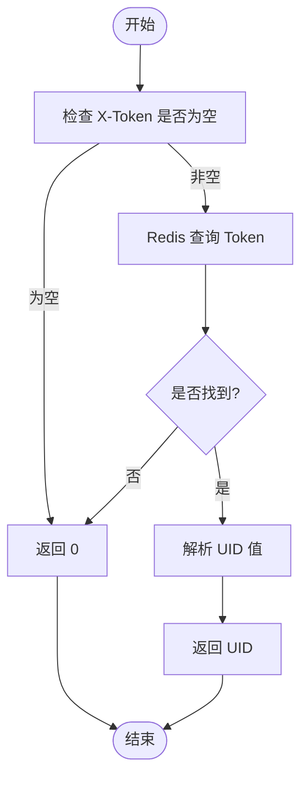
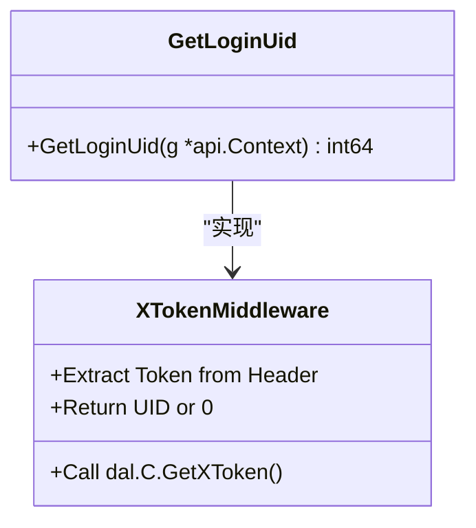
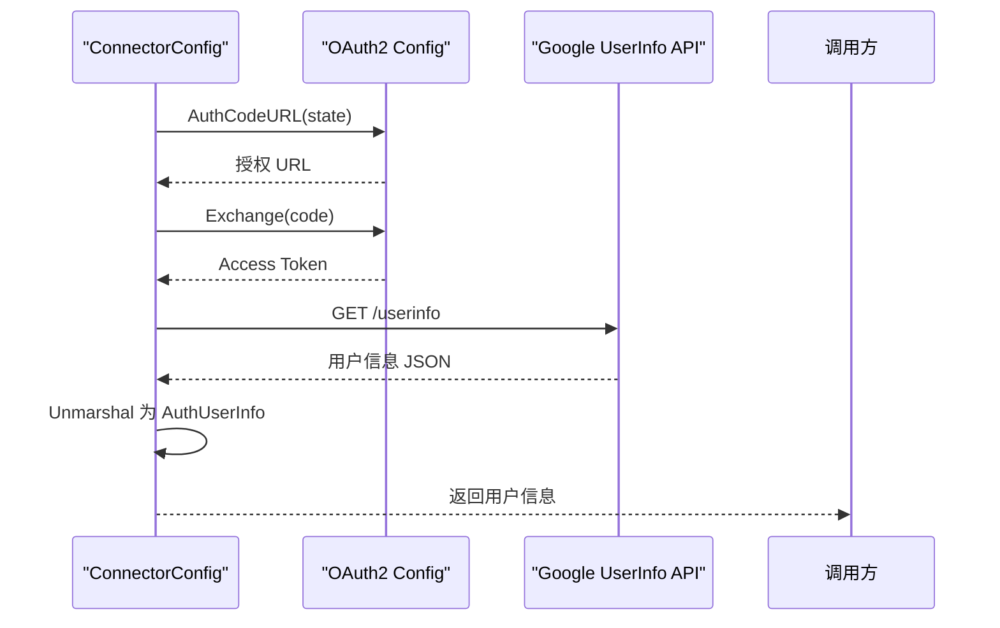

# 用户认证模块

<cite>
**本文档引用文件**  
- [login.go](file://app/api/login.go)
- [redis.go](file://app/dal/redis.go)
- [middleware/login.go](file://app/pkg/middleware/login.go)
- [connector-google/google.go](file://app/pkg/connector-google/google.go)
- [ecode.proto](file://app/api/proto/ecode.proto)
</cite>

## 目录
1. [简介](#简介)
2. [核心组件](#核心组件)
3. [第三方登录流程分析](#第三方登录流程分析)
4. [X-Token 生成与校验机制](#x-token-生成与校验机制)
5. [中间件拦截与上下文注入](#中间件拦截与上下文注入)
6. [Google OAuth 封装设计](#google-oauth-封装设计)
7. [错误码定义与处理](#错误码定义与处理)
8. [常见问题排查](#常见问题排查)

## 简介
本文档深入剖析用户认证模块的实现机制，涵盖第三方登录（Google OAuth）流程、X-Token 生成与校验逻辑、中间件拦截机制及用户信息缓存策略。重点分析 `login.go` 中 `HandleLogin` 接口如何调用 Google OAuth2.0 完成身份验证，并通过 `redis.go` 将用户信息写入缓存；解释 `IssueToken` 的 JWT Token 签发过程；结合 `middleware/login.go` 展示请求拦截与上下文注入的实现方式；阐述 `connector-google/google.go` 对 OAuth2 流程的封装设计。同时分析 `ecode.proto` 中定义的错误码在认证失败场景下的应用。

## 核心组件

本模块涉及多个核心组件，包括登录服务、Redis 缓存管理、中间件处理、OAuth2 封装和错误码定义。

**Section sources**
- [login.go](file://app/api/login.go#L1-L90)
- [redis.go](file://app/dal/redis.go#L1-L92)
- [middleware/login.go](file://app/pkg/middleware/login.go#L1-L17)
- [google.go](file://app/pkg/connector-google/google.go#L1-L90)
- [ecode.proto](file://app/api/proto/ecode.proto#L1-L55)

## 第三方登录流程分析

用户通过第三方（如 Google）登录时，系统首先调用 `Connector` 方法获取授权 URL，跳转至 Google 登录页面。用户完成登录后，回调 `ConnectorCallback` 接口，系统通过 `gothic.CompleteUserAuth` 获取用户信息，并在数据库中查找或创建用户记录。



**Diagram sources**
- [login.go](file://app/api/login.go#L35-L89)
- [dal/user.go](file://app/dal/user.go)

## X-Token 生成与校验机制

系统使用 Redis 存储 X-Token 与用户 UID 的映射关系，有效期为 180 天。`SetXToken` 方法将 Token 作为键、UID 作为值写入 Redis，`GetXToken` 则根据 Token 查询对应的 UID。



**Diagram sources**
- [redis.go](file://app/dal/redis.go#L50-L75)

**Section sources**
- [redis.go](file://app/dal/redis.go#L50-L75)

## 中间件拦截与上下文注入

`middleware/login.go` 提供 `GetLoginUid` 函数，用于从请求头中提取 `X-Token` 并查询其对应的用户 UID。该函数被多个业务接口调用，作为权限校验的第一步。



**Diagram sources**
- [middleware/login.go](file://app/pkg/middleware/login.go#L1-L17)

**Section sources**
- [middleware/login.go](file://app/pkg/middleware/login.go#L1-L17)

## Google OAuth 封装设计

`connector-google/google.go` 封装了 Google OAuth2.0 的完整流程。`Init` 函数初始化客户端 ID 和密钥，`ConnectorSender` 生成授权 URL，`ConnectorReceiver` 处理回调并获取用户信息。



**Diagram sources**
- [google.go](file://app/pkg/connector-google/google.go#L45-L89)

**Section sources**
- [google.go](file://app/pkg/connector-google/google.go#L1-L90)

## 错误码定义与处理

`ecode.proto` 定义了统一的错误码体系，涵盖客户端和服务器端常见错误。认证相关错误码包括 `ERR_NOT_AUTHENTICATED`（401）、`ERR_BAD_REQUEST`（400）等。

```mermaid
erDiagram
COMMON_ERROR ||--o{ ERROR_CODE : contains
COMMON_ERROR {
int code PK
string message
string description
}
ERROR_CODE {
int id PK
string name
int http_status
string zh_message
}
COMMON_ERROR ||--o{ ERR_NOT_AUTHENTICATED
COMMON_ERROR ||--o{ ERR_BAD_REQUEST
COMMON_ERROR ||--o{ ERR_INTERNAL_SERVER_ERROR
ERR_NOT_AUTHENTICATED {
int code PK
string message "未授权"
int http_status 401
}
ERR_BAD_REQUEST {
int code PK
string message "无效的请求"
int http_status 400
}
ERR_INTERNAL_SERVER_ERROR {
int code PK
string message "服务端内部错误"
int http_status 500
}
```

**Diagram sources**
- [ecode.proto](file://app/api/proto/ecode.proto#L1-L55)

**Section sources**
- [ecode.proto](file://app/api/proto/ecode.proto#L1-L55)

## 常见问题排查

### Token 过期
- **现象**：接口返回 `401 Unauthorized`
- **排查步骤**：
  1. 检查请求头是否包含 `X-Token`
  2. 使用 `redis-cli` 查询该 Token 是否存在于 Redis 中
  3. 若不存在，说明已过期，需重新登录

### OAuth 回调失败
- **现象**：回调接口返回错误或重定向失败
- **排查步骤**：
  1. 检查 `GOOGLE_CLIENT_ID` 和 `GOOGLE_CLIENT_SECRET` 配置是否正确
  2. 确认 `RedirectURL` 在 Google Cloud Console 中已注册
  3. 查看日志中 `CompleteUserAuth` 是否返回错误信息

**Section sources**
- [login.go](file://app/api/login.go#L65-L89)
- [google.go](file://app/pkg/connector-google/google.go#L70-L89)
- [ecode.proto](file://app/api/proto/ecode.proto#L1-L55)