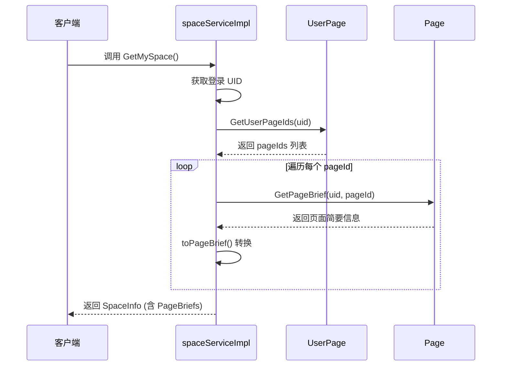
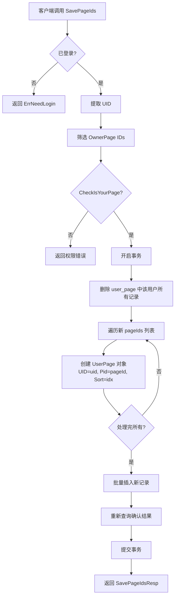
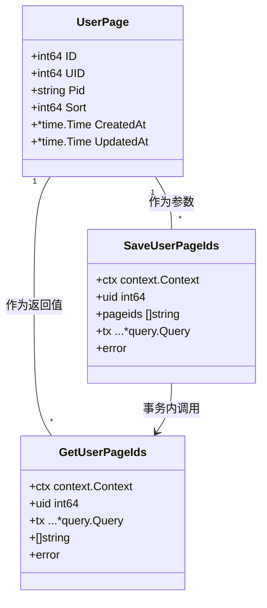

# 空间管理模块

<cite>
**本文档中引用的文件**  
- [space.go](file://app/api/space.go)
- [user_page.go](file://app/dal/user_page.go)
- [space.proto](file://app/api/proto/space.proto)
- [user_page.gen.go](file://app/dal/model/user_page.gen.go)
- [page_tool.go](file://app/api/page_tool.go)
</cite>

## 目录
1. [简介](#简介)
2. [核心功能概述](#核心功能概述)
3. [GetMySpace 接口实现机制](#getmyspace-接口实现机制)
4. [SavePageIds 接口与排序更新逻辑](#savepageids-接口与排序更新逻辑)
5. [GORM 批量操作与事务控制](#gorm-批量操作与事务控制)
6. [Protobuf 消息结构解析](#protobuf-消息结构解析)
7. [响应数据结构示例与默认初始化逻辑](#响应数据结构示例与默认初始化逻辑)
8. [前端显示异常与修复策略](#前端显示异常与修复策略)

## 简介
本模块负责用户“我的空间”中页面的组织、展示与顺序管理。通过 `GetMySpace` 和 `SavePageIds` 两个核心接口，实现了页面列表的获取与排序持久化功能。系统基于 GORM 查询生成器与 Protobuf 协议进行数据交互，确保前后端通信的高效与一致性。

## 核心功能概述
空间管理模块的核心功能包括：
- **页面聚合展示**：根据用户 ID 聚合其所有关联页面，并按预设顺序返回。
- **页面顺序调整**：允许用户通过客户端拖拽等方式调整页面顺序，并将新顺序持久化至数据库。
- **权限与数据一致性校验**：在保存排序时校验页面归属权，防止非法操作。
- **默认空间初始化**：当用户首次登录且无空间数据时，自动触发初始化流程。

## GetMySpace 接口实现机制
`GetMySpace` 接口用于获取当前登录用户的空间信息，包括空间名称及按序排列的页面简要信息列表。

该接口的执行流程如下：
1. 从上下文中提取当前登录用户的 UID。
2. 查询用户基本信息以获取 `DisplayName` 作为空间名称。
3. 调用 `dal.UserPage.GetUserPageIds` 方法，从 `user_page` 表中按 `sort` 字段升序查询该用户关联的所有页面 ID 列表。
4. 遍历每个页面 ID，调用 `dal.Page.GetPageBrief` 获取页面标题、描述、创建时间等简要信息。
5. 使用 `toPageBrief` 函数将数据库模型转换为 Protobuf 定义的 `PageBrief` 消息结构。
6. 将所有 `PageBrief` 对象聚合到 `GetMySpaceResp` 响应中并返回。

当用户尚未创建任何页面时，`GetMySpace` 仍会返回一个空的 `PageBriefs` 列表，前端可据此提示用户创建首个页面。



**Diagram sources**
- [space.go](file://app/api/space.go#L116-L166)
- [user_page.go](file://app/dal/user_page.go#L10-L18)
- [page_tool.go](file://app/api/page_tool.go#L49-L110)

**Section sources**
- [space.go](file://app/api/space.go#L116-L166)

## SavePageIds 接口与排序更新逻辑
`SavePageIds` 接口用于持久化用户调整后的页面顺序。客户端传入一个按新顺序排列的页面 ID 数组，服务端将其写入数据库。

其核心逻辑位于 `space.go` 的 `SavePageIds` 方法中：
1. 获取当前登录用户的 UID，若未登录则返回错误。
2. 从请求的 `PageIds` 列表中筛选出属于“拥有者页面”（Owner Page）的 ID。
3. 调用 `dal.Page.CheckIsYourPage` 确保用户对这些拥有者页面拥有所有权，防止越权操作。
4. 在一个数据库事务中执行以下操作：
   - 调用 `dal.UserPage.SaveUserPageIds` 删除该用户在 `user_page` 表中的所有旧记录。
   - 根据新的 `PageIds` 列表，按索引顺序（`idx`）作为 `sort` 值，批量创建新的 `UserPage` 记录并插入数据库。
   - 调用 `GetUserPageIds` 重新查询以确认写入结果。
5. 将确认后的页面 ID 列表封装在 `SavePageIdsResp` 中返回。

此设计通过“先删后插”的方式简化了排序逻辑，避免了复杂的 `sort` 值调整算法。



**Diagram sources**
- [space.go](file://app/api/space.go#L59-L114)
- [user_page.go](file://app/dal/user_page.go#L19-L38)

**Section sources**
- [space.go](file://app/api/space.go#L59-L114)

## GORM 批量操作与事务控制
`user_page.go` 文件中的 `SaveUserPageIds` 方法是排序更新的核心数据操作，其性能与一致性至关重要。

该方法通过 GORM gen 生成的查询对象实现：
- **事务控制**：整个“删除-插入”过程被包裹在 `dal.Q.Transaction` 中，确保了原子性。若插入失败，删除操作将被回滚，防止数据丢失。
- **批量删除**：使用 `Where(u.UID.Eq(uid)).Delete()` 一条 SQL 语句删除用户的所有关联记录。
- **批量插入**：通过 `Create(datas...)` 将构建好的 `[]*model.UserPage` 列表一次性插入数据库。GORM 会生成一条包含多值的 `INSERT` 语句，极大减少了网络往返开销。
- **性能考量**：虽然“先删后插”逻辑简单，但对于拥有大量页面的用户，频繁的全量更新可能成为性能瓶颈。未来可优化为仅更新 `sort` 字段的增量更新模式。



**Diagram sources**
- [user_page.go](file://app/dal/user_page.go#L19-L38)
- [user_page.gen.go](file://app/dal/model/user_page.gen.go#L1-L30)

**Section sources**
- [user_page.go](file://app/dal/user_page.go#L19-L38)

## Protobuf 消息结构解析
Protobuf 定义了前后端交互的契约，确保了接口的清晰与类型安全。

关键消息结构如下：
- **GetMySpaceResp**：`GetMySpace` 接口的响应体。
  - `space_name`：用户的显示名称。
  - `page_briefs`：`PageBrief` 对象的列表，按顺序包含所有页面的简要信息。
- **PageBrief**：页面简要信息。
  - `page_id`：页面的唯一标识符（如 O 开头的拥有者 ID）。
  - `title` 和 `brief`：页面的标题和描述。
  - `create_time` 和 `update_time`：时间戳。
  - `is_self`：布尔值，标识是否为用户自己的页面。
  - `page_conf`：`PageConf` 对象，描述页面的权限配置。
- **PageConf**：页面配置，包含 `read_only`、`can_edit`、`can_delete` 三个布尔字段，用于前端控制 UI 元素的显示与交互。
- **SavePageIdsReq**：`SavePageIds` 接口的请求体，仅包含一个 `repeated string page_ids` 字段，即客户端传入的新顺序列表。
- **SavePageIdsResp**：响应体，包含一个 `repeated string page_ids` 字段，返回服务端确认后的顺序，可用于客户端状态同步。

这些结构通过 `space.proto` 文件定义，并由 Protobuf 工具链生成 Go 代码，保证了数据序列化/反序列化的高效与正确。

**Section sources**
- [space.proto](file://app/api/proto/space.proto#L1-L319)

## 响应数据结构示例与默认初始化逻辑
### GetMySpace 响应示例
```json
{
  "space_name": "张三的收藏夹",
  "page_briefs": [
    {
      "page_id": "O20240701abc",
      "title": "工作文档",
      "brief": "日常工作相关链接",
      "create_time": 1719820800,
      "update_time": 1719820800,
      "is_self": true,
      "page_conf": {
        "read_only": false,
        "can_edit": true,
        "can_delete": true
      }
    },
    {
      "page_id": "O20240702def",
      "title": "学习资料",
      "brief": "编程学习资源",
      "create_time": 1719907200,
      "update_time": 1719907200,
      "is_self": true,
      "page_conf": {
        "read_only": false,
        "can_edit": true,
        "can_delete": true
      }
    }
  ]
}
```

### 默认初始化逻辑
当用户首次登录时，系统不会自动创建“我的空间”或默认页面。`GetMySpace` 接口会返回一个 `page_briefs` 为空数组的响应。前端应用应监听此状态，并引导用户通过调用 `CreatePage` 接口来创建他们的第一个页面。一旦首个页面创建成功，该页面的 ID 将被自动添加到 `user_page` 表中，`sort` 值为 0，后续 `GetMySpace` 调用即可返回该页面。

## 前端显示异常与修复策略
### 可能的异常
由于排序数据不一致，可能导致以下前端显示异常：
1. **页面顺序错乱**：前端本地缓存的顺序与服务端数据库中的 `sort` 值不一致。
2. **页面重复或丢失**：前端显示的页面列表与 `GetMySpace` 返回的列表存在差异，可能因 `SavePageIds` 调用失败但前端未感知所致。
3. **拖拽后状态未同步**：用户拖拽调整顺序后，`SavePageIds` 请求失败，但前端 UI 已更新，造成状态不一致。

### 修复策略
1. **强制刷新**：在 `SavePageIds` 调用失败时，前端应忽略本次操作，并立即调用 `GetMySpace` 重新拉取最新数据以恢复正确状态。
2. **乐观更新与回滚**：采用乐观更新策略，先在前端更新 UI，然后异步调用 `SavePageIds`。若调用失败，则在 UI 上显示错误提示，并提供“撤销”按钮，点击后同样通过 `GetMySpace` 恢复原始状态。
3. **定期同步**：对于长时间未操作的页面，前端可定期（如每 5 分钟）调用 `GetMySpace` 进行数据同步，确保与服务端状态一致。
4. **幂等性设计**：`SavePageIds` 接口本身是幂等的（相同的 `page_ids` 列表多次调用效果相同），这为前端重试机制提供了基础，可在网络不稳定时安全地重发请求。

**Section sources**
- [space.go](file://app/api/space.go#L59-L166)
- [user_page.go](file://app/dal/user_page.go#L10-L38)