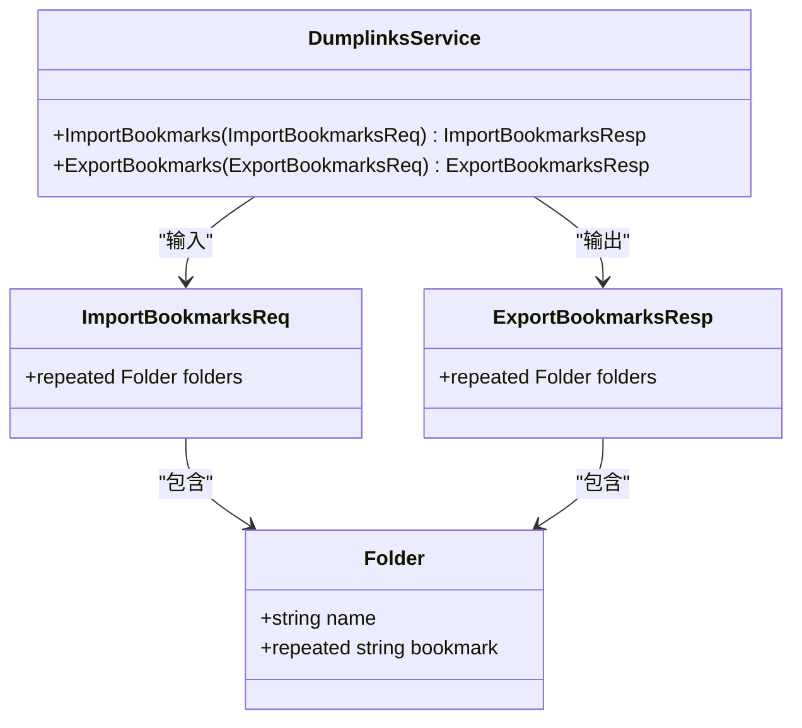
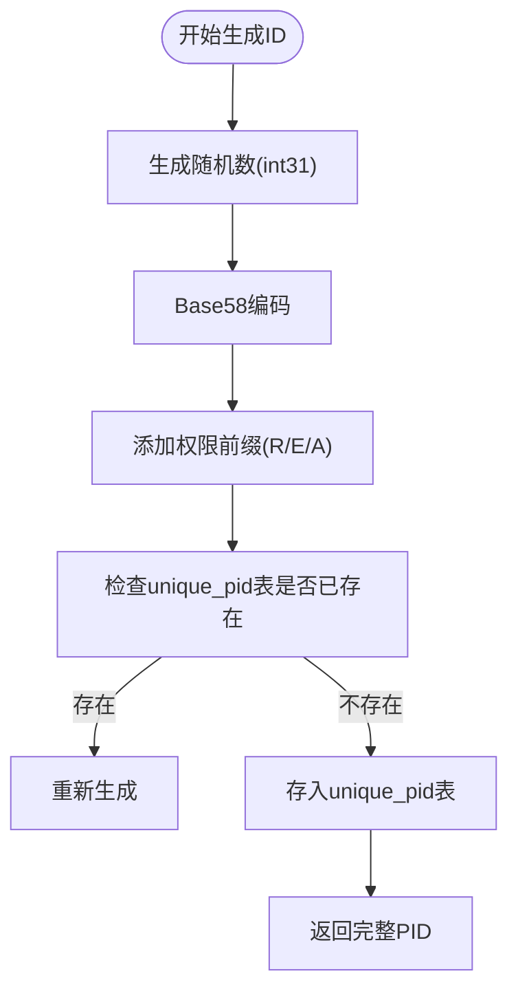
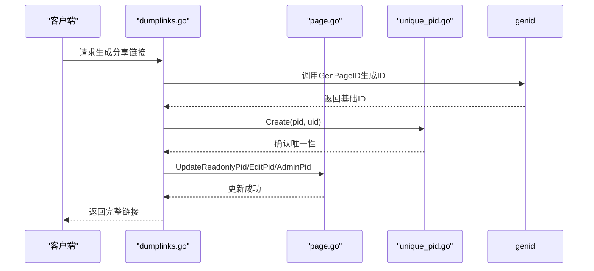

# 页面分享模块

<cite>
**本文档引用文件**  
- [dumplinks.go](file://app/api/dumplinks.go)
- [dumplinks.proto](file://app/api/proto/dumplinks.proto)
- [unique_pid.go](file://app/dal/unique_pid.go)
- [genid.go](file://app/pkg/maths/genid.go)
- [page.go](file://app/dal/page.go)
- [const.go](file://app/conf/const.go)
</cite>

## 目录
1. [简介](#简介)
2. [核心组件](#核心组件)
3. [权限级别与链接生成机制](#权限级别与链接生成机制)
4. [协议结构设计](#协议结构设计)
5. [短链ID生成策略](#短链id生成策略)
6. [权限配置持久化](#权限配置持久化)
7. [链接撤销机制](#链接撤销机制)
8. [访问行为差异说明](#访问行为差异说明)
9. [常见问题排查](#常见问题排查)

## 简介
本模块实现页面分享功能，支持只读、可编辑、管理员三种权限级别的链接生成与撤销。通过统一的接口管理页面对外共享链接，确保权限控制与数据安全。

## 核心组件

系统主要由以下组件构成：
- **dumplinks.go**：提供分享功能的API服务实现
- **dumplinks.proto**：定义gRPC服务接口和消息结构
- **unique_pid.go**：负责唯一PID的数据库操作
- **genid.go**：实现短链ID的生成算法
- **page.go**：处理页面主表的CRUD及权限字段更新
- **const.go**：定义页面ID类型常量及解析逻辑

**Section sources**
- [dumplinks.go](file://app/api/dumplinks.go#L1-L111)
- [unique_pid.go](file://app/dal/unique_pid.go#L1-L27)
- [genid.go](file://app/pkg/maths/genid.go#L1-L37)
- [page.go](file://app/dal/page.go#L1-L263)
- [const.go](file://app/conf/const.go#L1-L62)

## 权限级别与链接生成机制

系统支持三种权限级别的分享链接：
- **只读（ReadOnly）**：前缀为`R`，任何用户均可访问查看
- **可编辑（Edit）**：前缀为`E`，拥有链接的用户可编辑内容
- **管理员（Admin）**：前缀为`A`，拥有链接的用户可进行管理操作

链接生成流程如下：
1. 调用`genid.go`中的`GenPageID()`生成基础ID
2. 根据权限类型添加对应前缀（R/E/A）
3. 将生成的PID存入`unique_pid`表防止冲突
4. 更新`Page`表中对应的权限字段（ReadonlyPid/EditPid/AdminPid）

该机制确保每个权限级别的链接独立且不可猜测。

**Section sources**
- [genid.go](file://app/pkg/maths/genid.go#L1-L37)
- [const.go](file://app/conf/const.go#L1-L62)
- [unique_pid.go](file://app/dal/unique_pid.go#L1-L27)
- [page.go](file://app/dal/page.go#L1-L263)

## 协议结构设计



**Diagram sources**  
- [dumplinks.proto](file://app/api/proto/dumplinks.proto#L1-L38)

### 消息结构说明

#### PageLinkRequest（隐含在现有接口中）
虽然当前`dumplinks.proto`未显式定义`PageLinkRequest`，但其设计模式体现在：
- `ImportBookmarksReq` 包含待导入的书签数据结构
- 使用`repeated Folder`表示多层级文件夹结构
- 每个`Folder`包含名称和书签列表

#### 响应结构
- `ImportBookmarksResp`：空响应，表示操作成功
- `ExportBookmarksResp`：返回完整的书签树结构

所有接口均通过HTTP POST方式暴露，路径分别为`/dumplinks/importBookmarks`和`/dumplinks/exportBookmarks`。

**Section sources**
- [dumplinks.proto](file://app/api/proto/dumplinks.proto#L1-L38)

## 短链ID生成策略



**Diagram sources**  
- [genid.go](file://app/pkg/maths/genid.go#L1-L37)
- [unique_pid.go](file://app/dal/unique_pid.go#L1-L27)

### 实现细节

1. **随机数生成**：使用`rand.Int31()`生成32位随机整数，前期避免ID过长
2. **Base58编码**：将数字转换为不包含易混淆字符（0/O/l/I）的字符串
3. **前缀标识**：根据权限类型添加`R`、`E`或`A`前缀以区分用途
4. **唯一性保障**：通过`unique_pid`表全局校验，避免ID冲突

该策略兼顾了安全性、可读性和存储效率。

**Section sources**
- [genid.go](file://app/pkg/maths/genid.go#L1-L37)
- [unique_pid.go](file://app/dal/unique_pid.go#L1-L27)

## 权限配置持久化



**Diagram sources**  
- [dumplinks.go](file://app/api/dumplinks.go#L1-L111)
- [page.go](file://app/dal/page.go#L1-L263)
- [unique_pid.go](file://app/dal/unique_pid.go#L1-L27)

### 数据存储结构

`Page`表中相关字段：
- `pid`：页面所有者访问ID（前缀O）
- `readonlypid`：只读访问ID
- `editpid`：编辑访问ID
- `adminpid`：管理访问ID
- `conf`：配置字段（当前未使用，预留扩展）

权限字段更新通过`UpdateReadonlyPid`、`UpdateEditPid`、`UpdateAdminPid`等方法实现，确保原子性操作。

**Section sources**
- [page.go](file://app/dal/page.go#L1-L263)
- [dumplinks.go](file://app/api/dumplinks.go#L1-L111)

## 链接撤销机制

链接撤销通过`UnlinkPage`方法实现：

```mermaid
flowchart TD
Start([调用UnlinkPage]) --> ParseType["ParseIdType(pid)解析类型"]
ParseType --> CheckType{"类型判断"}
CheckType --> |ReadOnlyPage| UpdateDB["UpdateSimple(ReadonlyPid=\"\")"]
CheckType --> |EditPage| UpdateDB
CheckType --> |AdminPage| UpdateDB
CheckType --> |OwnerPage| ReturnError["返回不支持"]
UpdateDB --> CheckAffect{"RowsAffected > 0?"}
CheckAffect --> |否| ReturnNotFound["ErrNotYourPageOrLinkNotExist"]
CheckAffect --> |是| ReturnSuccess["操作成功"]
```

**Diagram sources**  
- [page.go](file://app/dal/page.go#L1-L263)

### 实现原理

1. **立即生效**：直接更新数据库字段为空字符串，后续请求无法匹配到该PID
2. **权限校验**：仅页面所有者（UID匹配）可执行撤销操作
3. **类型限制**：不允许撤销所有者链接（OwnerPage），临时链接（TempPage）也不支持unlink
4. **幂等性**：重复撤销同一链接返回成功，但影响行数为0

撤销后，该链接永久失效，无法恢复。

**Section sources**
- [page.go](file://app/dal/page.go#L1-L263)

## 访问行为差异说明

| 权限级别 | 前缀 | 登录要求 | 操作权限 | 是否可撤销 |
|---------|------|---------|----------|-----------|
| 只读 | R | 否 | 查看内容 | 是 |
| 可编辑 | E | 是 | 编辑内容 | 是 |
| 管理员 | A | 是 | 管理页面 | 是 |
| 所有者 | O | 是 | 完全控制 | 否 |

不同权限级别的访问通过`GetPage`方法中的`switch pageIdType`分支处理，确保权限隔离。

**Section sources**
- [page.go](file://app/dal/page.go#L1-L263)
- [const.go](file://app/conf/const.go#L1-L62)

## 常见问题排查

### 分享链接无法访问的常见原因

1. **链接已被撤销**
   - 排查路径：检查`page`表对应字段是否为空
   - 验证方法：`SELECT readonlypid, editpid, adminpid FROM page WHERE pid = ?`

2. **页面已被删除**
   - 排查路径：确认`page`表中是否存在该PID记录
   - 验证方法：`SELECT * FROM page WHERE pid = ? OR readonlypid = ?`

3. **权限变更导致失效**
   - 场景：页面所有者更改了分享设置
   - 排查路径：检查对应权限字段是否被清空

4. **用户身份不符**
   - 特定链接（如编辑、管理）需要登录且UID匹配
   - 排查路径：检查请求上下文中的UID与页面所有者是否一致

5. **ID类型解析错误**
   - 原因：PID格式不正确或首字符非法
   - 排查路径：验证PID首字符是否为R/E/A/O之一

所有异常均通过标准错误码返回，便于前端定位问题。

**Section sources**
- [page.go](file://app/dal/page.go#L1-L263)
- [const.go](file://app/conf/const.go#L1-L62)
- [dumplinks.go](file://app/api/dumplinks.go#L1-L111)