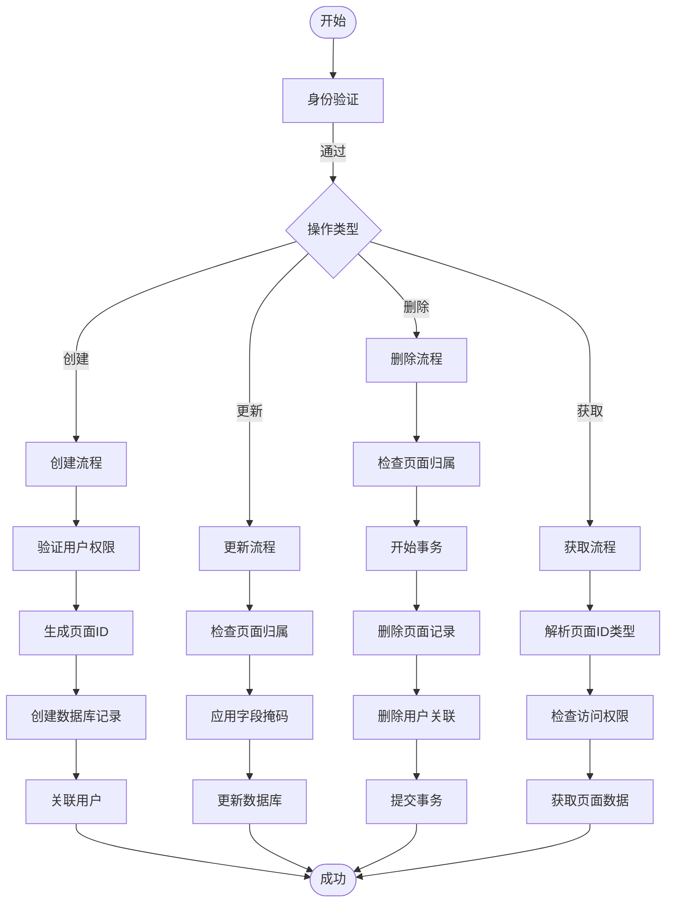
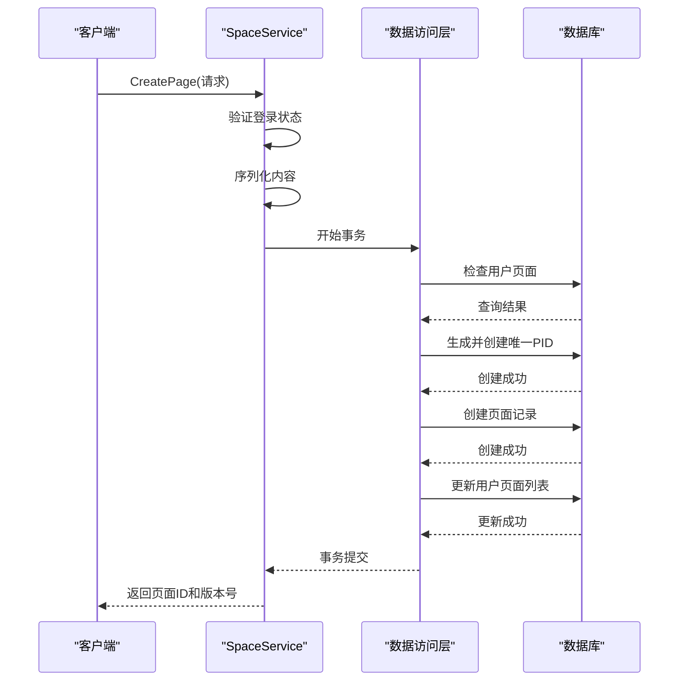
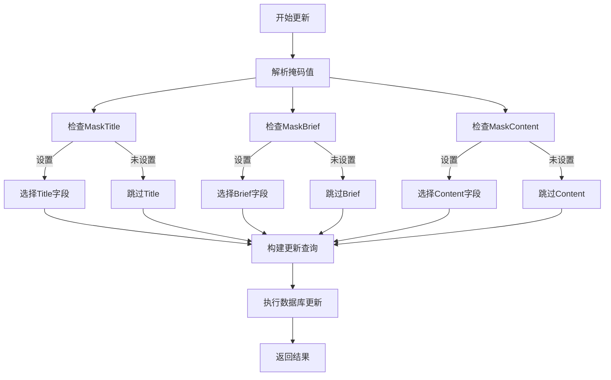

# 页面管理模块

<cite>
**本文档引用文件**  
- [space.go](file://app/api/space.go)
- [page_tool.go](file://app/api/page_tool.go)
- [page.gen.go](file://app/dal/model/page.gen.go)
- [page.go](file://app/dal/page.go)
- [user_page.go](file://app/dal/user_page.go)
- [ecode.proto](file://app/api/proto/ecode.proto)
- [space.proto](file://app/api/proto/space.proto)
</cite>

## 目录
1. [简介](#简介)
2. [核心业务流程](#核心业务流程)
3. [空间服务实现](#空间服务实现)
4. [字段掩码机制分析](#字段掩码机制分析)
5. [数据访问层实现](#数据访问层实现)
6. [用户页面关系管理](#用户页面关系管理)
7. [模型与数据库映射](#模型与数据库映射)
8. [错误处理与调试建议](#错误处理与调试建议)

## 简介
页面管理模块提供页面的创建、更新、删除和获取功能，支持基于字段掩码的选择性更新。系统通过Protobuf定义接口，使用GORM Gen生成安全的数据库查询，结合事务处理确保数据一致性。模块包含页面权限控制、版本管理、ID生成等核心机制。

## 核心业务流程
页面管理模块实现完整的CRUD操作流程，包括：
- **创建页面**：验证用户权限，生成唯一页面ID，创建页面记录并关联用户
- **更新页面**：基于字段掩码选择性更新指定字段，实现乐观锁控制
- **删除页面**：在事务中同步删除页面记录和用户关联关系
- **获取页面**：根据页面ID类型（所有者、只读、编辑、管理）进行权限判断

**Diagram sources**
- [space.go](file://app/api/space.go#L150-L250)
- [page.go](file://app/dal/page.go#L100-L200)

## 空间服务实现
空间服务`spaceServiceImpl`实现了页面管理的核心API，通过Protobuf定义的接口处理HTTP请求。服务方法解析请求参数，调用数据访问层完成业务逻辑。

### 页面创建流程
`CreatePage`方法处理页面创建请求，执行以下步骤：
1. 验证用户登录状态
2. 序列化页面内容为JSON字符串
3. 在事务中检查用户是否已存在个人页面
4. 生成所有者页面ID并确保唯一性
5. 创建页面记录并更新用户页面列表

**Diagram sources**
- [space.go](file://app/api/space.go#L150-L190)
- [page.go](file://app/dal/page.go#L20-L30)

### 页面更新流程
`UpdatePage`方法支持字段掩码的选择性更新，确保只更新指定字段：

**Section sources**
- [space.go](file://app/api/space.go#L200-L220)
- [page.go](file://app/dal/page.go#L100-L130)

### 页面删除流程
`DeletePage`方法在事务中删除页面，确保数据一致性：

**Section sources**
- [space.go](file://app/api/space.go#L225-L245)
- [user_page.go](file://app/dal/user_page.go#L30-L50)

## 字段掩码机制分析
字段掩码（FieldMask）机制允许客户端指定需要更新的字段，提高性能并减少网络传输。

### 掩码定义
在`page.go`中定义了三个掩码常量：
- `MaskTitle`：更新标题
- `MaskBrief`：更新简介
- `MaskContent`：更新内容

### 掩码应用
`UpdatePage`方法根据掩码值动态选择更新字段：

**Diagram sources**
- [page.go](file://app/dal/page.go#L100-L130)
- [page_tool.go](file://app/api/page_tool.go#L50-L60)

## 数据访问层实现
数据访问层使用GORM Gen生成类型安全的查询API，提供高效的数据库操作。

### GORM Gen查询操作
`page.go`中的方法通过GORM Gen生成器创建安全的数据库查询：

**Section sources**
- [page.go](file://app/dal/page.go#L20-L150)
- [query/page.gen.go](file://app/dal/query/page.gen.go#L42-L224)

### 事务处理
关键操作使用事务确保数据一致性：

**Section sources**
- [space.go](file://app/api/space.go#L150-L190)
- [dal/query.go](file://app/dal/query/gen.go#L10-L30)

## 用户页面关系管理
`user_page.go`实现用户与页面的关联关系管理，支持页面排序和批量操作。

### 关系表结构
用户页面关系表`user_page`包含：
- `uid`：用户ID
- `pid`：页面ID
- `sort`：排序序号

### 核心方法
- `GetUserPageIds`：获取用户所有页面ID，按排序返回
- `SaveUserPageIds`：保存用户页面列表，先删除后插入
- `DeleteUserPageId`：删除单个页面关联
- `BatchRemovePageLink`：批量移除页面链接

**Section sources**
- [user_page.go](file://app/dal/user_page.go#L10-L80)
- [model/user_page.gen.go](file://app/dal/model/user_page.gen.go#L10-L30)

## 模型与数据库映射
`page.gen.go`定义了页面模型与数据库表的映射关系。

### 字段映射
| 字段名 | 数据库列名 | 类型 | 约束 | 描述 |
|--------|------------|------|------|------|
| ID | id | bigint(20) | 主键，自增 | 自增ID |
| UID | uid | bigint(20) | 非空 | 页面所有者UID |
| Pid | pid | varchar(16) | 非空，唯一索引 | 原始页面ID，以O开头 |
| ReadonlyPid | readonly_pid | varchar(16) | 非空，索引 | 只读页面ID，以R开头 |
| EditPid | edit_pid | varchar(16) | 非空，索引 | 编辑页面ID，以E开头 |
| AdminPid | admin_pid | varchar(16) | 非空，索引 | 管理页面ID，以A开头 |
| Title | title | varchar(256) | 非空 | 标题 |
| Brief | brief | varchar(1024) | 非空 | 简要描述 |
| Content | content | mediumtext | 非空 | 实体内容 |
| Version | version | bigint(20) | 非空 | 版本号 |
| CreatedAt | created_at | datetime | 非空，默认CURRENT_TIMESTAMP | 创建时间 |
| UpdatedAt | updated_at | datetime | 非空，默认CURRENT_TIMESTAMP | 更新时间 |

**Section sources**
- [page.gen.go](file://app/dal/model/page.gen.go#L10-L30)
- [gensql/page.sql](file://app/dal/gensql/page.sql#L1-L20)

## 错误处理与调试建议
系统定义了详细的错误码，便于客户端处理异常情况。

### 常见错误码
| 错误码 | 错误名称 | 描述 | 调试建议 |
|--------|----------|------|--------|
| 40001 | ERR_NEED_LOGIN | 需要登录 | 检查用户登录状态，重新登录 |
| 40003 | ERR_UPDATE_MISS_NEED_REFRESH_PAGE | 页面已被修改，请刷新后重试 | 获取最新版本号后重试更新 |
| 40004 | ERR_NOT_YOUR_PAGE_OR_PAGE_NOT_EXIST | 页面不存在或不属于你 | 检查页面ID和用户权限 |
| 40006 | ERR_NOT_YOUR_PAGE_OR_LINK_NOT_EXIST | 页面链接不存在 | 检查页面链接的有效性 |

### 调试建议
1. **页面不存在**：确认页面ID格式正确，检查用户是否拥有该页面
2. **更新失败**：检查版本号是否匹配，获取最新版本后重试
3. **权限不足**：确认用户登录状态，检查页面访问权限
4. **事务失败**：查看数据库日志，检查外键约束和唯一性约束

**Section sources**
- [ecode.proto](file://app/api/proto/ecode.proto#L34-L54)
- [common.go](file://app/api/common/common.go#L10-L50)