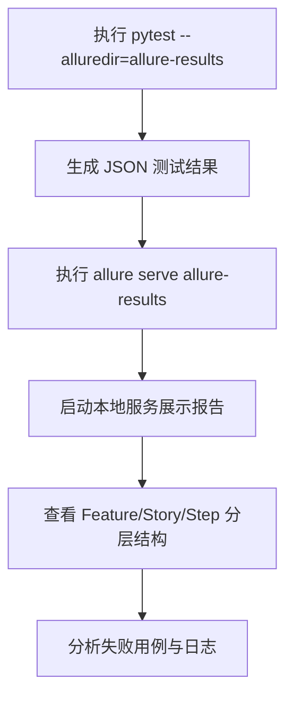
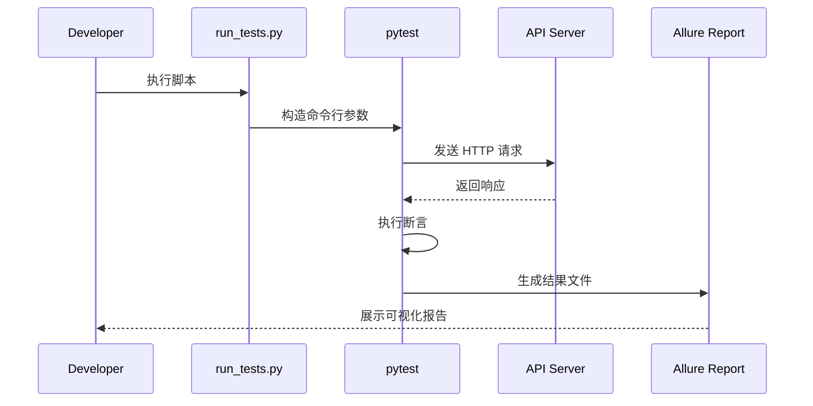

# 测试策略

<cite>
**本文档引用的文件**  
- [conftest.py](file://tests/conftest.py)
- [test_space_api.py](file://tests/test_space_api.py)
- [requirements.txt](file://tests/requirements.txt)
- [pytest.ini](file://tests/pytest.ini)
- [run_tests.py](file://tests/run_tests.py)
- [test_utils.py](file://tests/test_utils.py)
- [README.md](file://tests/README.md)
</cite>

## 目录
1. [简介](#简介)
2. [测试目录结构](#测试目录结构)
3. [测试依赖与运行方式](#测试依赖与运行方式)
4. [核心测试组件分析](#核心测试组件分析)
5. [接口测试用例详解](#接口测试用例详解)
6. [Allure 报告生成](#allure-报告生成)
7. [测试流程与依赖管理](#测试流程与依赖管理)
8. [改进建议](#改进建议)

## 简介
本文档全面介绍基于 `pytest` 框架构建的 ForgetURL 服务端 API 测试体系。该测试套件覆盖了非登录态与登录态下的核心功能验证，包括用户信息获取、页面管理、空间访问、链接操作等关键业务流程。通过 `Allure` 报告系统提供可视化测试结果，并结合 `conftest.py` 中的 fixture 机制实现高效测试数据管理与请求封装。

## 测试目录结构
`tests/` 目录是整个测试体系的核心，其结构清晰，职责分明：

```
tests/
├── conftest.py           # pytest 配置与共享 fixture
├── test_space_api.py     # 主要 API 接口测试用例
├── test_utils.py         # 测试工具类与数据验证器
├── requirements.txt      # Python 依赖包声明
├── pytest.ini            # pytest 运行配置
├── run_tests.py          # 测试执行脚本（支持参数化运行）
├── report.html           # 自动生成的 HTML 测试报告
├── __init__.py           # Python 包标识
└── README.md             # 测试说明文档
```

该结构遵循模块化设计原则，便于维护和扩展。

**Section sources**
- [README.md](file://tests/README.md#L50-L70)

## 测试依赖与运行方式
### 安装依赖
在运行测试前，需安装必要的 Python 包：

```bash
cd tests
pip install -r requirements.txt
```

`requirements.txt` 中定义了以下核心依赖：
- `requests`: 发起 HTTP 请求
- `pytest`: 测试框架
- `allure-pytest`: 生成 Allure 报告
- `pytest-html`: 生成独立 HTML 报告

**Section sources**
- [requirements.txt](file://tests/requirements.txt#L1-L6)

### 运行测试
支持多种运行方式：

| 运行方式 | 命令 |
|--------|------|
| 运行所有测试 | `pytest` |
| 仅运行登录态测试 | `pytest -m login` |
| 仅运行非登录态测试 | `pytest -m no_login` |
| 生成 HTML 报告 | `pytest --html=report.html --self-contained-html` |
| 生成 Allure 报告 | `pytest --alluredir=allure-results` |

此外，可通过 `run_tests.py` 脚本以参数化方式运行测试：

```bash
python run_tests.py --type login --report html
```

**Section sources**
- [pytest.ini](file://tests/pytest.ini#L1-L15)
- [run_tests.py](file://tests/run_tests.py#L1-L70)

## 核心测试组件分析
### conftest.py：测试配置中心
`conftest.py` 文件定义了多个关键 fixture，为测试提供统一上下文。

#### 基础配置
```python
@pytest.fixture(scope="session")
def base_url():
    return "http://test-api.brightguo.com/"
```
定义测试环境的基础 URL，当前指向预发布环境。

#### 请求头管理
- `headers_no_login`: 非登录态请求头，仅含 `Content-Type`
- `headers_with_login`: 登录态请求头，额外包含 `X-Token: test`

#### API 客户端封装
`api_client` fixture 封装了 `requests.Session`，提供统一的 POST 请求方法，并自动打印链路追踪 ID（`x-b3-traceid`），便于问题排查。

#### 测试数据
- `test_user_id`: 固定测试用户 ID（1）
- `sample_page_data`: 示例页面数据，用于创建测试页面
- `updated_page_data`: 更新后的页面数据，用于更新测试

**Section sources**
- [conftest.py](file://tests/conftest.py#L1-L139)

### test_utils.py：测试工具类
提供通用工具支持：

- `DataManager`: 全局测试数据共享管理器
- `ResponseValidator`: 响应数据结构验证器
- `TraceUtils`: 链路追踪工具，支持提取 trace ID 并格式化输出请求/响应日志

这些工具类提升了测试代码的可维护性和可读性。

**Section sources**
- [test_utils.py](file://tests/test_utils.py#L1-L152)

## 接口测试用例详解
`test_space_api.py` 是核心测试文件，采用 `Allure` 注解组织测试场景。

### 测试类结构
```python
@allure.feature("Space API")
class TestSpaceAPI:
    def setup(self, ...):  # 初始化测试上下文
```
使用 `@allure.feature` 标记功能模块，提升报告可读性。

### 登录态与非登录态测试
测试用例通过 `@pytest.mark.login` 和 `@pytest.mark.no_login` 标记区分场景，验证权限控制逻辑。

#### 非登录态测试
- **获取用户信息**: 验证返回基本字段（uid, display_name, avatar, email），不包含敏感信息（username, status）
- **获取页面数据**: 验证可访问公开页面
- **创建/更新/删除页面**: 验证操作失败，返回错误码（code ≠ 1）

#### 登录态测试
- **获取详细用户信息**: 验证返回完整字段，包括 `username`, `status`, `create_time` 等
- **拉取我的空间**: 验证 `getMySpace` 接口返回结构正确
- **创建页面**: 验证 `createPage` 成功并返回 `page_id`
- **更新与删除**: 验证 `updatePage` 和 `deletePage` 操作成功

### 测试依赖链
多个测试用例存在依赖关系：
1. `test_05b_create_page_with_login_success` 创建页面
2. `test_06b_get_my_space_verify_created_page` 验证页面出现在“我的空间”
3. `test_07b_get_created_page_with_login` 验证可获取该页面
4. `test_12b_delete_page_with_login_success` 最终删除页面

这种链式设计确保了测试数据的闭环管理。

**Section sources**
- [test_space_api.py](file://tests/test_space_api.py#L1-L380)

## Allure 报告生成
Allure 报告提供丰富的可视化信息：



报告中包含：
- 按 `feature` 和 `story` 组织的测试用例
- 每个步骤的详细日志（通过 `with allure.step()` 定义）
- 请求与响应的完整信息（由 `TraceUtils.log_request_details` 输出）

**Diagram sources**
- [test_space_api.py](file://tests/test_space_api.py#L1-L380)
- [test_utils.py](file://tests/test_utils.py#L1-L152)

## 测试流程与依赖管理


该流程实现了从测试执行到结果展示的自动化闭环。

**Diagram sources**
- [run_tests.py](file://tests/run_tests.py#L1-L70)
- [conftest.py](file://tests/conftest.py#L1-L139)

## 改进建议
尽管当前测试体系已覆盖核心功能，但仍可进一步提升：

### 补充单元测试（Go testing）
当前主要为 API 级别的集成测试，建议补充 Go 层面的单元测试：

```go
func TestCreatePage(t *testing.T) {
    // 测试业务逻辑、边界条件、错误处理
}
```
目标：提升核心函数的测试覆盖率，降低集成测试压力。

### 提高集成测试覆盖率
当前测试集中于 `space` 模块，建议扩展：
- `dumplinks` 模块接口测试
- `login` 模块认证流程测试
- 异常场景测试（如数据库连接失败、Redis 超时）

### 自动化测试数据清理
建议在 `teardown` 阶段自动清理测试产生的数据，避免数据污染。

### 引入 CI/CD 集成
将测试套件集成至 GitHub Actions 或 Jenkins，实现提交即测试，保障代码质量。

**Section sources**
- [test_space_api.py](file://tests/test_space_api.py#L1-L380)
- [app/api/space.go](file://app/api/space.go)