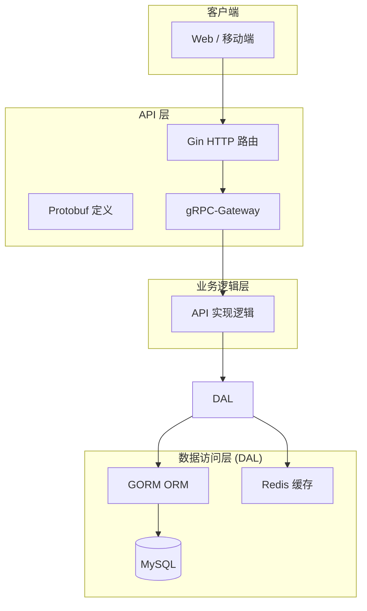
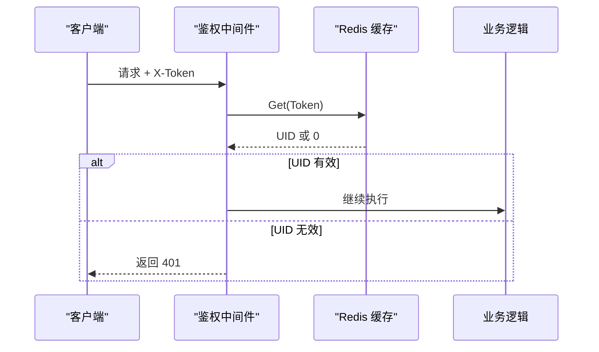
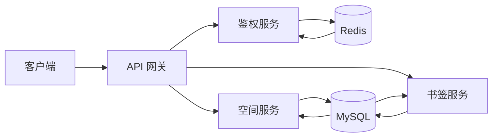

# 项目概述

<cite>
**本文档引用文件**  
- [README.md](file://README.md)
- [main.go](file://app/main.go)
- [router.go](file://app/route/router.go)
- [login.go](file://app/api/login.go)
- [space.go](file://app/api/space.go)
- [dumplinks.go](file://app/api/dumplinks.go)
- [base.go](file://app/conf/base.go)
- [init.go](file://app/dal/init.go)
- [redis.go](file://app/dal/redis.go)
- [login.proto](file://app/api/proto/login.proto)
- [space.proto](file://app/api/proto/space.proto)
- [dumplinks.proto](file://app/api/proto/dumplinks.proto)
- [login.go](file://app/pkg/middleware/login.go)
</cite>

## 目录
1. [项目简介](#项目简介)
2. [核心功能与使用场景](#核心功能与使用场景)
3. [系统架构设计](#系统架构设计)
4. [技术栈与组件协同](#技术栈与组件协同)
5. [API 请求流程与鉴权机制](#api-请求流程与鉴权机制)
6. [可扩展性与多语言支持](#可扩展性与多语言支持)
7. [系统上下文图](#系统上下文图)

## 项目简介

forgeturl-server 是一个基于 Go 语言开发的后端服务，旨在为用户提供书签与页面管理功能。系统支持用户空间组织、页面分享、权限控制以及批量书签操作，适用于个人知识管理、团队协作等场景。该项目采用分层架构设计，通过清晰的模块划分实现高内聚、低耦合的系统结构。

作为后端核心服务，forgeturl-server 提供了完整的 RESTful API 接口，支持非登录态与登录态下的多种操作，并通过 X-Token 机制实现安全的身份验证。系统设计注重可扩展性与可维护性，适用于中大型应用的持续演进。

**Section sources**
- [README.md](file://README.md#L1-L10)
- [main.go](file://app/main.go#L1-L33)

## 核心功能与使用场景

forgeturl-server 支持以下核心功能：

- **用户信息管理**：获取用户基本信息（支持非登录态与登录态）
- **空间管理**：拉取用户所属的“我的空间”，组织页面结构
- **页面管理**：创建、更新、删除页面，支持嵌套链接与标签分类
- **页面链接管理**：生成只读、可编辑或管理员权限的页面链接，实现灵活的分享机制
- **批量操作**：支持导入/导出浏览器书签，便于数据迁移
- **页面排序**：保存用户自定义的页面 ID 顺序

根据使用状态，API 分为两类：
- **非登录态接口**：如 `getUserInfo`、`getPage`，用于公开信息访问
- **登录态接口**：需携带 `X-Token` 请求头，用于执行写操作或访问私有数据

**Section sources**
- [README.md](file://README.md#L12-L80)

## 系统架构设计

系统采用典型的三层架构模式，职责清晰，便于维护与扩展：



**Diagram sources**
- [router.go](file://app/route/router.go#L1-L18)
- [init.go](file://app/dal/init.go#L1-L70)
- [redis.go](file://app/dal/redis.go#L1-L90)

**Section sources**
- [router.go](file://app/route/router.go#L1-L18)

### 分层职责说明

| 层级 | 职责 |
|------|------|
| **API 层** | 接收 HTTP 请求，路由分发，Protobuf 定义接口契约 |
| **业务逻辑层** | 处理核心业务规则，调用数据访问层完成操作 |
| **数据访问层 (DAL)** | 封装数据库与缓存操作，提供统一数据接口 |

## 技术栈与组件协同

forgeturl-server 采用现代 Go 技术栈，各组件协同工作如下：

- **Go 语言**：高性能、并发友好的后端开发语言
- **Gin 框架**：轻量级 Web 框架，处理 HTTP 路由与中间件
- **gRPC-Gateway**：将 gRPC 接口暴露为 RESTful API，实现多协议支持
- **Protobuf**：定义接口契约，生成强类型代码，支持多语言客户端
- **GORM**：ORM 框架，简化数据库操作，支持 MySQL
- **Redis**：缓存用户登录状态（X-Token），提升鉴权性能

系统通过 `protoc` 工具链自动生成 Go 代码与 OpenAPI 文档，确保接口一致性与文档实时性。`genapi.sh` 脚本自动化完成 Protobuf 编译与代码生成，提升开发效率。

**Section sources**
- [genapi.sh](file://app/genapi.sh#L1-L62)
- [login.proto](file://app/api/proto/login.proto#L1-L79)
- [space.proto](file://app/api/proto/space.proto#L1-L130)

## API 请求流程与鉴权机制

### 非登录态请求流程

以获取页面数据为例：
```bash
curl '127.0.0.1:80/space/getPage' -d '{"page_id": "test_page_id"}' -H 'content-type: application/json'
```
- 客户端发送 POST 请求至 `/space/getPage`
- 服务端解析 JSON 请求体，验证参数
- 查询数据库获取页面内容并返回

### 登录态请求流程

以创建页面为例：
```bash
curl '127.0.0.1:80/space/createPage' -d '{...}' -H 'content-type: application/json' -H 'X-Token: test'
```
- 客户端在请求头中携带 `X-Token: <token>`
- 中间件 `GetLoginUid` 从 Redis 中查询 Token 对应的用户 ID
- 业务逻辑层验证用户权限后执行创建操作

### X-Token 鉴权机制



**Diagram sources**
- [login.go](file://app/pkg/middleware/login.go#L1-L15)
- [redis.go](file://app/dal/redis.go#L66-L90)

**Section sources**
- [login.go](file://app/pkg/middleware/login.go#L1-L15)
- [README.md](file://README.md#L82-L128)

## 可扩展性与多语言支持

### 第三方登录抽象层

系统通过 `connector-provider` 模式支持第三方登录（如 Google、微信）：
- `pkg/connector-google/google.go` 实现 Google 登录
- `pkg/connector-provider/provider.go` 提供统一接口
- 基于 `goth` 库实现 OAuth2 协议

新增第三方登录只需实现对应 `Provider`，无需修改核心逻辑。

### 多语言客户端生成

通过 Protobuf 定义接口契约，可生成多种语言的客户端 SDK：
- `protoc` 生成 Go 客户端
- `protoc-gen-openapi` 生成 OpenAPI 3.0 规范
- 支持生成 TypeScript、Python、Java 等语言客户端

此设计支持前后端分离开发，便于构建跨平台应用。

**Section sources**
- [login.go](file://app/api/login.go#L1-L57)
- [provider.go](file://app/pkg/connector-provider/provider.go#L1-L10)

## 系统上下文图



该图展示了系统主要组件及其交互关系：
- 客户端通过 API 网关访问各项服务
- 鉴权服务依赖 Redis 存储 Token 映射
- 空间与书签服务共享 MySQL 数据库
- 所有服务通过统一的 Protobuf 接口定义进行通信

**Diagram sources**
- [router.go](file://app/route/router.go#L1-L18)
- [init.go](file://app/dal/init.go#L1-L70)